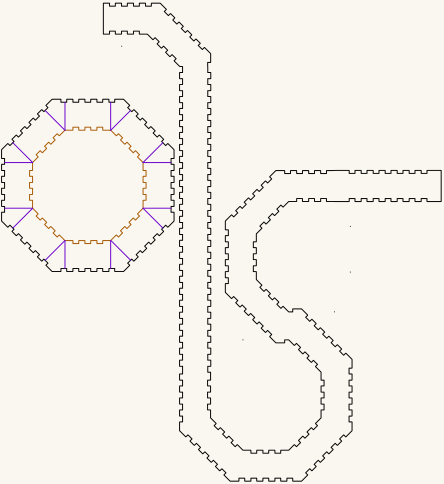

# Octagonal trumpet

The trumpet form of the [octagonal torus](https://github.com/Gernreich/octagonal-torus) —
a flaring octagonal horn built on the same 25 × 25mm channel and the same R 90 plate, cut
from 3mm Baltic birch plywood. Output is millimetre-true — `1 user unit = 1mm` with a
physical `width`/`height` — so it prints and cuts at real size.

**[Read the writeup](https://gernreich.github.io/octagonal-trumpet/)**

*Click the picture to download the cut file. It is a display rendering — the cut file
draws a hairline on no background, which a browser shows almost invisibly. Green, orange
and cyan are darkened in the picture; at full strength they are too pale to read against a
light ground. The cut file keeps the exact values.*

Built for **[LaserMadeMusic](https://www.youtube.com/@LaserMadeMusic)**, where the cutting
and the playing are shown.

**[Download everything as a ZIP](https://github.com/Gernreich/octagonal-trumpet/archive/refs/heads/main.zip)**

## What is on the sheet

Measured out of the file, not copied from whatever drew it:

| Part | Count | Size |
|---|---|---|
| Octagonal plate, finger-jointed rim | 1 | 172.3mm across flats, R 90 |
| Its central hole | 1 | 116.3mm across flats, R 62.94 |
| Curved flare band, finger-jointed both edges | 1 | 507.4 × 306.1mm |

The sheet is **444.1 × 484.6mm** and every part sits inside it. The plate is the same
geometry as the torus's: rim at apothem 86.149, hole at 58.149, and the same joint phase,
so a panel cut for the torus mates with this plate too.

## Colour is the cut order

Blue engraves, then **green → orange → cyan → black**, with black always the cut that frees
the part and violet always skip. That sequence is shared by every LaserMadeMusic
repository. This sheet uses two of the four stages, and there is nothing to engrave.

| | Colour | What | Why then |
|---|---|---|---|
| 1 | **orange `#ff8000`** | the plate's central hole | while the plate is still held by the sheet |
| 2 | **black `#000000`** | the plate rim and the flare band | frees them, so they go last |

Give both an explicit operation. A per-colour job silently skips any colour you leave
unmapped.

**Violet `#8000ff` is skip** — 16 lines across the plate wall, one at the middle of every
flat and one at every corner, each running from the hole edge out to the rim. They divide
the wall into sixteen segments and are carried in the drawing rather than cut. Turn one
green to cut it. Leave the colour unmapped, or delete it.

## Before you cut

**Cut this in 3mm Baltic birch plywood** — what it is built in, and the void-free core
matters at the finger joints, where a void lands in a tooth that has to carry the flare.

The band curves, so **grain direction is a real choice**: run the face grain along its
length and it bends more willingly, across and it resists. Neither is wrong; they give
different flares.

## Files

| | |
|---|---|
| `octagonal-trumpet.svg` | the cut-ready sheet |
| `previews/` | display rendering — **not** a cut file |
| `index.md` · `index.html` | the published page; the markdown is the source |

Released under [CC0 1.0](LICENSE).
