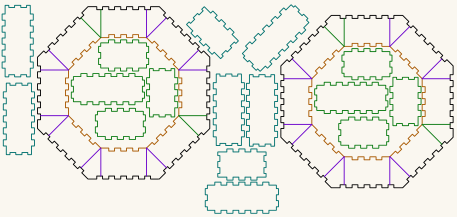

# Octagonal torus — parametric, 90mm radius, 25 × 25mm cross-section

A laser-cut octagonal torus: two nested octagonal tubes joined by annular plates, leaving a
**square channel** all the way round. The cut file here is a 25 × 25mm channel with an outer
octagon of R 90 in 3mm Baltic birch plywood — but those are three numbers you choose, and everything else
derives from them, within one constraint. [Build it at your own size](#build-it-at-your-own-size).

<!-- readme-only -->
**[Read the writeup](https://gernreich.github.io/torus-octagonal/)** — the trigonometry,
the generator settings, and how every number was verified against the cut files. Also
here as markdown: [`Octagonal_Torus_Gold.md`](Octagonal_Torus_Gold.md).


**[Download everything as a ZIP](https://github.com/Gernreich/torus-octagonal/archive/refs/heads/main.zip)** — the cut file, the writeup, the diagram and the verification tools.

**[The rest of the build files](https://gernreich.github.io/)** — every instrument,
generator and tool, indexed.

## The files, at a glance

<p>
<a href="BuildA1_90_25.svg"></a>
</p>

<p>
<a href="RunA1_R90.svg"></a>
<a href="RunA2_R59Point693.svg"></a>
</p>

*Above, the cut file — colour is the cut order, not decoration. Below, two of the three
generator runs it was assembled from. Click any to download. The pictures are display
renderings with the stroke thickened; the real files draw 0.2646mm, which a browser shows
almost invisibly against a transparency checkerboard. Green, orange and cyan are darkened in the picture — at full strength they are too pale to read against a light ground. The cut file keeps the exact values.*

---

## Just cut it

**[`BuildA1_90_25.svg`](BuildA1_90_25.svg)** — the torus's 18 pieces, 20 contours, verified.

| | |
|---|---|
| Material | 3mm Baltic birch ply |
| Kerf (`burn`) | 0.1mm |
| Sheet | 458 × 218mm |
| Pieces | 2 plates · 8 outer panels · 8 inner panels |
| Result | 25.000mm radial × 25.000mm axial · 172.3 across flats · 110.3 bore |

Dry-fit one plate against one inner panel in cardboard before committing a sheet. The plate's tabs
around the hole should drop into the panel's notches.

### Every piece carries its number

Added 2026-09-03. The panels differ by very little and it matters: the outer ones are 73.326 and
71.568mm wide, the inner ones 50.130 and 48.372mm. Off the bed they are a pile of near-identical
rectangles, and a narrow panel in a wide panel's place does not close the ring.

So each piece is engraved with a number in **blue `#0000ff`, which engraves and never cuts** —
give it a marking operation, or leave it unmapped and lose nothing but the numbers. Hex, one glyph,
counting 1 to 12 the way the bell rings and the bore sections do. **The tick below and right of the
glyph is the baseline**: 6 and 9 are one shape turned over, and the tick says which way up you are
holding it.

| # | piece | size | cut stage |
|---|---|---|---|
| `1` | outer panel, narrow | 71.568 × 31.200mm | cyan — on the open sheet |
| `2` | plate | 172.499 × 172.498mm | black — frees the plate |
| `3` | inner panel, narrow | 48.372 × 31.200mm | cyan — on the open sheet |
| `4` | outer panel, wide | 73.326 × 31.200mm | cyan — on the open sheet |
| `5` | plate | 172.499 × 172.498mm | black — frees the plate |
| `6` | inner panel, wide | 50.130 × 31.200mm | green — nested, cut first |
| `7` | inner panel, wide | 50.130 × 31.200mm | green — nested, cut first |
| `8` | outer panel, narrow | 71.568 × 31.200mm | cyan — on the open sheet |
| `9` | outer panel, wide | 73.326 × 31.200mm | green — nested, cut first |
| `A` | inner panel, narrow | 48.372 × 31.200mm | green — nested, cut first |
| `B` | outer panel, narrow | 71.568 × 31.200mm | cyan — on the open sheet |
| `C` | outer panel, narrow | 71.568 × 31.200mm | cyan — on the open sheet |
| `D` | outer panel, wide | 73.326 × 31.200mm | green — nested, cut first |
| `E` | inner panel, narrow | 48.372 × 31.200mm | green — nested, cut first |
| `F` | inner panel, wide | 50.130 × 31.200mm | green — nested, cut first |
| `10` | inner panel, wide | 50.130 × 31.200mm | green — nested, cut first |
| `11` | inner panel, narrow | 48.372 × 31.200mm | cyan — on the open sheet |
| `12` | outer panel, wide | 73.326 × 31.200mm | cyan — on the open sheet |

Numbers run across the sheet, left to right and top to bottom, banded — the order the parts come
off the bed. `node number_pieces.js --table` prints this table from the file, and
`node number_pieces.js --clear` takes the engraving out again.

**Cut everything except the violet.** Those 64 paths are the optional cuts — sixteen on each plate
and ring, each running straight from the hole edge to the rim. Take them and the torus comes apart
into sections, which is how you reach the simple trumpet, and the segments they define are the
patches for rejoining. Move them to a non-cutting layer or delete them first, or turn one green if
you do want it cut.

**Colour is the cut order: green → orange → cyan → black.** Eight panels and both patches are nested
inside the plate and ring holes, so they have to be cut before the hole that frees that waste; the
holes have to be cut before the rims that free the plates. Give all four a cutting operation and run them in that order.
`verify_torus.js` checks the sequence and will tell you if it is wrong.

**Violet `#8000ff` is skip** — the 24 optional cuts described above, twelve on each of the two
plates. Leave it unmapped or delete it. **Blue `#0000ff` is the piece numbers**: blue means engrave
across these repositories and never cuts, so give it a marking operation or leave it unmapped.

The sequence is shared by every LaserMadeMusic repository — blue engraves, then
green → orange → cyan → black, with black always the cut that frees the part and violet always
skip. A file uses only the stages it needs.

**Two optional stiffening rings are described in the writeup but are not on this sheet.** They are
plain octagons, no joinery, 172.258mm across the flats with a 110.298mm hole — the finished torus's
own outside and bore — so one laid on a face sits flush at both edges. The torus closes without
them, and this file ships its 18 pieces and nothing else.

## Turn it

**[`torus-turn.html`](torus-turn.html)** — the torus as a solid you can drag:
eight 45° facets, a 25 × 25mm section, 468.2mm of centreline. Colour by face to
read the construction or by facet to follow it round; the slider builds it a
facet at a time.

It draws the **airway**, not the plywood — the passage bounded by the wall
faces, at apothems 58.149 and 83.149, which is what `verify_torus.js` measures
out of the cut file. Generated by
[bore-ribbon](https://gernreich.github.io/bore-ribbon/)'s `ribbon_view.py`,
because a torus of rectangular section swept along a planar curve is exactly
what that repository draws:

```sh
python3 ../bore-ribbon/ribbon_view.py --shape=torus --facet=45 --bore=25 \
    --radius=76.4696 --out=torus-turn.html
```

`76.4696` is the circumradius of the centreline octagon: its facets sit at
apothem 70.649, the mean of the two above, and offsetting by ±12.5 reproduces
both to 0.001mm.

## Build it at your own size

Made with **[boxes.py](https://boxes.hackerspace-bamberg.de/)** by Hackerspace Bamberg — generator
**RegularBox**. Each link opens the form with every setting already filled in — change the radius or
thickness if you want, then hit **Generate**. Save each one under its own name; boxes.py serves them
all as `RegularBox.svg`.

1. **[Outer tube, R 90](https://boxes.hackerspace-bamberg.de/RegularBox?FingerJoint_style=rectangular&FingerJoint_surroundingspaces=1.0&FingerJoint_bottom_lip=0.0&FingerJoint_edge_width=1.0&FingerJoint_extra_length=0.0&FingerJoint_finger=2.0&FingerJoint_play=0.0&FingerJoint_space=2.0&FingerJoint_width=1.0&h=25&outside=0&radius_bottom=90&radius_top=90&n=8&top=closed&alignment_pins=1.0&bottom=closed&thickness=3.0&burn=0.1&format=svg&labels=0&labels=1&reference=100.0&tabs=0.0&qr_code=0&inner_corners=loop&spacing=0.5&debug=0&language=en&render=0)** — keep both discs and all 8 panels
2. **[Inner panels, R 59.693](https://boxes.hackerspace-bamberg.de/RegularBox?FingerJoint_style=rectangular&FingerJoint_surroundingspaces=1.0&FingerJoint_bottom_lip=0.0&FingerJoint_edge_width=1.0&FingerJoint_extra_length=0.0&FingerJoint_finger=2.0&FingerJoint_play=0.0&FingerJoint_space=2.0&FingerJoint_width=1.0&h=25&outside=0&radius_bottom=59.693&radius_top=59.693&n=8&top=closed&alignment_pins=1.0&bottom=closed&thickness=3.0&burn=0.1&format=svg&labels=0&labels=1&reference=100.0&tabs=0.0&qr_code=0&inner_corners=loop&spacing=0.5&debug=0&language=en&render=0)** — keep the 8 panels only
3. **[Hole cutter, R 56.446](https://boxes.hackerspace-bamberg.de/RegularBox?FingerJoint_style=rectangular&FingerJoint_surroundingspaces=1.0&FingerJoint_bottom_lip=0.0&FingerJoint_edge_width=1.0&FingerJoint_extra_length=0.0&FingerJoint_finger=2.0&FingerJoint_play=0.0&FingerJoint_space=2.0&FingerJoint_width=1.0&h=25&outside=0&radius_bottom=56.446&radius_top=56.446&n=8&top=closed&alignment_pins=1.0&bottom=closed&thickness=3.0&burn=0.1&format=svg&labels=0&labels=1&reference=100.0&tabs=0.0&qr_code=0&inner_corners=loop&spacing=0.5&debug=0&language=en&render=0)** — keep one disc, invert it, cut the hole in both outer discs

**Inverting the disc:** in Inkscape, break the octagon outline into its eight segments — one per
face — and flip each one. The flipped segments together are the hole; place them concentric on each
outer disc and cut. **The [video](https://www.youtube.com/@LaserMadeMusic) shows this step by step**, and
[the writeup](Octagonal_Torus_Gold.md#how-the-inversion-was-done) explains what flipping does to the
joint.

The eight segments in `BuildA1_90_25.svg` have been stitched into one closed loop per plate, but
that is **probably unnecessary** — the gaps between segments measured 0.077mm against a 0.1mm
kerf, so the cuts overlap anyway. It only matters if your laser software applies its own kerf
compensation, which needs closed paths — and if it does, switch it off, because `burn = 0.1` is
already baked into these files.

Run 3 uses a *smaller* radius on purpose: flipping shifts the band outward by one material
thickness. So you type the radius whose *apothem* is 3mm short of where the band should land —
3.247 smaller in radius, since 3mm of apothem is 3 × sec(22.5°) — and the inversion carries it
exactly into place. Details in Part 8a of the writeup.

The size relationship is fixed by one constant:

```
R_inner = R_outer − (ring + thickness) × sec(22.5°)
        = 90 − 28 × 1.082392 = 59.693
```

`sec(22.5°) = 1.0824` — an octagon's corners sit 8.24 % further out than its flats.

**The three numbers are not independent.** The ring and both walls have to fit inside the outer
octagon, which puts a floor under the radius:

```
R_outer  >  (ring + 2 × thickness) × sec(180°/n)
```

For a 25mm ring in 3mm that floor is 33.554mm, so R 90 is comfortably clear. Below it the hole
cutter comes out zero or negative and there is no bore at all — ask for a 500mm ring at R 10 and
the arithmetic has nowhere to put it. `torus-geometry-diagram.js` checks this before it draws
anything and refuses, naming the minimum for your ring and thickness.

## Check your own file

```
node verify_torus.js BuildA1_90_25.svg RunA2_R59Point693.svg
```

Reports the stroke palette, contours, plate and hole geometry, hole concentricity, **joint phase**,
**cut order**, nesting clearances, and whether everything sits inside the viewBox. The phase check
is the one that matters — it catches a hole whose tabs land where the panel is solid, which is a
build that measures perfectly and cannot be assembled.

```
node torus-geometry-diagram.js 90 25 3        # redraw the figure at any size
```

## What else is here

`RunA1/2/3` are the three generator outputs from the links above, unmodified. Run 2 doubles as the
reference `verify_torus.js` checks joint phase against, so keep it if you plan to verify your own files.
Part 10 of the writeup says what each one is.

## Licence

Released under **[CC0 1.0](LICENSE)** — public domain, no strings. Cut it, modify it, sell what you
make, no attribution required. A credit is always welcome but never owed.

That dedication covers what is mine: the writeup, the diagram and its generator, and the tools. The
part geometry itself comes from **[boxes.py](https://www.festi.info/boxes.py/)** by **Florian Festi** — the SVGs carry its
`dc:source` provenance in their metadata. boxes.py is GPL 3.0; its source is at
[github.com/florianfesti/boxes](https://github.com/florianfesti/boxes). Check its own terms if you
plan to redistribute generated output at scale.

## Credit

Parts generated with **[boxes.py](https://www.festi.info/boxes.py/)** by **Florian Festi** (GPL 3.0,
[source](https://github.com/florianfesti/boxes)), generator **RegularBox**, run on the
[Hackerspace Bamberg instance](https://boxes.hackerspace-bamberg.de/).
