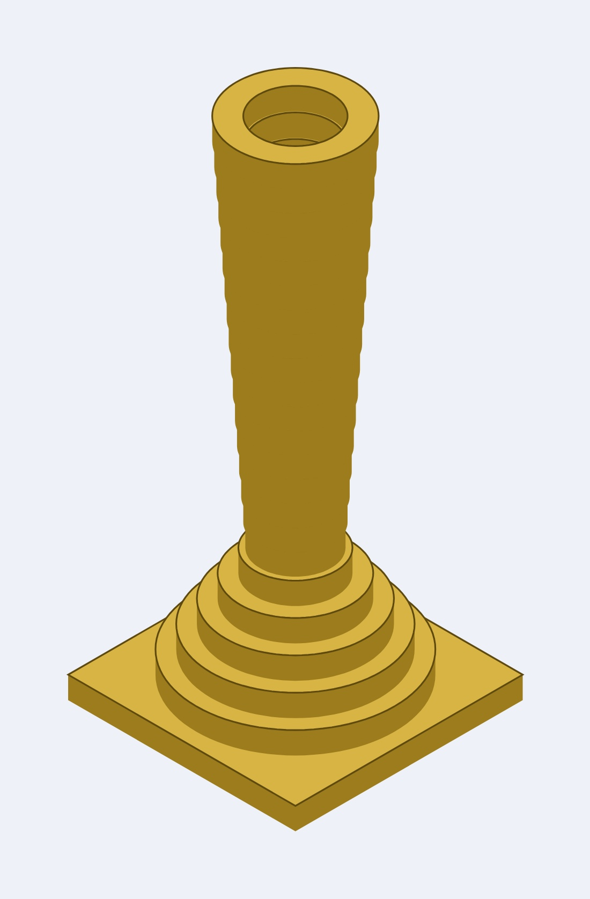
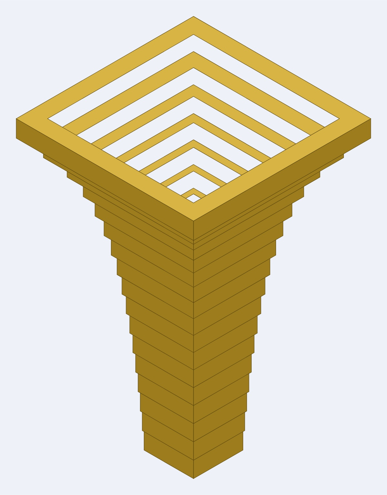
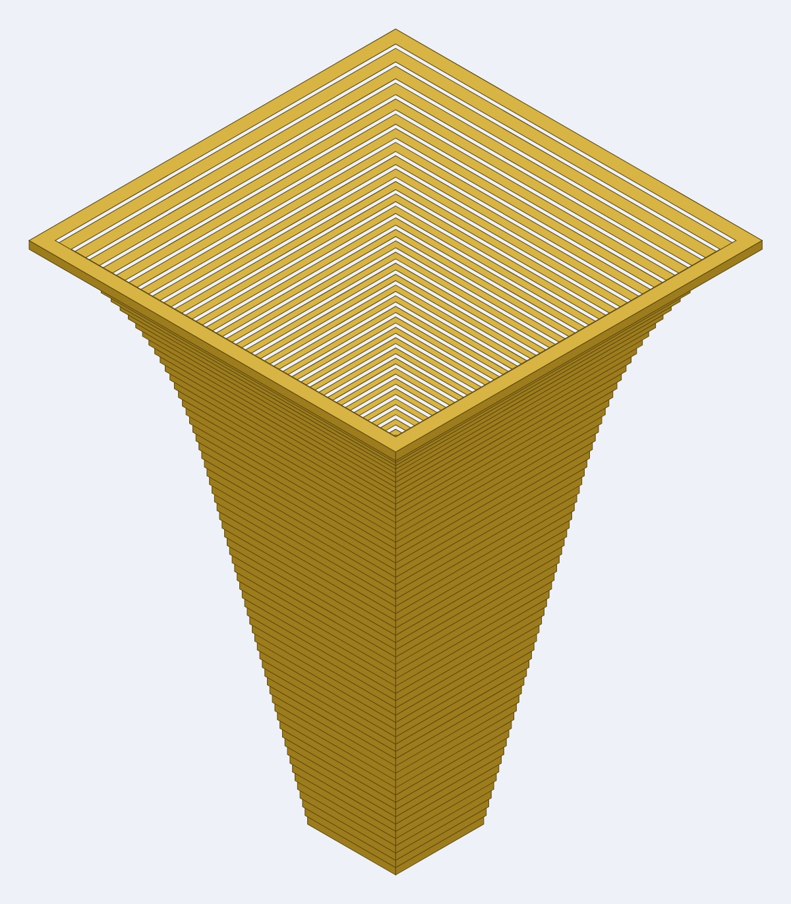

# Trumpet parts

The **bell** and the **mouthpiece**, shared by every trumpet in these repositories. Both
are built on the same **25 × 25mm channel** — 31mm outside in 3mm Baltic birch plywood —
so either fits any bore cut to it:

- **[Coiled trumpet](https://github.com/Gernreich/trumpet-coiled)** — a bore that coils
  flat and drops twice, with no elbows.
- **[Octagonal trumpet](https://github.com/Gernreich/trumpet-octagonal)** — a curved
  octagonal bore, the trumpet form of the
  [octagonal torus](https://github.com/Gernreich/torus-octagonal).

They live here rather than inside one instrument because neither is changed by the shape
of the bore. A trumpet is a mouthpiece, a length of tube and a bell; only the tube differs.

Millimetre-true at `1 user unit = 1mm`, so everything prints and cuts at real size.

<!-- readme-only -->
**[Read the writeup](https://gernreich.github.io/trumpet-parts/)** — the same text as this
page, set for reading, with a table of contents.

Built for **[LaserMadeMusic](https://www.youtube.com/@LaserMadeMusic)**, where the cutting
and the playing are shown.

**[The rest of the build files](https://gernreich.github.io/)** — every instrument,
generator and tool, indexed.

**[Download everything as a ZIP](https://github.com/Gernreich/trumpet-parts/archive/refs/heads/main.zip)**

## What fits what

The bore is cylindrical — constant section end to end — and the only part of a trumpet
that flares is the bell. That is why these two parts are interchangeable across bores:

| | dimension | mates with |
| --- | --- | --- |
| Bore, air channel | 25mm square | the bell's 25mm throat and the mouthpiece's 25mm station |
| Bore, end face | the 3mm ring between them | covered completely by the bell's flange and the mouthpiece's plate |
| Mouthpiece station one | 31mm square plate, 25mm square aperture | the end face of any bore section |

## The mouthpiece

**`mouthpiece/mouthpiece-round-parts.svg`** — 30 rings, 90mm stacked, the whole mouthpiece
in one sheet: square where it meets the bore, round by the throat, and a cup at the lip.
**Station one is a sharp 25mm square aperture in a sharp 31mm square plate**, matching the
bore corner for corner; the corners round away going up and the section is a true circle
from the ø7.5mm station on, 21mm from the joint. Three runs, from the bore:

| | Rings | Airway |
| --- | ---: | --- |
| **Backbore** | 9 | 25 -> 5mm in 2.5mm steps, square becoming round |
| **Entrance** | 17 | the 3.66mm **throat** (a #27 drill), then 0.40mm a ring out to 10.06 |
| **Bowl** | 4 | 10.06 -> 16.5mm over 12mm — the cup, ending at the rim |

**These rings stack; they do not telescope.** The wall is 3.00mm at every one of the 30
stations, the throat included, so what varies is the shared face: 2.80mm per side through
the cup and 1.00mm at the tightest backbore joint. No ring can drop through the one below,
at the corners any more than across the flats. The bell inverts it — a fixed 3mm lap and
a wall that varies with the flare.

**The backbore steps 2.5mm, not 4mm, and that is what makes the square end possible.** A
ring's outer is its aperture offset by the wall, so the seat the next ring lands on is the
wall minus how far the two apertures differ in that direction. Across the flats that is
half the aperture step, and the old 4mm steps left 3.00 − 2.00 = 1.00mm. Through the corners
of a *sharp* square the same step costs 2.83mm, leaving 0.17mm — and rounding a corner pulls
the diagonal in further still, which takes it negative. **A square mouthpiece cannot be built
on a 4mm taper at all.** At 2.5mm the corner seat is 1.23mm with room to round. It is the
same 25 -> 5mm cone either way, sampled finer: three more rings, 9mm more mouthpiece, and no
change to the profile the air sees.

Roundness is not scheduled. Each station takes the largest corner radius that still leaves
1.00mm of seat in both directions, so the part rounds as fast as its own geometry permits
and no faster.

### A real mouthpiece: `--layout=trumpet`

**`mouthpiece/mouthpiece-trumpet-parts.svg`** — the same 30 rings and the same 90mm, with
the length where a trumpet actually puts it.

| | Backbore | Entrance | Cup |
| --- | ---: | ---: | ---: |
| `--layout=asbuilt` *(default)* | 27mm | 51mm | 12mm |
| `--layout=trumpet` | **75mm** | — | 12mm |

A real mouthpiece opens its throat into the cup almost at once and spends its length on the
backbore. The default has that close to inverted: a short steep backbore, and 51mm of
near-cylindrical run on the *lip* side of the throat, which is a 48mm-deep cup by any honest
reading. It stays the default only because a mouthpiece exists to that profile and its rings
are numbered for it. **Cut `--layout=trumpet` for a new one.**

`--backbore` sets its length in rings and `--power` how it opens — 1 is a straight cone,
higher keeps it near-cylindrical off the throat and opens it later, as a real one does.

**The wall is no longer a constant, and it cannot be.** A ring's outer is its aperture plus
two walls, so the seat above it is the wall of whichever ring is narrow there, less half the
aperture step. A real cup turns far too fast for 3mm: straight off the throat it runs ø3.66
to ø11.25 in a single ring, wanting **4.80mm** of wall to have anything to sit on. Each ring
now takes the wall its own step demands — 3mm nearly everywhere, 4.80mm on the throat ring,
and nowhere else. Held at 3mm the cup would have had to be 36mm deep, which is not a cup.

### Retrofitting a cup onto one already glued

**`mouthpiece/mouthpiece-cup-parts.svg`** — the bowl on its own, 4 rings, ø10.06 to a
**ø16.5mm rim**. The sheet above used to stop at ø10.06 opening 0.40mm a ring, which is a
3.8° half-angle: a tube, not a bowl. A trumpet rim is 16 to 17mm across inside, so the cup
was not shallow, it was absent. **These rings stack on top of a mouthpiece already glued
without one** — they replace nothing and nothing below needs recutting.

A sheet from `mouthpiece-round.py` is that part plus these four rings, ring for ring, so
both routes number identically: `0` to `19`, then `1A` to `1d`. Cut one sheet for a new
mouthpiece; cut this one to rescue a mouthpiece already built.

**A cup is a bowl, not a cone**, and the difference is where the wall stands up. The
profile is an ellipse arc through the depth-radius plane whose slope is zero at the rim, so
the wall runs parallel to the axis where your lip sits and turns toward the throat going
down. The first ring opens 3.21mm — a 28° half-angle — and the rim ring only 0.33mm. A
cone would meet the rim at an angle and feel like a funnel.

They are numbered `1A` to `1d`, continuing the stack rather than restarting, and every
joint is checked including the one landing on glued work: 1.40mm of seat at the tightest.
`--rim` and `--rings` move the rim diameter and the depth.

The bowl is a staircase of 3mm ply. Sand or fill the steps and round the rim over before
playing it — as cut, the rim edge is a square corner and your lip will say so.

**Its rings carry engraved hex numbers too, 0 on the bore plate through 19 on the lip.**
They matter more here than on the bell: the sixteen cup rings differ by 0.40mm and are
indistinguishable by eye. **The numbering runs in assembly order, not by size** — the
airway narrows to the throat and opens again, so the backbore and the cup pass through the
same diameters and sorting by size would shuffle one into the other. `number_rings.py`
refuses to guess on a profile that doubles back; `--order=document` numbers them as the
file lists them, which is assembly order. b and d are lower case because on seven segments
an upper-case B is the same shape as 8 and an upper-case D the same shape as 0.

`mouthpiece-round-parts-section.svg` is the axial section of the part above, drawn by
`bell-section.py`. It is a display drawing, not a cut file.

**The previous mouthpiece is still here.** `mouthpiece.py` generates it —
23 rings, 69mm, a 4mm backbore taper, and a 25mm *round* aperture in the square plate, so
the joint threw away the bore's corners and 21% of the airway stepped out of the channel at
station one. `mouthpiece-section.svg` and the view above are drawings of that design.
`mouthpiece-view.py` draws it and only it: it takes every ring for a circle apart from a
hardcoded square plate with a round bore, so pointing it at the square-to-round part would
produce a confident picture of the wrong object.

**A note on its variable names.** `mouthpiece.py` calls the 25 -> 5mm run `cup` and the
3.66 -> 10.06mm run `backbore`, which is the reverse of the anatomy: the cup is at the lip
and the backbore opens into the instrument. The numbers are right and the parts are right;
the names inside the script are not, and the `<desc>` it writes into the SVG repeats them.

## The bell

Four bells. **The rings telescope**: each ring's aperture is the one below it plus the
radius gained, lapped by a fixed **3mm** for glue, so the bore widens at every joint and the
wall varies with the flare.

**Ring 0 is a flange, not a ring.** The bore ends in a square annulus of ply 3mm wide — 25mm
inside, 31mm out — and the flange is a sharp 37mm square with a 25mm square hole, so it
covers that whole face and stands 3mm proud of it. It is the only ring whose outside is not
set by the profile, and it is wider than the several rings above it.

The throat is **25mm square, the bore's air channel**, so the airway runs straight through
the joint. It used to be 31mm — the bore's *outside* — which put a 3mm shoulder per side in
the airway and left the first ring sitting entirely outside the bore's footprint with
nothing to glue to but the tube wall.

| File | Rings | Build | Pieces | Rim diameter | Angle, throat → steepest | Sheet, per pass |
| --- | ---: | --- | ---: | ---: | --- | --- |
| `bell-trumpet-10rings.svg` | 10 | 7 ply | **70** | 129.0 | 2.4° -> 36.7° | 241 × 254mm |
| `bell-trumpet-14rings.svg` | 14 | 5 ply | **70** | 129.0 | 2.4° -> 41.4° | 283 × 314mm |
| `bell-trumpet-17rings.svg` | 17 | 4 ply | **68** | 129.0 | 2.3° -> 46.6° | 348 × 314mm |
| `bell-trumpet-67rings.svg` | 67 | 1 ply | **67** | 129.0 | 2.3° -> 59.3° | 767 × 534mm |

**Each file draws every ring once — cut it as many times as the `Build` column says.** The
10-ring bell is 7 laminations a ring: 7 passes, 70 pieces, glued into ten 21mm bands. Cut
it once and you get a 30mm bell instead of a 210mm one. Only the 67-ring file is one pass.

All four now reach the same 129.0mm rim, because with a 3mm lap the old 2mm minimum-wall
floor never binds and the profile follows the Bessel curve exactly rather than being
inflated by it. They come to 67–70 pieces, so a coarse bell is not less cutting, and they
are within a hair of each other on material: 0.43 m² of 3mm ply for the 10-ring, 0.44 for
the 14- and 17-ring, 0.41 for the 67-ring.

**Nesting is where the real saving is, and it is hand work.** The 17-ring sheet was once
nested by hand into 347 × 133mm — **0.18 m²** — against the 348 × 314mm the generator lays
out. The generator drops each ring in a grid and never puts a small ring inside a big one's
aperture, so most of every sheet is the hole in the middle of a ring. That is a quarter of a
square metre of ply an afternoon in Inkscape buys you.

*10, 14, 17 and 67 rings — the same Bessel profile sampled at four resolutions.*

The four files follow a **Bessel profile**, gamma about 0.7 — the standard model for a
trumpet bell — opening from the bore's 25mm channel. The ply is 3mm so a ring rises 3mm; fewer rings
means each ring is several identical laminations glued into a single band.

They are not four samplings of one fixed length. A whole number of rings at each rise lands
somewhere slightly different, so the four come out **210, 210, 204 and 201mm** long, and the
67-ring reaches a wider rim than the other three.

Where a bell overshoots the 201mm profile its **rim ring flares less than the ring below**.
That ring is still a full lamination stack tall — it is `plies` pieces of 3mm ply like every
other — and simply has less curve left to draw. It shows on the 14-ring, whose steepest ring
is 36.8° and whose rim ring is 24.6°; the angle above is the steepest, which is why that
column and the last number `bell.py` prints are not always the same ring.

**Coarser is gentler at the throat and steeper at the rim**: 2.4° against 2.3° where the
horn is nearly cylindrical, 36.7° against 59.3° at the rim, because a coarse ring averages
across a stretch of curve the fine one resolves. The 17-ring is the balance, and its sheet
fits a 400mm bed at 348mm even unnested. `bell.py` generates all
four. `bell-section.py` draws the axial sections — `bell-trumpet-10rings-section.svg`,
`bell-trumpet-14rings-section.svg`, `bell-trumpet-17rings-section.svg` and
`bell-trumpet-67rings-section.svg` — `bell-view.py` the assembled views, `ramp_bell.py`
applies the cut-order colour, and `verify_bell.py` checks an edited sheet.

## The square-to-round bell

The four above are square end to end. `bell-round.py` is the alternative: the same Bessel
profile, the same 3mm ply and the same 3mm lap, but **the section morphs from the bore's
square to a round rim**. Ring 0 is the same 37mm square flange with a 25mm square hole that
covers the bore's end face; the corners are rounded away up the horn until the rim is a true
circle.

| File | Rings | Build | Pieces | Rim diameter | Sheet, per pass |
| --- | ---: | --- | ---: | ---: | --- |
| `bell-round-10rings.svg` | 10 | 7 ply | **70** | ø144.8 | 262 × 276mm |
| `bell-round-14rings.svg` | 14 | 5 ply | **70** | ø144.8 | 302 × 340mm |
| `bell-round-17rings.svg` | 17 | 4 ply | **68** | ø144.8 | 371 × 340mm |
| `bell-round-67rings.svg` | 67 | 1 ply | **67** | ø144.8 | 674 × 675mm |

**Every ring is a rounded square** — a square of half-width `h` with its corners rounded to
radius `c`. At `c = 0` that is exactly the square that meets the bore; at `c = h` it is
exactly a circle. Nothing is approximated at either end of the morph.

**These rings stack; they do not telescope**, and that is what fixes the seat. Each ring's
outer contour is the *next* ring's aperture offset outward by 3mm, and offsetting a
rounded square by `d` gives another rounded square — half-width `h+d`, corner radius `c+d`
— so the gap between the two is exactly `d` in every direction, corners included. Every
joint seats on 3mm per side however square or however round the two rings happen to be, and
the flange joint on more. That lap was 1.5mm and the joints opened up: it is the width of
the glue land, and 1.5mm leaves nothing for kerf or for a ring set down a hair off centre.

**Area, not width, is held to the profile.** A circle inscribed in a square has 21% less
area, so rounding the corners at constant width would choke the horn at the very place it
should be opening. Each station is widened instead to enclose the area the square bell
would have had — by nothing at the throat, by 12.8% at the round rim. That is why the rim
comes to ø144.8mm where the square 17-ring bell's is 129.0mm square. `--law=width` turns
that off and follows the half-width instead.

`--morph` sets the schedule: `linear` rounds evenly along the length, `flare` tracks the
radius gained so the section stays squarer through the long slow throat and turns over the
last third, `early` is circular by mid-horn. Nothing about the joint changes between them.

`bell-section.py` sections these through the flats as it does any bell. `bell-view.py`
reads the corner radius out of the arcs the corners are drawn with, so the assembled view
rounds where the part rounds; it used to draw every ring as a square, which was true of
`bell.py`'s four and of nothing else.

The generator checks the seat, the wall and the bore before it writes anything, because
`verify_bell.py` will not: it reads an arc as proof it is looking at the mouthpiece and
skips these sheets. Every sheet now fits a 400mm bed except the 67-ring, which is one pass
of 674 × 675mm and always wanted a big machine.

## A smaller bell

**A bell cannot be scaled.** The throat is 31mm because the bore is 31mm outside, and a ring
rises 3mm because the ply is 3mm — neither number is ours to halve. What is free is the
profile, so a smaller bell is a **shorter length** with **whatever rim you want** at the end
of it, and the flare between them steepens to suit.

Both generators take the same three options: `--length` in mm, `--rim` the bore's diameter
at the rim before the wall is added, and `--gamma` the Bessel exponent.

**`bell-round-99mm-11rings.svg` is one, kept in the repository.** It comes from
`bell-round.py 11 --length=99 --rim=80`: eleven rings of 3 ply, 99mm long, a 31mm square
throat opening to a ø96.3 round rim, 33 pieces off a 248 × 202mm sheet at 0.15 m², walls
3.6 to 11.8mm. Half the length of the standard bell and under a third of its material, and
99mm divides evenly by its 9mm rise, so there is no flat collar at the rim.

**Its rings carry engraved hex numbers, 0 on the smallest through A on the rim.** Eleven
rings glued in the wrong order is eleven rings unglued, and consecutive rings here differ
by about two millimetres — nothing you can judge by eye once the parts are off the bed.
`number_rings.py` puts the index inside each ring in engraving blue, sized to that ring's
wall: 1.60mm on ring 0 where the wall is 2.29mm, up to a 4mm cap on the rim. The digits are
seven-segment line strokes rather than text, so no font has to survive the trip into the
laser software, and each one is grown to the largest size where every point of it still
lands between that ring's aperture and its outer edge.

**Bring the rim down with the length.** Asking for a 99mm bell and leaving the rim at 123mm
is legal but steep: the flare has half the distance to cover, so the wall runs to 21mm at
the rim and the sheet grows rather than shrinks.

**Pick a length the rings divide into.** A whole number of rings rarely lands on the
profile, and the leftover is a flat collar — the rim ring is a full lamination stack tall
but draws only what curve was left. At 201mm that is cosmetic; at 100mm the same few
millimetres can leave the rim ring nearly cylindrical. Both generators report the overshoot
and name a length that would have divided evenly. 99mm is a good one: 33 × 3mm, 11 × 9mm or
3 × 33mm.

**A non-default profile carries its length in the filename** — `bell-round-99mm-11rings.svg`
— so a short bell that happens to land on the same ring count can never overwrite one of the
standard sheets.

## Colour is the cut order

**Blue engraves, then green -> orange -> cyan -> black**, with black always the cut that
frees the part and violet always skip. That sequence is shared by every LaserMadeMusic
repository.

**A nested sheet needs more than that.** Where a small ring sits inside a big one's
aperture, the small one has to be cut first or it is freed along with the waste it sits in,
and one black stage cannot say so. `ramp_bell.py` answers that with a **black → red ramp**,
one stage per ring by size, so the cut runs smallest first. None of the sheets here are
nested today, so all of them cut in a single black stage with their numbers in blue. Give
a ramped sheet an explicit operation per colour — a per-colour job silently skips any
colour left unmapped.

## Before you cut

**Cut these in 3mm Baltic birch plywood.** Ring thickness is ply thickness here: a bell
ring rises 3mm because the sheet is 3mm, and the mouthpiece stacks 23 rings into 69mm the
same way. Substituting 4mm stock does not scale the design, it breaks the profile.

Check an edited sheet with `verify_bell.py` rather than diffing path data — once paths
have been through an editor and converted to curves, a byte diff says nothing.

## Files

**The bell**, in `bell/` — `bell-trumpet-10rings.svg`, `bell-trumpet-14rings.svg`,
`bell-trumpet-17rings.svg`, `bell-trumpet-67rings.svg`, generated by `bell.py`.
`ramp_bell.py` applies the cut-order colour, `number_rings.py` engraves each ring's hex
index — smallest ring 0, in engraving blue, added without touching a single cut path —
and `verify_bell.py` checks an edited sheet for ring sizes, the lap it states, nesting order
and overlapping cuts.

**The square-to-round bell**, in `bell/` — `bell-round-10rings.svg`,
`bell-round-14rings.svg`, `bell-round-17rings.svg`, `bell-round-67rings.svg`, and the
half-size `bell-round-99mm-11rings.svg`, generated by `bell-round.py`, which checks its own
sheets rather than leaving it to `verify_bell.py`.

**The mouthpiece**, in `mouthpiece/` — `mouthpiece-round-parts.svg` and
`mouthpiece-trumpet-parts.svg`, both generated by `mouthpiece-round.py`, which checks
every joint in both directions before it writes, and numbered by `bell/number_rings.py`.
`mouthpiece-cup-parts.svg`, from `mouthpiece-cup.py`, is the cup that stacks on the end
of one built before the bowl existed. Its
predecessor is not kept as a sheet any more; `mouthpiece.py` still writes it on demand.

**Display only, never cut** — the axial sections `bell-trumpet-10rings-section.svg`,
`bell-trumpet-14rings-section.svg`, `bell-trumpet-17rings-section.svg`,
`bell-trumpet-67rings-section.svg`, `bell-round-10rings-section.svg`,
`bell-round-14rings-section.svg`, `bell-round-17rings-section.svg`,
`bell-round-67rings-section.svg`, `bell-round-99mm-11rings-section.svg`,
`mouthpiece-round-parts-section.svg`, `mouthpiece-trumpet-parts-section.svg`,
`mouthpiece-cup-parts-section.svg` and `mouthpiece-section.svg`, drawn by
`bell-section.py`; and the assembled views `bell-trumpet-10rings-view.jpg`,
`bell-trumpet-14rings-view.jpg`, `bell-trumpet-17rings-view.jpg`,
`bell-trumpet-67rings-view.jpg` and `mouthpiece-view.jpg`, from `bell-view.py` and
`mouthpiece-view.py`.

Released under [CC0 1.0](LICENSE).
