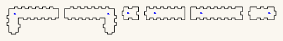

# Bore generator

Turns a bore written as a walk through a lattice of blocks into per-piece laser
cut files, and checks them before you cut. It is what produces the bore in
[trumpet-coiled](https://github.com/Gernreich/trumpet-coiled).

`snakebox.py` is a [Boxes.py](https://github.com/florianfesti/boxes) generator.
It is not standalone — Boxes.py provides the finger joints, burn compensation
and SVG writer.

<!-- readme-only -->
**[Read the writeup](https://gernreich.github.io/bore-generator/)** — the same text as this
page, set for reading, with a table of contents.

**[The rest of the build files](https://gernreich.github.io/)** — every instrument,
generator and tool, indexed.

Built for **[LaserMadeMusic](https://www.youtube.com/@LaserMadeMusic)**, where the cutting
and the playing are shown.

**[Download everything as a ZIP](https://github.com/Gernreich/bore-generator/archive/refs/heads/main.zip)**
— the toolchain and the walks it regresses against.

Split out of `octomino-snakes`, which enumerated and classified the 369 octominoes and is
now archived and private. The bore toolchain kept growing after that work finished, and a
live instrument should not depend on a frozen repository to rebuild its own parts.

<div class="tw">
<table>
<tr>
<td align="center"><a href="coupon-16mm/mating-section-cut-once.svg"></a></td>
</tr>
<tr>
<td align="center"><sub>coupon-16mm/mating-section-cut-once.svg &middot; 483.2 &times; 71.2mm sheet</sub></td>
</tr>
</table>
</div>

## Install

`bore_split.py` looks for Boxes.py at `~/boxes` and its interpreter at
`~/boxes/venv/bin/python`, so cloning there needs no configuration; `SNAKEBOX_BOXES`
and `SNAKEBOX_PY` override both.

```sh
git clone --depth 1 https://github.com/florianfesti/boxes.git ~/boxes
cd ~/boxes
python3 -m venv venv && ./venv/bin/pip install -r requirements.txt
cp /path/to/bore-generator/snakebox.py boxes/generators/
./venv/bin/pip install numpy scipy shapely   # for check.py and nest.py
./venv/bin/python scripts/boxes SnakeBox --path=RRRRRRR --output=out.svg
```

`SnakeBox` then also appears in the local web UI (`scripts/boxesserver`) under
*Misc*.

## Usage

```sh
boxes SnakeBox --path=RRUULLD --blocksize=31 --thickness=3 --burn=0.1 \
      --labels=0 --reference=0 --inner_corners=corner --spacing=0.5
```

| Option | Default | Meaning |
|---|---|---|
| `--path` | `RRRRRRR` | cell-to-cell moves, `U`/`D`/`L`/`R`, case-insensitive; empty for a single cell |
| `--open_faces` | — | single cell only: which two faces are open, two of `N`/`S`/`E`/`W` |
| `--blocksize` | 40 | outer cube edge, mm — used for x, y and z alike |
| `--pin_width` | 12 | width of each connecting tab, mm |
| `--pin_length` | 3 | how far each tab stands proud, mm; **0 disables the coupling** and gives plain butt ends |
| `--pin_play` | 0 | extra width of the notches, per side, mm |
| `--pin_seat` | 0.2 | extra **depth** cut into each notch, mm; stops the tab bottoming out before the two end faces meet |

The trailing flags in the example are the house style used for every part these
repositories cut; keep them if you want new parts to match.

### `--path` is moves, not cells

N moves gives N+1 cells, so an octomino is **7** characters (`RRRRRRR`), not 8.
Length is otherwise unconstrained — a 2-cell stub and a 16-cell run both work,
and both mate with the octomino set.

These are rejected at generate time, each with an explicit message:

| Path | Why |
|---|---|
| `RRL` | revisits a cell |
| `RRUULD` | curls back and touches itself — gives a branch, not a strand |
| `RRUULLD` | the 3×3 ring: encloses a hole |
| `DLDDRRU` | two cells meet only at a corner (see below) |

The last two are the surprising ones: a perfectly legal self-avoiding walk can
still fail, because the *shape* it traces is not a snake.

### `--pin_length=0` gives plain ends

`bore_split.py --flat` passes this for a whole bore.

Set it to 0 for a tube that butts flush against parts with no coupling — an
`ABox` run, for instance. The end profile is then skipped entirely rather than
drawn with zero-length sides: `polygonWall` eats a thickness at each -90 turn
for corner correction, so a zero-length tab side goes *negative* and draws
backwards, leaving two zero-width spikes per end. Skipping the profile is the
only clean way to get a plain edge.

## Single-cell pieces and the elbow

A path always yields a straight-through piece at its two ends, so the shortest
turn a path can express is three cells. For a compact corner, give one cell and
name the open faces:

```sh
boxes SnakeBox --path= --open_faces=S,E --blocksize=31
```

That is a 31mm cube with two adjacent faces open — four parts, each 31.2 × 31.2
at `--pin_length=0`. Opposite faces (`--open_faces=S,N`) give a one-cell straight
instead.

This works because a plate edge is set in by the material thickness only where a
wall actually sits (see *Sizing* below). The earlier rule assumed the two open
faces were at opposite ends of a strand; with adjacent open faces it left the
plate polygon 2t short in both axes — wrong geometry rather than an error.

### An elbow's openings have three sides, not four

On a one-cell elbow the two openings **share an edge**, so each opening's frame
is missing a side: the fourth side of one opening *is* the other opening. The
piece therefore carries 3 tabs and 3 notches, not 4 and 4.

It still mates in any rotation with a normal tube, because the three tabs sit at
the same side midpoints as three of the tube's four notches, and any three of
four symmetric positions engage.

Because those two openings share an edge, the elbow has no material along it,
and neither neighbouring tube reaches it either — one stops at one opening
plane, the other at the other. That leaves the **inside of the bend open by
`t` × `t` across the bore's width**: 3 × 3 × 25 = 225mm^3 at `blocksize=31`.
Modelled as solids it is sealed from outside by the two neighbours' walls and
the elbow's plates, so it is a notch in the bore rather than a leak — but it
shows as a gap where the two neighbouring walls fail to meet.

### The lap closes it, using a tab that did nothing

Of the four tabs at an elbow joint, the one facing the elbow's missing face
meets nothing. `--lap_in` / `--lap_out` name a face whose wall runs `t` past
that opening as a **full-width tongue** instead of a tab: `blocksize - 2t` wide
and `t` deep, which is exactly the missing corner. The next piece's end face
then lands flat on it — two flat faces, 3 × 25mm of glue area. Modelled as
solids, the empty corner goes from 225mm^3 to **0**.

The tongue is only as wide as the wall. Running the wall's whole length on
instead would carry the finger teeth past the joint plane, where they would
foul the next piece's plates.

`bore_split.py` works out which neighbour carries it. The tongue has to land on
a wall rather than a plate, so a straight — whose roll is free — is rolled to
suit; a bend's roll is fixed by its own turn. If neither neighbour of an elbow
can take it on a wall, the splitter says so and leaves that corner open rather
than guessing.

**This costs interchangeability.** A piece carrying a tongue is cut for the
elbow beside it: `straight1_lapW.svg` is not the same part as `straight1.svg`
and the two are not swappable. Pieces without a lap are unaffected.

### A port joint has no corner to leave open

The corner the lap exists to close does not arise at a port: the bore crosses a
face, not an edge shared by two openings, and the turn inside the ported piece
leaves no void.

The joint is a spigot and socket. With the plate stopped short, the outer `t` of
the port cell is empty, so the mating piece slides that far in and seats on
three sides — the two side walls and the end wall. Modelled from what the parts
measure, 261mm^2 of its end frame is backed, of the 336mm^2 total; the missing
side is where the bore carries on, so there is nothing to back it. The mating
piece has no tabs at that end (`--plain_in` / `--plain_out`): a tab would need
material in a band the plate does not reach.

Two things a port forces:

- **Which plate.** Only the face the bore crosses is cut; the other stays solid
  or the bore leaks. The un-mirrored plate is the piece seen from the side given
  by the cross product of the two axes `flat()` keeps — `+x` when the normal is
  x, `-y` for y, `+z` for z — and `--port_mirror` cuts the other one.
- **Which way the tabs face.** A port is a hole, so it can only offer slots. The
  piece feeding it must present tabs, which flips the whole chain to
  `--tabs_at_exit`; every joint still has exactly one tab side and one slot side.
  A bore that would need tabs at both ends of one piece is rejected.

Both change the geometry, so both appear in the file name.

## Everything is black — one cut stage

Nothing is emitted in Boxes.py's green `ETCHING` colour. Across these
repositories **colour is the cut order** — blue engraves, then green → orange →
cyan → black — so a green cell-division line is not a marking, it is a cut that
runs *before* the outline and slices the plate into pieces. The generator used
to draw those divisions and the option has been removed rather than defaulted
off, so it cannot come back by accident.

## Sizing

```
internal bore = blocksize - 2 * thickness
```

So a 25mm bore needs `--blocksize=31` at 3mm material, and a 10mm bore needs
`--blocksize=16`. This is the number people get wrong.

`bore_split.py` takes it as `--blocksize=N` and moves both halves at once — the
pitch the plan is laid out on and the pitch SnakeBox cuts to. `check.py` takes
the same switch and must be given it: `--files` only looks at the sheets as the
machine sees them, never at the pitch, so the gate will report a clean pass
having checked a design you are not cutting.

## Tuning the fit

### Width clearance and depth clearance are different jobs

`pin_play` is a *width* clearance, `pin_seat` a *depth* one. Width decides how
tight the tab is side to side — that is the fit you feel when pushing parts
together. Depth decides whether the two end faces can close at all.

Make the tab and the notch the same depth and the tab bottoms out at the exact
moment the faces meet, so char at the notch floor, a sheet running a little
thick, or any glue holds the seam open — **a visible line along the whole joint
even when the finger joints are tight**. `pin_seat` cuts the notch 0.2mm
deeper than the tab is long, which cannot loosen anything: a tab is held by its
width and its side faces, never by its tip.

The tab itself is untouched by `pin_seat`, so parts cut before it still mate —
an old 3.00mm tab drops into a new 3.20mm notch, and a new tab is identical
to an old one.

`pin_play` widens the notch only; the tab is always exactly `pin_width`. So
clearance per side *is* `pin_play`, and changing it never alters the tab — parts
cut at different play values still interchange.

**The default is 0, and that is deliberate.** Boxes.py's finger joints carry
`play = 0.0` — no designed clearance at all — and rely entirely on `burn` for
fit. The first cut set used `pin_play=0.1`, which stacked 0.1mm per side on top
of already-correct kerf compensation; the finger joints came out good and tight
while the pin/slot was slightly loose. Matching the finger joints at 0 is the
fix. Only raise it if your kerf varies enough that the finger joints are loose
too — and in that case `burn` is the real dial.

octomino-snakes' `cut-files/fit-test/` is a sweep for dialling this in. The **cell count encodes
the setting**, so the pieces stay identifiable after cutting:

| Cells | `pin_play` | Clearance per side |
|---|---|---|
| 2 | 0.10 | 0.10mm (first cut set — measured slightly loose) |
| 3 | 0.05 | 0.05mm |
| 4 | 0.025 | 0.025mm |
| 5 | 0.0 | line-to-line (**current default**) |
| 6 | −0.025 | interference |

Because every tab is identical, any coupon's tab tests any other coupon's notch.

If the *finger joints* are loose too, `pin_play` is the wrong dial — that is
`burn`, which should be half your kerf. Too low a burn loosens everything at
once.

### The 16mm coupon, cut and ready

`PLAY_BY_BORE` is a lookup of what has been cut — **0 at the 25mm bore, 0.025
at the 10mm** — and the direction between those two says required clearance
*falls* as the joint grows. That is a hypothesis with two points on it. The
coupon in [`coupon-16mm/`](coupon-16mm) is the test that settles it, at the
bore where the 48% tab fraction binds and the tab comes out **7.68mm**.

| sheet | cut | |
| --- | --- | --- |
| [`mating-section-cut-once.svg`](coupon-16mm/mating-section-cut-once.svg) | **once** | section 2, the tab side — identical at all three clearances |
| [`notch-A-play0-cut-once.svg`](coupon-16mm/notch-A-play0-cut-once.svg) | once | section 1 at **0** per side |
| [`notch-B-play0.0125-cut-once.svg`](coupon-16mm/notch-B-play0.0125-cut-once.svg) | once | section 1 at **0.0125** |
| [`notch-C-play0.025-cut-once.svg`](coupon-16mm/notch-C-play0.025-cut-once.svg) | once | section 1 at **0.025** |

Cut all four, then try each notch section against the one tab section. **If
take-up scales with the joint, B is the one that fits.**

**The tags are not decoration.** Every part on a notch sheet is engraved `1A`,
`1B` or `1C`, because the three differ by 0.0125mm of notch and otherwise come
off the bed as three identical piles. Without them the test can be performed
and not read.

Whatever fits, add the row to `PLAY_BY_BORE` and stop passing `--play`: the
table is what has been measured, and the flag exists to measure.

## The connector

Both ends are open. One end carries four tabs, the other four matching notches,
one centred on each side of the square end frame — so tubes mate in **any of the
four rotations**.

That works because the end frame is a square annulus of width `thickness`. Its
*partition* into parts is only 2-fold symmetric (the two face plates cover the
middle of the top and bottom sides; the two side walls cover the full left and
right sides), but the annulus *region* is 4-fold symmetric. A tab centred on
each side therefore lands on material in every rotation.

Tabs are sized from `pin_width`, **independent of `blocksize`** as far as
SnakeBox is concerned, so tubes of any bore interconnect. That was the rule
here too until a 16mm block was cut: `pin_width` has to *fit inside the end
frame*, which is `blocksize - 2t`, and the 12mm default does not fit the 10mm
frame a 16mm block leaves. SnakeBox raises rather than cutting something wrong:

    pin_width 12.0 is too wide for the 10.0mm end frame

`bore_split.COMMON` therefore passes `--pin_width` explicitly: **0.48 x the
sound square, floored at the finger-joint tooth** and capped to leave 2mm of
shoulder either side. The floor matters. A tooth is `2 x thickness` and does
**not** shrink with the block, so scaling the tab alone took it below the teeth
— at the 10mm bore the fraction alone gives 4.8mm against a 6mm tooth, which
made the one tab carrying a section seam the *narrowest* feature on the sheet.
With the floor it is 6mm there, level with the teeth, and 12mm at the 25mm bore
where the fraction still wins, so nothing already cut moved.

Tubes of different bore no longer interconnect across that scaling, which costs
nothing: they have different bores. Set `--pin_width` by hand if you want two
sizes to mate and both frames can take the same tab.

**The bore's two outer ends carry no coupling at all.** `plain_ends()` marks the
first piece's entry and the last piece's exit plain, because there is no next
section for them to reach: what meets them is the mouthpiece at one end and the
bell at the other, and both present a flat plate that glues onto the end face. A
tab standing `pin_length` proud of that face holds the plate off it. The
mechanism was already there for ports, which cannot carry a tab either; it just
never fired for the ends of the bore itself.

It shows in the shape and so in the filename — `BDL~a`, `BDL_buttin` — because
the gender of an end changes the part. **A walk whose end sections previously
shared a shape with an inner one will therefore rename two files**, and the
generator does not delete what it stops writing. Check the folder for orphans.

**The notch gets `--pin_play`, the tab does not.** SnakeBox leaves play at 0 on
the grounds that finger joints carry none either, and that does not follow: a
finger joint is a dozen teeth sharing an edge, where the errors average out,
while a section seam is one tab in one notch drawn exactly its own width. That
is a press fit before char, glue, or any kerf the burn allowance did not
predict — section 1 would not enter section 2 on the bench. `COMMON` now passes
**0.025mm per side**, so the notch opens 0.05mm and the tab keeps its full
width.

**That number was cut, not chosen.** Four fits went through 3mm ply at the 10mm
bore: 0.0 would not assemble at all, 0.3 went together with a perceptible rock,
0.1 was very slightly loose, 0.05 fits.

**The 25mm bore, though, assembled fine at 0.0** — the fit it was cut at before
2026-09-01. So the requirement is not absolute and not a constant: the zero
clearance that jams a 6mm tab in a 10mm frame is fine on a 12mm tab in a 25mm
one.

**The 10mm bore is not a small size, it is the extreme one.** Working the sizing
rules across every bore shows they cross at exactly one place: at 10mm the tab is
a full finger-joint tooth *and* the shoulder is at its 2mm minimum, both at once.
Below 10mm the tab has to be cut narrower than a tooth to keep any shoulder at
all. So the joint that jammed is the tightest geometry these rules permit, not a
point somewhere along a range — which is worth knowing before reading much into
one jam.

A third difference goes with it, unrecorded until now: **the 10mm shoulder is
narrower than the material is thick.** 2.00mm of shoulder in 3mm ply is 0.67 of a
ply; the 25mm shoulder is 6.50mm, or 2.17. One is a short-grain sliver, the other
a piece of wood.

**What the two data points do rule out.** Required clearance *falls* as the joint
grows — 0.025mm per side at a 6mm tab, zero at a 12mm one. A constant absolute
clearance would need the same figure at both, and a constant fraction of the tab
would need *more* at 25mm, not less. Both are contradicted. What fits the
direction is a fabrication error that does not scale — kerf variation, ply
thickness, positioning, all fixed in millimetres — against an elastic take-up
that does, so the larger joint simply absorbs what the smaller one cannot.

That is a hypothesis and is marked as one. Note also that the shoulder-stiffness
reading in this repository's earlier note has a sign problem: a narrower shoulder
is *less* stiff and should spread more easily, making the small joint easier to
close rather than harder. It only works as an explanation if the 2mm sliver
splits instead of flexing, which is a different mechanism.

**The test that would settle it** is cheap and does not need a bore: cut a coupon
of just the two mating end frames at an intermediate size — 16mm, where the tab is
7.68mm and the 48% fraction is what binds — at 0.0, 0.0125 and 0.025 per side. If
take-up scales with the joint, the middle value should be the one that fits.
Minutes on the bed, and it turns a lookup into a curve.

So the play is a **lookup of what has been cut, not a curve through it**:

| bore | tab | clearance | |
| ---: | ---: | ---: | --- |
| 25mm | 12.0mm | **0.0** | assembles, fits well |
| 10mm | 6.0mm | **0.05** | assembles, fits well |

A bore not in the table gets the small-joint value, because that is the safe
direction — too loose is a worse joint, too tight is no joint at all. Measure it
and add a row rather than trusting the fallback.

### The tab is centred on the tube, not on the edge it sits in

A plate edge is inset by `t` only where a wall sits. On a straight both
neighbours of an opening are walls, so its edge is `blocksize - 2t` —
symmetric — and centring the tab on that edge also centres it on the tube. On an
**elbow** the two openings share a corner, so one end of the edge loses nothing
and the edge is `blocksize - t`. Centring on it put the tab `t/2` off the tube's
centreline, so it no longer lined up with the notch it had to meet: 1.5mm out
at `blocksize=31, t=3`. The tab is now measured from the tube's centre in every
case.

Walls were never affected — they are drawn across `blocksize - 2t`, symmetric by
construction, which is why only the elbow *plates* were wrong.

## Describing a whole bore

`bore_split.py` turns a bore written as a walk along its centreline into the
pieces that build it. `bore_render.py` draws the same walk in 3D so you can
check it before cutting.

```sh
python3 bore_split.py "N N1 E2 S3 U2 N1 N"
python3 bore_split.py "W D3 E4 N" --write ../../test
```

Turn them around: [`N N1 E2 S3 U2 N1 N`](examples/notation_example.html) ·
[`W D3 E4 N`](examples/three_block_example.html)

Both need `SNAKEBOX_BOXES` pointing at a Boxes.py checkout with `snakebox.py`
installed, unless yours is at `~/boxes`. The report needs neither.

### The notation

Facing north, east is on your right. `N S` away / toward you, `E W` east /
west, `U D` up / down.

You start **half a block in already**, at the centre of block 1, facing the
first term. Every term after that turns you where you stand and then moves you.

| Term | Means |
|---|---|
| `N` first | the way you came in |
| `D3` | turn down where you stand, then move three blocks down |
| `E4` | turn east, then move four blocks east |
| `N` last | turn, then leave that way — the final block becomes an elbow |

A term whose direction matches your heading does not turn, it only travels.
**The turn costs no block**, because it happens in the block you are standing
in — which is what an elbow physically is. So

```
blocks = 1 + the sum of the numbers
```

and every block whose heading changes is an elbow. `E10` followed by `S3` gives
nine blocks of straight, one bending block, then three more straight: you write
the travel you want and the corners take care of themselves. How those blocks are
then grouped into cut pieces is a separate question — see below.

### How it splits into pieces

Every SnakeBox piece is flat: its cells lie on a 2D grid, one block thick. A
bore is three-dimensional only because pieces are rolled relative to each other
at the joints. So **one piece can hold any run of blocks that stays in a single
plane**, however many times it turns, and only a change of plane forces a joint.

A piece is one flat slab, so its **cells** must share a constant coordinate —
that axis is the plane normal. Each opening is then one of two kinds:

- **rim** — the bore arrives along the plane and the opening sits on the edge of
  the slab, opposite its neighbouring cell. An end block that bends cannot have
  one, because its opening would land on a side face.
- **port** — the bore arrives along the plane normal, straight through a face.
  One plate **stops a cell short** rather than being perforated, leaving that
  cell's face open (`--port_in` / `--port_out`, and `--port_mirror` to choose
  which of the two plates). The plate is only as wide as the bore — it sits
  between the side walls — so a bore-sized hole would sever it.

A port is what lets a change of plane happen inside a piece instead of forcing a
separate elbow. [`U U2 E2 S2 U2 U`](examples/test_bore.html) takes three pieces without
one and **two** with it, because blocks 5-9 share a constant x and only their entry leaves that
plane.

The splitter takes the **fewest** legal pieces, as a shortest path over block
positions. Scanning greedily from the left is not enough: it pulls a straight
into the group behind it and then strands the following bend on its own, when
that same straight could have begun the next piece and carried the bend inside
it. On the bore below that greedy choice cost two extra pieces —
`U U2 E2 S2 U2 U` splits into three, not five.

The plane comes from the directions a piece travels through, not from which
coordinates happen to stay constant: a piece whose cells lie on a line has two
constant axes, and only one of them is the plane you want.

```
E E10 S3          14 blocks, 1 piece    east then south: one horizontal plane
E E10 U3          14 blocks, 1 piece    east then up:    one vertical plane
W D3 E4 N          8 blocks, 3 pieces   E1  B1  E2
U U2 E2 S2 U2 U    9 blocks, 3 pieces   B1  E1  B2   (two Ls and an elbow)
N N1 E2 S3 U2 N1 N 10 blocks, 2 pieces  B1  B2
```

The last three, to turn around: [`W D3 E4 N`](examples/three_block_example.html) ·
[`U U2 E2 S2 U2 U`](examples/test_bore.html) ·
[`N N1 E2 S3 U2 N1 N`](examples/notation_example.html)

An L is one piece no matter how long its legs, because it never leaves its
plane. An earlier version cut a piece at every elbow; the last example was nine
pieces under that rule, three under greedy coplanar runs, and two now.

Fewer pieces is not free. The lap that closes the inside of a bend has to land
on a wall, and a straight beside an elbow can be rolled to provide one while a
bend cannot. Merging that straight into a neighbouring L can therefore leave an
elbow with no neighbour able to carry the tongue; the splitter reports which
piece, and leaves that corner open.

Pieces are named for what they are: `straight<n>.svg`, the two elbows above,
and `bend_<path>.svg` for a multi-block piece that turns, where `<path>` is the
`--path` string it is cut from.

### Sheets and labels

Sheets wrap to the **xTool P2S work area, 600 × 308mm**. A piece too big to fit
is still written, but flagged in the cut list. `BED_W` / `BED_H` at the top of
`bore_split.py` set this; note that a single *part* wider than the bed cannot be
wrapped, only reported.

Every part is engraved in blue with its **section number** and nothing else, at
about 1.7mm — `1` on every part of the first section along the bore, `4` on
every part of the fourth. The number is the position in the build, not the
shape, so a loose part tells you where it goes; plates and walls tell themselves
apart by size. Two sections that happen to be the same shape are cut as
separate files rather than sharing one, since sharing would make the number
lie; the cut list says when that has happened.

Files are named `NN_<shape>.svg` for the same reason — `01_` first along the
bore. A piece too tall for the bed is laid on its side, and a piece with more
parts than one sheet holds is split into `_1`, `_2`. The label goes at the
roomiest point **on the part**, not at the centre of its bounding box: an
L-shaped face plate has its bounding-box centre out in the notch, where the
engraving would miss the material altogether. If the roomiest spot is still
tight the label shrinks to fit.

### What it rejects

- a number on the first term — that term is only the way you came in
- a reversal (`E` then `W`), which is not a turn
- turning twice in one block: a block bends once, so the previous term needs at
  least one block of travel
- half blocks written out — entering is implicit now

It **warns** when two terms share a heading with no turn between (`E2 E3`
should be `E5`), and when two elbows meet directly. The latter is sound if both
turns lie in one plane, but if their planes are perpendicular each opening is
missing a different side: only two of the three tabs engage and the spare one
sits in the bore. Put a one-block straight between them.

Note that this notation cannot catch a mistyped direction the way an earlier,
wordier one could — every direction is legal here, since every term may turn.
A wrong letter gives a valid bore, just not yours. Render it before cutting.

### Openings

The entry hole faces backwards along the way you travel, so the two openings
end up opposite each other exactly when the entry and exit **headings match**.
A bore that enters heading north and leaves heading north has openings on
opposing faces; one that leaves east does not.

## Supporting scripts

Python 3. Most are standard library only; `check.py` needs **shapely** and `nest.py`
needs **numpy** and **scipy**. Installing them into the Boxes.py venv means one
interpreter runs everything and no environment variables are needed:

```sh
~/boxes/venv/bin/pip install numpy scipy shapely
~/boxes/venv/bin/python bore_split.py "N N4 U3 E4 U3 S4 U3 W4 U3 N4 N" --write DIR
```

| Script | Does |
|---|---|
| `bore_split.py` | turns a bore in the notation above into per-piece cut files |
| `bore_render.py` | draws a bore in 3D, coloured by piece, joints marked |
| `check.py` | runs every check on a bore's parts and sheets before cutting |
| `assemble.py` | folds a section up as a solid and tests whether its bore is sealed |
| `nest.py` | packs a bore's parts onto sheets four ways and reports the best |
| `piece_render.py` | draws one piece from six angles, each face coloured by the part it is |
| `viewer.py` | writes a bore as a page you can turn around with the mouse |
| `mcwalk.py` | draws a walk under Minecraft's rules, lighting up any cell filled twice |
| `hilbert.py` | emits a Hilbert cube as a walk |
| `regress.py` | runs the gate over every design in `walks/` and the design library |
| `svgpath.py` | reads the point list back out of an SVG path |

`bore_split.py` writes to `../../test` by default — the design library, kept
outside every repository. Override it with an explicit path to `--write`.

## `walks/`

Twenty-four bores kept as one line of notation each, and the corpus `regress.py`
runs the gate over. They exist because every one of them broke something once:

| Group | Files | What they hold onto |
|---|---|---|
| the hooks | `small_hook.txt`, `hook_check.txt`, `hook_return.txt`, `hook_riser.txt`, `double_hook.txt`, `double_hook_tight.txt`, `triple_hook.txt`, `triple_hook_up.txt`, `quad_hook.txt`, `quad_hook_deep.txt`, `quad_hook_full.txt`, `quad_hook_round.txt`, `five_loop.txt`, `five_loop_up.txt` | a spiral tightening one loop at a time, each variant a step where the split or the fit changed |
| the telescopes | `telescope_spiral.txt`, `wide_telescope.txt`, `nested_spiral.txt` | coils that grow as they climb, the widest sheets the bed will take |
| the Hilbert cubes | `hilbert_cube.txt`, `hilbert_open.txt`, `hilbert_snorkel.txt` | a space-filling curve at three scales — the densest walks here, and the ones that fold hardest |
| the singles | `three_block_turn.txt`, `corner_to_corner.txt`, `metre_spring.txt` | the three-block minimum on its own, a walk that turns at every opportunity, and a metre of bore in a spring |
| the built one | `trumpet_switchback.txt` | the walk in [trumpet-switchback](https://github.com/Gernreich/trumpet-switchback), cut and assembled at both 25mm and 10mm — the only one here that exists in wood |

Run them all:

```sh
~/boxes/venv/bin/python regress.py
```

Add one by dropping a `.txt` in beside the others. `regress.py` picks it up by
name.

## Verifying

There is no test runner; correctness is checked by re-deriving geometry from the
output. Invariants that have caught real bugs:

- walls == boundary runs − 2; perimeter == 18 units for any 8-cell path
- convex corners − reflex corners == 4 for any rectilinear outline
- exactly 4 tabs and 4 notches per box, one width each across the whole set
- all four tabs at the *same* end — the count alone does not prove this

`SnakeBox` was validated against Boxes.py's own `Tetris` generator: the L, I and
S tetrominoes are themselves snakes, and `SnakeBox` reproduces
`Tetris --shape=L/I/S` with byte-identical cut paths.

### Two parsing traps

If you write your own checker: burn compensation leaves sub-0.1mm steps at
every corner, and `polygonWall` splits edges into *collinear* pieces at corner
corrections. Naive vertex-pattern matching reads both as spurious features.
Merge collinear runs first.

Released under [CC0 1.0](LICENSE).
