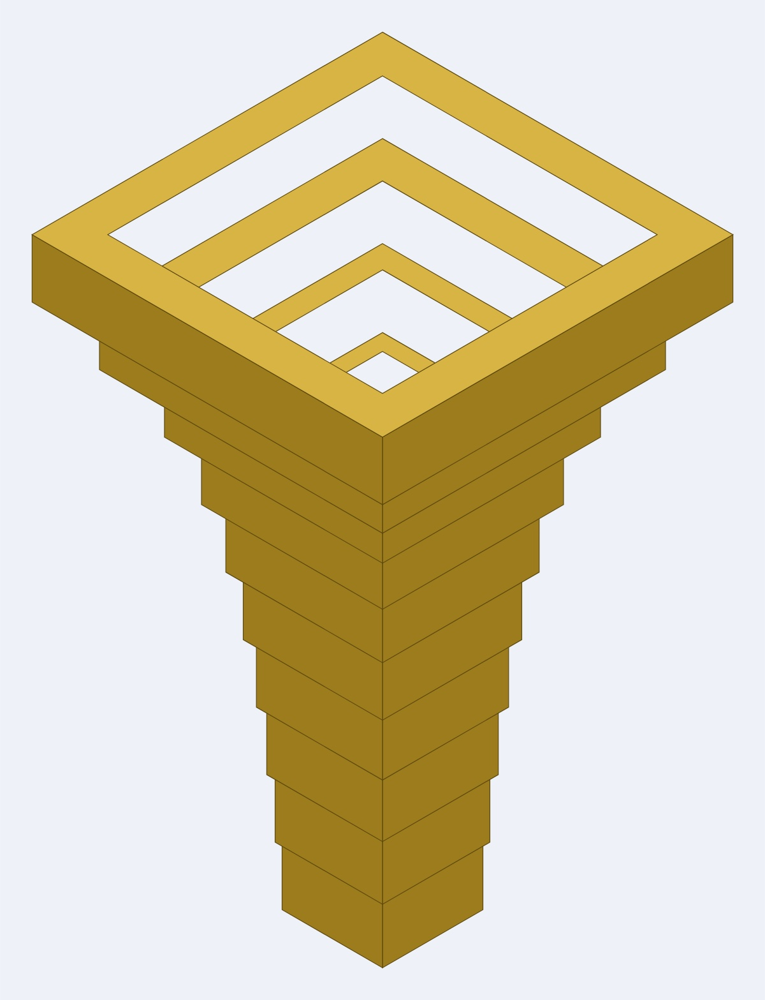
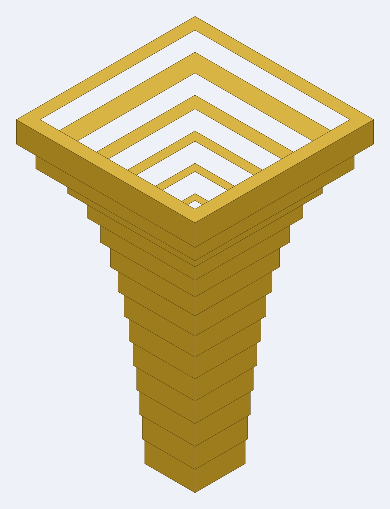

# Coiled trumpet

A trumpet bore in 25 × 25mm square section that **coils flat and drops twice**, built from
eight box sections with **no elbows at all** — every turn happens inside a section, so
every joint is a flat face glued to a flat face. Companion to the
[octagonal trumpet](https://github.com/Gernreich/trumpet-octagonal) and the
[octagonal torus](https://github.com/Gernreich/torus-octagonal), which share the same
25 × 25mm channel. Cut from 3mm Baltic birch plywood, millimetre-true at
`1 user unit = 1mm`, so it prints and cuts at real size.

The **bell** and the **mouthpiece** are here too — neither is touched by the way the bore
turns, so the flare and the cup are the same parts whatever shape the tube takes.

**[Turn the bore around in your browser](trumpet-coiled.html)** — drag to rotate,
colour it by direction or by section, and step through the blocks one at a time.

Built for **[LaserMadeMusic](https://www.youtube.com/@LaserMadeMusic)**, where the cutting
and the playing are shown.

## Why no elbows

An **elbow** is a single block that turns. It sounds like the cheap way to bend a bore and
it is the expensive one, because its opening frame has **three sides, not four**. The
missing side has to be made up by the sections either side of it: both get a flattened
plate to butt-glue against, both need a tongue to locate on, and a 3 × 3 × 25mm void is
left unfilled inside the corner. Flat-to-flat gluing is the whole difficulty of building
one of these, and every elbow adds three more of the worst kind.

Turning the bore *inside* a section costs nothing extra to cut and glues like any other
seam. So this design pays in blocks to buy zero elbows — and the price turns out to be
small.

## The design is one line

```
N N3 U6 W5 N10 E5 D3 S8 W3 D3 N12 N
```

The first letter is the way in, the last is the way out, and each term between them turns
where you stand and then travels *n* blocks. The bore is **1 + the sum of the numbers** —
59 blocks, 1829mm of centreline. Axes match Minecraft, where the shape was laid out block
by block: `U`/`D` are up and down, `N` is away from the noon sun, `E`/`W` follow the
sunrise.

That single line is the entire specification. It is stored in the viewer page, and the cut
files regenerate from it.

## One block is 31mm, not 25

A block is 25 × 25 × 25mm of sound space wrapped in **3mm of wall**, so its outside is
31mm. Coring it out for the bore to pass through does not shrink it — the four walls stay
and the block still takes up 31mm. **A run of N blocks is 31N mm long.** Getting this
wrong shortens every section by 6mm, and it is the error that invalidated the original
build sheet on the elbow version.

## When a turn is free, and when it costs

A section can carry a turn internally only if it has a straight block on each side of the
corner that its neighbours have not claimed. That gives one rule, and it has to be checked
over **every window of three consecutive terms**:

> If three consecutive terms name **three different axes**, the middle one must be **3 or
> more**. If they name only two axes, the turn is a **fold** and costs nothing at any
> spacing.

Folds are free; coils are not. A run that stays in one plane can turn as often and as
tightly as it likes and still come out as a single piece. The moment a third axis joins
in, the middle leg needs three blocks — one arm each side and the corner between them.

For this walk:

| window | axes | verdict |
| --- | --- | --- |
| `N3 U6 W5` | three | middle 6 — fine |
| `U6 W5 N10` | three | middle 5 — fine |
| `W5 N10 E5` | two | fold, free |
| `N10 E5 D3` | three | middle 5 — fine |
| `E5 D3 S8` | three | middle 3 — the minimum |
| `D3 S8 W3` | three | middle 8 — fine |
| `S8 W3 D3` | three | middle 3 — the minimum |
| `W3 D3 N12` | three | middle 3 — the minimum |

Three legs sit exactly on the floor of 3. Shorten any of them and an elbow appears.

## The sections

Eight sections, cut as nine files — section 3 does not fit one sheet of the bed and comes
as two.

| # | blocks | in → out | plate | parts | sheet |
| ---: | --- | --- | --- | ---: | --- |
| 1 | 1–5 | N → U | 2 × 4 bl | 6 | 521 × 151mm |
| 2 | 6–11 | U → W | 2 × 5 bl | 6 | 583 × 182mm |
| 3 | 12–26 | W → E | 4 × 11 bl | 8 | 482 × 288 + 556 × 96mm |
| 4 | 27–31 | E → D | 4 × 2 bl | 6 | 498 × 127mm |
| 5 | 32–34 | D → S | 2 × 2 bl | 6 | 403 × 86mm |
| 6 | 35–42 | S → W | 2 × 7 bl | 6 | 505 × 285mm |
| 7 | 43–45 | W → D | 2 × 2 bl | 6 | 403 × 86mm |
| 8 | 46–59 | D → N | 2 × 13 bl | 6 | 522 × 247mm |

**50 flat parts**, every one engraved with its section number, because the sections only go
together in one order. Sheets are sized for a 600 × 308mm bed.

The section names describe the shape as a run of moves across the flat plate —
`08_bend_LDDDDDDDDDDDD` is one step left and then twelve down — so a file name and
the part it cuts are the same description.

## The mouthpiece

**`mouthpiece/mouthpiece-parts.svg`** — 23 rings, 69mm stacked. **The 31mm square plate
joins the bore**, so from the lip end the profile is: a **cup** of 16 rings narrowing
10.06 -> 4.06mm over 48mm, the **throat** at 3.66mm (a #27 drill, the standard trumpet
size), then a **backbore** of 6 rings opening 5 -> 25mm over 18mm.

**These rings stack; they do not telescope.** The wall is 3.00mm at every one of the 23
stations, the throat included, so what varies is the shared face: 2.80mm per side through
the cup, 2.33 across the throat, 1.00 at the five 4mm steps. No ring can drop through the
one below. The bell inverts it — a fixed 1.5mm lap and a wall that varies with the flare.

<p>

</p>

`mouthpiece/mouthpiece-section.svg` is the axial section; both it and the view above are
display drawings, not cut files. `mouthpiece.py` generates the parts and
`mouthpiece-view.py` the view.

## The bell

Four bells, all fitting over the tube's 31mm outside. **The rings telescope**: each ring's
aperture is the one below it plus the radius gained, lapped by a fixed 1.5mm for glue, so
the bore widens at every joint and the wall varies with the flare.

| File | Rings | Build | Pieces | Rim diameter | Angle | Sheet, per pass |
| --- | ---: | --- | ---: | ---: | --- | --- |
| `bell-trumpet-10rings.svg` | 10 | 7 ply | **70** | 126.0 | 2.9° -> 30.0° | 265 × 262mm |
| `bell-trumpet-14rings.svg` | 14 | 5 ply | **70** | 126.0 | 2.8° -> 36.8° | 307 × 326mm |
| `bell-trumpet-17rings.svg` | 17 | 4 ply | **68** | 126.0 | 2.8° -> 38.8° | 347 × 133mm |
| `bell-trumpet-67rings.svg` | 67 | 1 ply | **67** | 145.7 | 9.5° -> 50.8° | 995 × 693mm |

**Each file draws every ring once — cut it as many times as the `Build` column says.** The
10-ring bell is 7 laminations a ring: 7 passes, 70 pieces, glued into ten 21mm bands. Cut
it once and you get a 30mm bell instead of a 210mm one. Only the 67-ring file is one pass.

All four come to 67–70 pieces, so a coarse bell is not less cutting — it is smaller sheets,
about 0.49 m² of 3mm ply against the 67-ring's 0.69 m².

<p>




</p>

*10, 14, 17 and 67 rings — the same 201mm Bessel horn sampled at four resolutions.*

The four files are a **Bessel horn**, gamma about 0.7 — the standard model for a trumpet
bell — from a 31mm throat over 201mm. The ply is 3mm so a ring rises 3mm; fewer rings means
each ring is several identical laminations glued into a single band.

Counter-intuitively, **coarser is better at the throat and worse at the rim**: at 12mm of
rise a 2mm minimum wall is 2.8°, where at 3mm it is stuck at 9.5°. The 17-ring is the
balance, and its nested sheet fits a 400mm bed with room to spare. `bell.py` generates all
four. `bell-section.py` draws the axial sections — `bell-trumpet-10rings-section.svg`,
`bell-trumpet-14rings-section.svg`, `bell-trumpet-17rings-section.svg` and
`bell-trumpet-67rings-section.svg` — `bell-view.py` the assembled views, `ramp_bell.py`
applies the cut-order colour, and `verify_bell.py` checks an edited sheet.

## Cutting

**Colour is the cut order**, shared across all these repositories: **blue engraves, black
cuts.** In the bore nets, blue lays the section number onto every part first and black
frees it.

`bell-trumpet-17rings.svg` is the exception — its rings ramp from `#000000` on the smallest
to `#ff0000` on the rim, one stage per ring, so the cut runs smallest first and no nested
part is freed before its own outline is cut. Its numbers are blue, engraved. Give it an
explicit operation: a per-colour job silently skips any colour left unmapped.

Standard settings, and they must stay uniform across the set — mixing `burn` changes finger
joint fit while every outside dimension still matches, which no drawing shows:

```
blocksize 31mm   thickness 3mm   burn 0.1   spacing 0.5   inner corners: corner
```

## Regenerating

The walk lives in the viewer page, so the page is a complete record of the design and the
cut files come back from it alone:

```sh
cd ../octomino-snakes/generator
python3 bore_split.py ../../trumpet-coiled/trumpet-coiled.html \
    --write ../../trumpet-coiled
```

That rewrites every file in this directory and runs the full gate as it goes — 253 checks
on this design, none failing. To try a change without writing anything:

```sh
python3 bore_split.py --no-write "N N3 U6 W5 N10 E5 D3 S8 W3 D3 N12 N"
```

The generator is [octomino-snakes](https://github.com/Gernreich/octomino-snakes), which
builds the nets on top of **boxes.py** (Florian Festi, GPL 3.0,
<https://www.festi.info/boxes.py/>).

## A warning about Minecraft

The shape is designed in Minecraft, and Minecraft **cannot check it**. It fills cells, and
filling a cell that is already full is a no-op — no warning, no sound, nothing — so a walk
that runs back through itself still builds into a connected tunnel that looks correct from
every angle.

That is fatal here and harmless there. In Minecraft the cells are scenery; in a bore they
are the air path, and a cell filled twice is a junction where the air arrives with two ways
out. There is no box section with an opening in four sides, so the crossing cannot be cut
at all. A walk that builds cleanly in Minecraft may still be impossible.

## Files

**The bore** — nine nets, 8 sections, 50 pieces:
`01_bend_DDDR.svg`, `02_bend_UUUUL.svg`, `03_bend_LLLDDDDDDDDDDR_1.svg`,
`03_bend_LLLDDDDDDDDDDR_2.svg`, `04_bend_RRRD.svg`, `05_bend_LU.svg`,
`06_bend_UUUUUUL.svg`, `07_bend_LD.svg`, `08_bend_LDDDDDDDDDDDD.svg`.
`trumpet-coiled.html` holds the walk they are generated from.

**The bell** — `bell-trumpet-10rings.svg`, `bell-trumpet-14rings.svg`,
`bell-trumpet-17rings.svg`, `bell-trumpet-67rings.svg`, generated by `bell.py`.
`ramp_bell.py` applies the cut-order colour; `verify_bell.py` checks an edited sheet for
ring sizes, the 1.5mm lap, nesting order and overlapping cuts.

**The mouthpiece** — `mouthpiece-parts.svg`, generated by `mouthpiece.py`.

**Display only, never cut** — the axial sections `bell-trumpet-10rings-section.svg`,
`bell-trumpet-14rings-section.svg`, `bell-trumpet-17rings-section.svg`,
`bell-trumpet-67rings-section.svg` and `mouthpiece-section.svg`, drawn by
`bell-section.py`; the assembled views `bell-trumpet-10rings-view.jpg`,
`bell-trumpet-14rings-view.jpg`, `bell-trumpet-17rings-view.jpg`,
`bell-trumpet-67rings-view.jpg` and `mouthpiece-view.jpg`, from `bell-view.py` and
`mouthpiece-view.py`.

Released under [CC0 1.0](LICENSE).

Bore nets are generated by
[octomino-snakes](https://github.com/Gernreich/octomino-snakes) on top of
**[boxes.py](https://www.festi.info/boxes.py/)** by **Florian Festi** (GPL 3.0),
`burn=0.1`, blocksize 31mm. The bells, the mouthpiece and the text are CC0.
