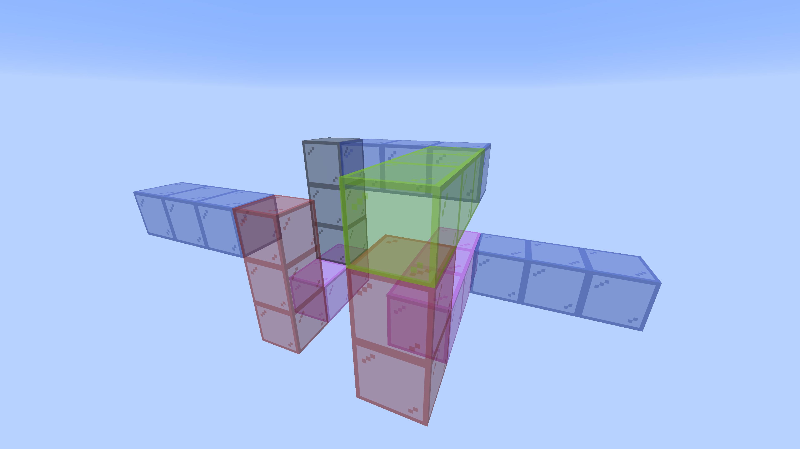

# trumpet-switchback

A trumpet whose bore **folds back on itself twice**, which is what the
switchback in the name means. **`25mm/` and `10mm/` each hold a complete
instrument**: a mouthpiece, a bore of six laser-cut sections that assemble into
one sealed passage, and a bell. Cut one folder and you have everything; nothing
but the size differs between them.

    N N1 W3 U2 E3 N3 D3 W2 U3 N1

The walk folds back twice inside a 4×4 cross-section and runs nine blocks
north overall. Every section is a **bend** — there are no elbows, so no
section needs a neighbour's plate flattened and butt-glued to it, which is
the difficulty of the whole build.

<p>

</p>

*The walk laid out block by block in Minecraft, coloured by direction — blue
north, green east, magenta west, red up, grey down. The same walk serves both
sizes; only the block it is drawn on changes.*

<!-- readme-only -->
**[Read the writeup](https://gernreich.github.io/trumpet-switchback/)** — the
same text as this page, set for reading, with a table of contents.

**[The repository](https://github.com/Gernreich/trumpet-switchback)** — both
instruments and the page they regenerate from.

**[Download everything as a ZIP](https://github.com/Gernreich/trumpet-switchback/archive/refs/heads/main.zip)**
— GitHub builds it from `main` on every push, so it is never out of date.

Built for **[LaserMadeMusic](https://www.youtube.com/@LaserMadeMusic)**, where the cutting
and the playing are shown.

**[The rest of the build files](https://gernreich.github.io/)** — every instrument,
generator and tool, indexed.

## What is in each folder

    25mm/                        10mm/
      mouthpiece/                  mouthpiece/
      bore/                        bore/
      bell/                        bell/

Three parts, cut in that order and glued mouthpiece to bore to bell. Every
sheet in a folder belongs to the same instrument, so there is no mixing to get
wrong — see [Do not mix the folders](#do-not-mix-the-folders) for the one thing
that can still bite.

## The two sizes

A block is the sound square plus a wall each side, so **the bore is the block
less 6mm** in 3mm stock. That one number is the whole difference between the
folders:

| | `25mm/` | `10mm/` |
|---|---|---|
| bore | 25mm square | 10mm square |
| block | 31mm | 16mm |
| centreline | 682mm | 352mm |
| switch | *(default)* | `--blocksize=16` |

Everything else is shared: the same walk, the same six sections in the same
order, the same shapes, the same in and out faces, no elbows in either.

The two bores use the same six filenames — see
[Do not mix the folders](#do-not-mix-the-folders).

The tab is the one thing that does not simply scale. SnakeBox's `--pin_width`
defaults to 12mm, chosen when 31 was the only block there was, and 12mm does
not fit inside the 10mm end frame at all — it raises rather than cuts.
`bore-generator` sets it to 0.48 of the sound square **but never below the
finger joint tooth**, which is `2 × thickness` and does not shrink with the
block: 12mm at 25, 6mm at 10. Without that floor the fraction alone gives
4.8mm at 10 — a seam tab narrower than the ordinary teeth beside it, which is
exactly backwards.

The notch it enters is opened by **0.025mm per side**, so the joint carries
0.05mm of clearance; the tab keeps its full width. That figure comes off the
bench rather than out of the air — 0.3mm rocked and 0.1mm was still slightly
loose when the same joint was cut at this bore in
**[bore-stretched](https://github.com/Gernreich/bore-stretched)**. SnakeBox leaves that at zero, on the grounds that finger joints have no
play either, but a finger joint is a dozen teeth sharing an edge and a section
seam is one tab in one notch. At zero the two are drawn the same width and the
sections will not go together.

### 25mm bore — `25mm/bore/`

Cut in order; each part is engraved with its section number.

| # | file | blocks | in | out | plate | shape | sheet |
|---|---|---|---|---|---|---|---|
| 1 | [`25mm/bore/01_bend_DL_buttin.svg`](25mm/bore/01_bend_DL_buttin.svg) | 1-3 | N | W | 2×2 | BDL~a | 391×86mm |
| 2 | [`25mm/bore/02_bend_LUUR.svg`](25mm/bore/02_bend_LUUR.svg) | 4-8 | W | E | 2×3 | BLUUR | 554×117mm |
| 3 | [`25mm/bore/03_bend_RD.svg`](25mm/bore/03_bend_RD.svg) | 9-11 | E | N | 2×2 | BRD | 403×86mm |
| 4 | [`25mm/bore/04_bend_DL.svg`](25mm/bore/04_bend_DL.svg) | 12-14 | N | D | 2×2 | BDL | 397×89mm |
| 5 | [`25mm/bore/05_bend_DLLU.svg`](25mm/bore/05_bend_DLLU.svg) | 15-19 | D | U | 3×2 | BDLLU | 537×130mm |
| 6 | [`25mm/bore/06_bend_RD_buttout.svg`](25mm/bore/06_bend_RD_buttout.svg) | 20-22 | U | N | 2×2 | BRD~b | 403×86mm |

### 10mm bore — `10mm/bore/`

| # | file | blocks | in | out | plate | shape | sheet |
|---|---|---|---|---|---|---|---|
| 1 | [`10mm/bore/01_bend_DL_buttin.svg`](10mm/bore/01_bend_DL_buttin.svg) | 1-3 | N | W | 2×2 | BDL~a | 241×56mm |
| 2 | [`10mm/bore/02_bend_LUUR.svg`](10mm/bore/02_bend_LUUR.svg) | 4-8 | W | E | 2×3 | BLUUR | 344×72mm |
| 3 | [`10mm/bore/03_bend_RD.svg`](10mm/bore/03_bend_RD.svg) | 9-11 | E | N | 2×2 | BRD | 253×56mm |
| 4 | [`10mm/bore/04_bend_DL.svg`](10mm/bore/04_bend_DL.svg) | 12-14 | N | D | 2×2 | BDL | 247×59mm |
| 5 | [`10mm/bore/05_bend_DLLU.svg`](10mm/bore/05_bend_DLLU.svg) | 15-19 | D | U | 3×2 | BDLLU | 370×59mm |
| 6 | [`10mm/bore/06_bend_RD_buttout.svg`](10mm/bore/06_bend_RD_buttout.svg) | 20-22 | U | N | 2×2 | BRD~b | 253×56mm |

### Either size

**The two end sections are flat where they face outward.** Every seam inside
the bore is a tab entering a notch, but sections 1 and 6 have nothing beyond
them to couple to — what meets them is the mouthpiece at one end and the bell
at the other, and both present a flat plate that glues straight onto the end
face. A tab standing 3mm proud of that face would hold the plate off it. So
section 1's mouth end and section 6's bell end are plain edges, which is what
`~a` and `~b` mark in the shape column and `_buttin` / `_buttout` in the
filename.

Sections 1 and 4 were the same shape until then, and 3 and 6 with them; the
flat ends make all six distinct. They were always cut separately anyway, so
each carries its own engraved number and the assembly order stays readable on
the bench.

Both end sections are a single straight block either side of their turn, which
is the least a section can have.

## The mouthpiece and the bell

| | `25mm/` | `10mm/` |
|---|---|---|
| mouthpiece | [`mouthpiece-trumpet-parts.svg`](25mm/mouthpiece/mouthpiece-trumpet-parts.svg) | [`mouthpiece-round-bore10-parts.svg`](10mm/mouthpiece/mouthpiece-round-bore10-parts.svg) |
| station one | 25mm square in a 31mm plate | 10mm square in a 16mm plate |
| rim | ø16.5mm | ø17mm |
| bell | [`bell-round-17rings.svg`](25mm/bell/bell-round-17rings.svg) | [`bell-round-152mm-bore10-17rings.svg`](10mm/bell/bell-round-152mm-bore10-17rings.svg) |
| bell length | 204mm | 153mm |
| bell mouth | ø138.8 of air in a ø144.8 rim | ø80.0 of air in a ø86.0 rim |
| **cut the bell sheet** | **4 times** | **3 times** |
| bell pieces | 68 | 51 |

**The bell sheet draws every ring once and is cut more than once.** A ring is a
stack of 3mm laminations — four of them at 25mm, three at 10mm — so the sheet
goes through the machine that many times and you glue the copies up into one
ring. Cut it once and you get a **51mm bell** instead of 204 or 153, which is
the single most expensive mistake in this build. The bore is not like this:
those six sheets are cut once each.

Both bells are 17 rings and both seat on the ring below over **3.00mm per side
at every joint** — see
[bell-round.py](https://github.com/Gernreich/trumpet-parts/blob/main/bell/bell-round.py).
Each mouthpiece is 30 rings of one lamination, so its sheet is cut once.
Both mouthpieces use the `trumpet` layout, which spends its length on the
backbore and keeps a short cup, as a real one does.

Each also carries a section drawing — an axial slice showing the bore climbing
one staircase and the outside climbing another:
[`25mm/bell/bell-round-17rings-section.svg`](25mm/bell/bell-round-17rings-section.svg),
[`25mm/mouthpiece/mouthpiece-trumpet-parts-section.svg`](25mm/mouthpiece/mouthpiece-trumpet-parts-section.svg),
[`10mm/bell/bell-round-152mm-bore10-17rings-section.svg`](10mm/bell/bell-round-152mm-bore10-17rings-section.svg)
and
[`10mm/mouthpiece/mouthpiece-round-bore10-parts-section.svg`](10mm/mouthpiece/mouthpiece-round-bore10-parts-section.svg).
**Those are display only — never cut one.**

**All four sheets live here outright.** Nothing else cuts them: the 10mm pair
suit no other bore, and the 25mm pair — the 17-ring bell and the
`--layout=trumpet` mouthpiece — are cut by this instrument alone.
`trumpet-coiled` and `trumpet-octagonal` take a different bell and the
`asbuilt` mouthpiece, which stay in
**[trumpet-parts](https://github.com/Gernreich/trumpet-parts)** along with the
generators. So there is one copy of each sheet and nothing to keep in step.

**Every ring is engraved with its hex index**, 0 on the smallest. Rings glued
in the wrong order is rings unglued, and consecutive rings differ by about two
millimetres — nothing you can judge by eye once the parts are off the bed.

## Do not mix the folders

The two bores use the **same six filenames**, because the shapes really are the
same and only the pitch differs. Nothing stops you cutting from the wrong
folder, and the parts will look plausible right up until they do not fit. The
sheet size is the tell — section 4, say, is **247×59mm on the small bore and
397×89mm on the large** — and the tables above carry every sheet at both sizes.

The bell and the mouthpiece are safe: their filenames differ between sizes.

## The pages

Each bore folder carries its own viewer —
[`25mm/bore/bore.html`](25mm/bore/bore.html) and
[`10mm/bore/bore.html`](10mm/bore/bore.html). Drag to turn, colour by
direction or by section, and a slider follows the bore from the mouth. They are
the same page with different measurements in them, and self-contained apart
from their fonts, so either opens from a checkout as readily as from the
published page.

## Where it comes from

Generated by
**[bore-generator](https://github.com/Gernreich/bore-generator)**, which holds
the walk as `walks/trumpet_switchback.txt` and gates these files in
`regress.py` as two designs, one per size. Its
[CLAUDE.md](https://github.com/Gernreich/bore-generator/blob/main/CLAUDE.md)
carries the conventions — the elbow rule, which switches reach the gate, and why
a regenerated folder is not a checked one. To rebuild and check:

```sh
cd ../bore-generator
W="$(cat walks/trumpet_switchback.txt)"
D=../trumpet-switchback
python3 bore_split.py --refuse-elbows "$W" --write $D/25mm/bore
python3 bore_split.py --blocksize=16 --refuse-elbows "$W" --write $D/10mm/bore
~/boxes/venv/bin/python regress.py trumpet
```

`--refuse-elbows` is not optional here: it stops before writing anything if the
walk would cost an elbow. Neither is the folder on the end of each line — leave
`--blocksize=16` off the second command and it quietly fills `10mm/bore/` with
full-size parts under the small set's names, which no drawing shows.

The mouthpiece and the bell come from
**[trumpet-parts](https://github.com/Gernreich/trumpet-parts)**, not from here:

```sh
cd ../trumpet-parts/mouthpiece
python3 mouthpiece-round.py --bore=10 --rim=17 --layout=trumpet
cd ../bell && python3 bell-round.py 17 --bore=10 --length=152 --mouth=80
```

Both sizes gate at **194 checks, 0 failed**. Nothing here should be cut from a
file that has not passed it.

## Licence

CC0 1.0 Universal. See `LICENSE`.
