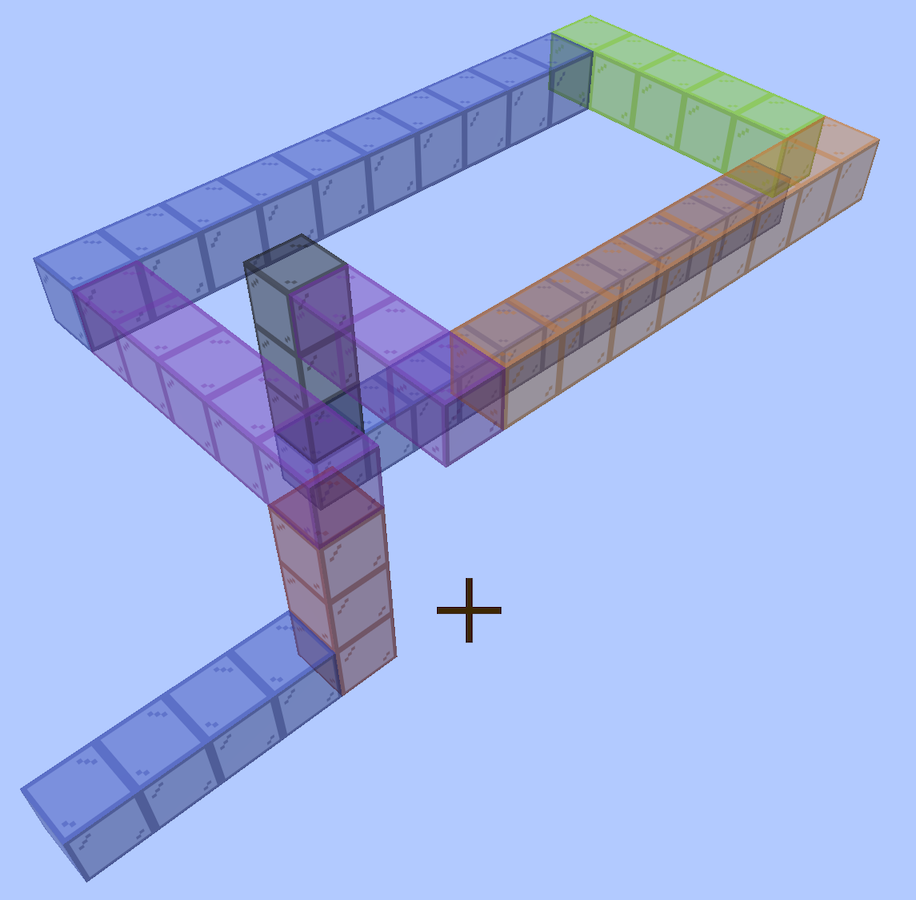
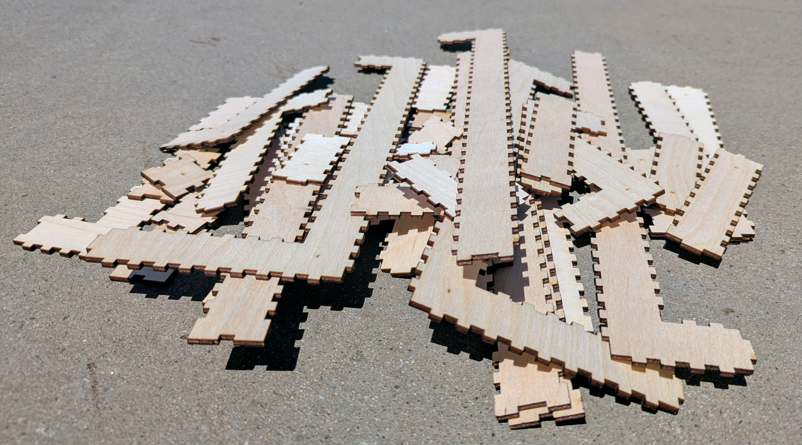

# Coiled trumpet

A trumpet bore in 25 × 25mm square section that **coils flat and drops twice**, built from
eight box sections with **no elbows at all** — every turn happens inside a section, so
every joint is a flat face glued to a flat face. Companion to the
[octagonal trumpet](https://github.com/Gernreich/trumpet-octagonal) and the
[octagonal torus](https://github.com/Gernreich/torus-octagonal), which share the same
25 × 25mm channel. Cut from 3mm Baltic birch plywood, millimetre-true at
`1 user unit = 1mm`, so it prints and cuts at real size.

The **bell** and the **mouthpiece** live in
**[trumpet-parts](https://github.com/Gernreich/trumpet-parts)**, shared with the
[octagonal trumpet](https://github.com/Gernreich/trumpet-octagonal). Neither is touched by
the way the bore turns, so only the tube belongs to an instrument.

The bore was designed **in Minecraft**, laid out block by block and coloured by direction —
which is where the notation comes from, and why the axes match the game's: `U`/`D` up and
down, `N` away from the noon sun, `E`/`W` along the sunrise.

<p>

</p>

*The same walk, built in glass. Each colour is one direction, the same palette the viewer
uses — so a run's colour tells you which way it goes.*

<p>

</p>

*The whole bore, cut and not yet glued — 50 plates across 8 sections. **Every edge is a
finger joint and every face is flat.** The stepped pieces are where the bore turns: a
section carries its own corner, so nothing here is an elbow.*

**[Read the writeup](https://gernreich.github.io/trumpet-coiled/)** — the same text as
this page, set for reading, with a table of contents.

**[Turn the bore around in your browser](bore/bore.html)** — drag to rotate,
colour it by direction or by section, and step through the blocks one at a time.

Built for **[LaserMadeMusic](https://www.youtube.com/@LaserMadeMusic)**, where the cutting
and the playing are shown.

**[The rest of the build files](https://gernreich.github.io/)** — every instrument,
generator and tool, indexed.

## Why no elbows

An **elbow** is a single block that turns. It sounds like the cheap way to bend a bore and
it is the expensive one, because its opening frame has **three sides, not four**. The
missing side has to be made up by the sections either side of it: both get a flattened
plate to butt-glue against, both need a tongue to locate on, and a 3 × 3 × 25mm void is
left unfilled inside the corner. Flat-to-flat gluing is the whole difficulty of building
one of these, and every elbow adds three more of the worst kind.

Turning the bore *inside* a section costs nothing extra to cut and glues like any other
seam. So this design pays in blocks to buy zero elbows — and the price turns out to be
small.

## The design is one line

```
N N3 U6 W5 N10 E5 D3 S8 W3 D3 N12 N
```

The first letter is the way in, the last is the way out, and each term between them turns
where you stand and then travels *n* blocks. The bore is **1 + the sum of the numbers** —
59 blocks, 1829mm of centreline.

That single line is the entire specification. It is stored in the viewer page, and the cut
files regenerate from it.

## One block is 31mm, not 25

A block is 25 × 25 × 25mm of sound space wrapped in **3mm of wall**, so its outside is
31mm. Coring it out for the bore to pass through does not shrink it — the four walls stay
and the block still takes up 31mm. **A run of N blocks is 31N mm long.**

## When a turn is free, and when it costs

A section can carry a turn internally only if it has a straight block on each side of the
corner that its neighbours have not claimed. That gives one rule, and it has to be checked
over **every window of three consecutive terms**:

> If three consecutive terms name **three different axes**, the middle one must be **3 or
> more**. If they name only two axes, the turn is a **fold** and costs nothing at any
> spacing.

Folds are free; coils are not. A run that stays in one plane can turn as often and as
tightly as it likes and still come out as a single piece. The moment a third axis joins
in, the middle leg needs three blocks — one arm each side and the corner between them.

For this walk:

| window | axes | verdict |
| --- | --- | --- |
| `N3 U6 W5` | three | middle 6 — fine |
| `U6 W5 N10` | three | middle 5 — fine |
| `W5 N10 E5` | two | fold, free |
| `N10 E5 D3` | three | middle 5 — fine |
| `E5 D3 S8` | three | middle 3 — the minimum |
| `D3 S8 W3` | three | middle 8 — fine |
| `S8 W3 D3` | three | middle 3 — the minimum |
| `W3 D3 N12` | three | middle 3 — the minimum |

Three legs sit exactly on the floor of 3. Shorten any of them and an elbow appears.

## The sections

Eight sections, cut as nine files — section 3 does not fit one sheet of the bed and comes
as two.

| # | blocks | in → out | plate | parts | sheet |
| ---: | --- | --- | --- | ---: | --- |
| 1 | 1–5 | N → U | 2 × 4 bl | 6 | 521 × 151mm |
| 2 | 6–11 | U → W | 2 × 5 bl | 6 | 583 × 182mm |
| 3 | 12–26 | W → E | 4 × 11 bl | 8 | 482 × 288 + 556 × 96mm |
| 4 | 27–31 | E → D | 4 × 2 bl | 6 | 498 × 127mm |
| 5 | 32–34 | D → S | 2 × 2 bl | 6 | 403 × 86mm |
| 6 | 35–42 | S → W | 2 × 7 bl | 6 | 505 × 285mm |
| 7 | 43–45 | W → D | 2 × 2 bl | 6 | 403 × 86mm |
| 8 | 46–59 | D → N | 2 × 13 bl | 6 | 522 × 247mm |

**50 flat parts**, every one engraved with its section number, because the sections only go
together in one order. Sheets are sized for a 600 × 308mm bed.

The section names describe the shape as a run of moves across the flat plate —
`08_bend_LDDDDDDDDDDDD` is one step left and then twelve down — so a file name and
the part it cuts are the same description.

## Cutting

**Colour is the cut order**, shared across all these repositories: **blue engraves, black
cuts.** Blue lays the section number onto every part first and black frees it. Nothing
here uses the middle stages.

Standard settings, and they must stay uniform across the set — mixing `burn` changes finger
joint fit while every outside dimension still matches, which no drawing shows:

```
blocksize 31mm   thickness 3mm   burn 0.1   spacing 0.5   inner corners: corner
```

## Regenerating

The walk lives in the viewer page, so the page is a complete record of the design and the
cut files come back from it alone:

```sh
cd ../bore-generator
python3 bore_split.py ../trumpet-coiled/bore/bore.html \
    --write ../trumpet-coiled/bore
```

That rewrites every file in this directory and runs the full gate as it goes — 253 checks
on this design, none failing. To try a change without writing anything:

```sh
python3 bore_split.py --no-write "N N3 U6 W5 N10 E5 D3 S8 W3 D3 N12 N"
```

The generator is [bore-generator](https://github.com/Gernreich/bore-generator), which
builds the nets on top of **boxes.py** (Florian Festi, GPL 3.0,
<https://www.festi.info/boxes.py/>).

## Files

**The bore**, in `bore/` — nine nets, 8 sections, 50 pieces:
`01_bend_DDDR.svg`, `02_bend_UUUUL.svg`, `03_bend_LLLDDDDDDDDDDR_1.svg`,
`03_bend_LLLDDDDDDDDDDR_2.svg`, `04_bend_RRRD.svg`, `05_bend_LU.svg`,
`06_bend_UUUUUUL.svg`, `07_bend_LD.svg`, `08_bend_LDDDDDDDDDDDD.svg`.
`bore.html` sits beside them and holds the walk they are generated from.

The bell, the mouthpiece and their section drawings are in
[trumpet-parts](https://github.com/Gernreich/trumpet-parts).

Released under [CC0 1.0](LICENSE).

Bore nets are generated by
[bore-generator](https://github.com/Gernreich/bore-generator) on top of
**[boxes.py](https://www.festi.info/boxes.py/)** by **Florian Festi** (GPL 3.0),
`burn=0.1`, blocksize 31mm. The bells, the mouthpiece and the text are CC0.
