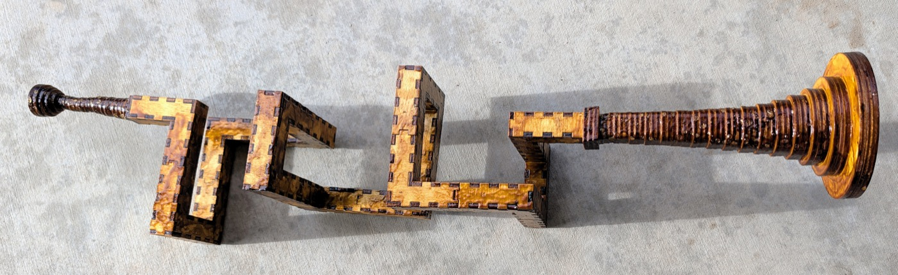

# Trumpet

A trumpet cut flat from 3mm birch ply and glued into a tube. The airway is a
**10mm square** running through **16mm blocks** — 10mm of air inside 3mm walls —
and it never changes section from the mouthpiece to the throat of the bell.

The instrument that has been built is a **coil of 1096mm in 12 sections**, with a
**72mm** mouthpiece at one end and a 153mm bell at the other. It winds 1080° —
**three** turns, right-handed, about a north–south axis. Everything else here is
a candidate for the next one.

The mouthpiece on this instrument is 24 rings where the design cuts 30 — 72mm
rather than 90 — so it is the instrument that is short, not the drawing. The
coil winds three whole turns: its walk is `W U E D` three times over, and its
first and last blocks sit on the same cross-section point, which a fractional
number of turns cannot do.

<!-- readme-only -->
**[Read the writeup](https://gernreich.github.io/trumpet/)**



---

## The idea

A brass instrument is a long tube you have to fit into a small space. A trumpet
could be done with three tight bends and a lot of drawn brass. This does it by
**treating the tube as a walk through a lattice of cubes** — north three, up two,
east three — and cutting each run of that walk as a flat-packed box.

The walk is written down. `N1 W3 U2 E3 N3 D3 W2 U3 N3 E3 D2 W3 N3 U3 E2 D3 N1`
is the bore of the built instrument: the first term is the direction you enter
from and how far you go before anything turns, and every term after it turns
where you stand and then moves that many blocks. A generator turns that string
into cut files, checks them, and tells you what you are holding.

```
python3 tools/bore_split.py "N1 W3 U2 E3 N3 D3 W2 U3 N3 E3 D2 W3 N3 U3 E2 D3 N1" \
    --bore=10 --straight=30 --no-write
```

**A turn costs no block.** It happens inside the block you arrived at, and you
start in block 1 rather than in front of it, so the tube is `1 + the sum of the
numbers` blocks long. Forty-three steps, forty-four blocks.

## What decides a good bore

Three things, and they pull against each other.

**Length, because length is pitch.** A tube twice as long sounds an octave
lower. The four coils in `parts/bore/concept/walk/no-elbows/coil/fold2-long-straight/`
are one shape cut at four lengths — **274, 548, 822 and 1096mm, an exact
1:2:3:4** — and the built instrument is the longest of them.

> Their folder names say 0.75, 1.5, 2.25 and 3 turns, and measurement agrees:
> the four sweep 270°, 540°, 810° and 1080° about the coil axis, one group of
> three lateral legs being three-quarters of a turn. Both the lengths and the
> turn counts are exact.

**Section, because section is tone.** The airway must stay 10mm square the whole
way. That is what makes a turn expensive: a block that turns has openings on two
different faces and both must sit square, so **a turning block has to stay
cubic** even when the straights are stretched. The built bore is 28 straight
blocks at 30mm and 16 turns at 16mm, which is where its 1096mm comes from.

**Elbows, because an elbow is a bad part.** An elbow is a turn stranded as its
own one-block piece: three tabs, fiddly to hold, weak at the seam. Every walk
offered here is elbow-free, and `--refuse-elbows` stops the generator before it
writes anything rather than handing you a folder to inspect.

> Fewest elbows is **not** cheapest in parts. Measured over 133 walks it trades
> 23 elbows for 46 more pieces, because folding a turn into a bend adds two walls
> to that bend while a lone elbow is only four parts for its whole block. It is
> still the right trade: parts are cheap and bad seams are not.

## The instrument, end to end

| | length | what it is |
| --- | ---: | --- |
| mouthpiece | 90mm | 30 rings, 10mm square → ø3.66 throat → ø17 lip |
| bore | 1096mm | 44 blocks, 12 sections, no elbows |
| bell | 153mm | 17 rings, 10mm square → ø86 rim (ø80 of air) |
| **total** | **1339mm** | |

For scale, a B♭ trumpet is about 1480mm of tube, so this is a little shorter and
should sit a little higher.

**It plays. One of its notes is F4** — 349.2 Hz, measured off the built
instrument.

**Do not size a bore from a pipe formula.** F4 lands on no simple mode of a
1.339m tube: it is 2.73 times the open-open fundamental (`c/2L` = 128 Hz) and
5.45 times the closed-open one (`c/4L` = 64 Hz), and neither multiple is a whole
number. That is what a bell and a mouthpiece do — they pull the resonances away
from where a plain tube would put them, and how far is not something either
formula knows. Length still sets the register, which is why the four truncations
above are worth cutting: their bores are an exact 1:2:3:4, so what the ends
actually contribute is measurable rather than assumed.

### The mouthpiece and the bell are shared

Neither end is touched by the way a bore turns, so **only the tube belongs to an
instrument**. Both live in `parts/`, both take `--bore`, and both close onto the
same 10mm square in a 16mm face.

```sh
cd parts/mouthpiece && python3 mouthpiece-round.py
cd parts/bell && python3 bell-round.py 17 --bore=10 --length=152 --mouth=80
```

Each rebuilds its shipped sheet byte for byte and writes it into its own
`cut-files/`.

The joint at each end is a **square annulus of ply 3mm wide** — 10mm inside,
16mm out. The bell's ring 0 is a flange that covers all of it: a 22mm square with
a 10mm hole, standing 3mm proud. The throat is taken from the bore's channel, so
ring 0 lands squarely on the face it seals.

## A page for each

Each of these carries the walk it is cut from, its blocks and centreline, its
sections with their plates and sheet sizes, and a link to a viewer you can turn
at tab size. The first is the instrument that exists; the next three are
candidates that have not been cut. The spiral after them is neither: it is a
swept curve rather than a walk, and it has been cut and glued up.

| | |
| --- | --- |
| **[the three-turn trumpet](three-turn/)** | 44 blocks, 1096mm, twelve sections — **the one that was built**, and it plays |
| **[the switchback trumpet](switchback/)** | 22 blocks, 352mm, six sections — folds back on itself twice |
| **[the greek spiral](greek-spiral/)** | 68 blocks, 1088mm, **one** section — a flat meander, the only bore here that cuts in one piece |
| **[the spiral bore](ribbon-spiral/)** | 17 facets of 45°, 1000mm, R34.7 to R112.9 — a swept curve rather than a walk, cut in ply and glued up |
| **[the bell and the mouthpiece](ends/)** | The two ends, shared by every bore on the 10mm channel |

## Cutting

Everything is **3mm birch ply on an xTool P2S**, 600 × 308mm of bed.

**Colour is the cut order**: blue engraves, then green → orange → cyan → black,
and black frees the part. On a bore section blue engraves the section number and
black cuts. On a ring, orange takes the aperture first so the hole is in before
the outline releases the part.

**Every part is engraved with its section number**, and two sections of the same
shape are cut separately so each carries its own. The built bore has two such
pairs — 3 and 6, and 7 and 10.

Sections are numbered from the mouthpiece. Assemble in order; the first piece is
marked `buttin` and the last `buttout`, and those two are the only plain ends.

## What is in here

```
built/              the two instruments that exist in wood, a folder each
parts/
  mouthpiece/       the shared mouthpiece, and its viewers
  bell/             the shared bell, square and square-to-round
  bore/concept/     every candidate, none of them cut
tools/              the generator, the gate, and the walks
three-turn/         a page each: the two instruments that exist, the
switchback/         two candidates worth reading about on their own,
greek-spiral/       and the two ends they all share
ribbon-spiral/
ends/
```

The five page directories hold nothing but a `README.md` and the `index.html`
rendered from it. Every number on them is read back out of the walk, the cut
file or the generator, never typed from memory.

**`built/` is what exists and `concept/` is what is drawn**, and the line between
them is wood. Two instruments are in `built/`: the three-turn coil, shellacked
and playing, and the 1000mm spiral, glued up in bare ply. Both carry a bell and
a mouthpiece, which is what earns the word — an instrument is a bore *and* its
two ends, so `built/` sits at the root rather than inside `parts/bore/`. Nothing
in `concept/` has been cut, and a folder there is not a promise that it should
be.

A walk is filed under three facts about it, each of which costs something at the
machine:

```
concept/walk/<elbows|no-elbows>/<family>/<contact|no-contact>/<design>
```

**Family** is the shape — `coil`, `meander`, `spiral`, `hilbert` — and it is
measured, not asserted: a coil has an axis it advances along and a handedness,
a meander has neither.

**Elbows** is whether any turn is stranded as its own one-block piece.

**Contact** is whether the bore comes back and touches itself: two blocks
sharing a face, an edge or a vertex without being joined along the tube. At a
face the airway runs past 6mm of wood rather than 3; at an edge or a vertex the
two walls meet on a line or a point, which is a place for the glue-up to go out
of true. None of it is fatal, and a tight coil can rarely avoid it — but it is a
property of the walk, decided before anything is cut, so the library sorts on it.

> Blocks **two** apart along the walk are edge-neighbours at every single turn —
> that is the geometry of turning, not the bore touching itself, and counting it
> would file every walk here under `contact`. So contact is measured between
> blocks **three or more** apart. Of the 20 designs filed this way, 11 are both
> elbow-free and touch-free, 7 touch, and 2 are touch-free but carry an elbow.
> `coil/search/` is not among them: it is the search that the promoted coils came
> out of, and its ten remaining walks split 4 to 6 across the line.

### Three ways to make a tube

They are not variations on each other. The section grows at every turn, and how
much is the whole comparison:

| | curve | section at a turn | why it exists |
| --- | --- | --- | --- |
| lattice walk | 90° turns | +41.4% | fits a walk into a box |
| swept curve | any planar curve | +3.5% at 30° | constant section on a smooth curve |

The lattice walk is what the built instrument uses, and it is the more expensive
per turn by a wide margin. It buys packing: a walk folds into a box a smooth
curve does not reach.

A third construction, a closed ring of facets, is not listed: a loop has no ends,
so it cannot take a mouthpiece or a bell. `ribbon_bore.py --shape=torus` still
draws one, because the mitring it needs is the same mitring every other shape
needs, but nothing here is a candidate bore.

The **swept curve** (`parts/bore/concept/swept-curve/`) sweeps a rectangle along a
planar curve, so two faces are flat and two are faceted. **Eleven designs are
drawn** — counted as folders holding cut files, which is the only count that
cannot drift from what is on disk: a serpentine and an opposed pair at 1000mm,
three spirals at 1000, 1458 and 1767mm, a volute at 1180mm, a wave at 836mm, two
double spirals at 1506 and 1000mm, and two double-spiral halftests at 196 and
240mm. The halftests are there to try the joint, not to be an instrument.

One of them is in ply, and it is **not in that folder any more**: the 1000mm
spiral — `R35to113`, 17 facets of 45°, its radius growing 34.7 → 112.9mm — has
had both its sheets cut, the bore glued up and both ends fitted, so it is filed
with the instruments in `built/` while its swept-curve siblings stay under
`concept/`. `ribbon_bore.py` draws it either way. It carries **[a page of
its own](ribbon-spiral/)**: the cheek and its 149 mortices, the two panels the
square port costs, and what shellac is for on a glue-up with this many joints.

The **double spiral** is the one shape here whose two arms interleave. Two of
them half a turn apart about one centre, crossed in the middle by a straight:
1506.4mm of bore on a cheek plate 232 × 241mm. Arm B *is* arm A turned through
180°, so the gap between neighbouring passes is half the radial pitch by
construction rather than by search — choose the pitch and you have chosen the
gap. The cheek is a 20mm band, so 46mm a turn is the first pitch that clears it,
and the two passes come out 23.00mm apart.

Its centreline is the one that does not step its arc radius facet by facet.
Vertices sit on a smooth spiral `r = R0 + b·θ` sampled every facet instead, which
the note beside `--shape=spiral` warns is the construction `offset()` cannot
follow. That note is about offsetting a smooth curve and faceting the result
separately; offsetting the faceted centreline is exact whatever placed its
vertices, and the airway measures 4.4e-14mm from the bore here. The stepping
construction could not be used anyway — its polar radius advances 7mm across one
half turn and 32mm across another, and two arms interleaved at those radii
collide.

The open middle is forced, not styled. A straight through the centre is tangent
to the crossover arc only when the arm's inner end lies outside **twice** that
arc's radius, so R62 against R30 is a floor; tighten it and the inner panels stop
being long enough to hold a 6mm tooth, and the generator refuses rather than
drawing one. Both openings still come out on the rim facing opposite ways, which
is what a total turning of 0° buys.

Two arms wound into each other is the one arrangement here that could have run
the bore back into itself, and the check that would have caught it already
existed: *the cheek outline does not cross itself*. It passes, at 85 edges and no
crossings.

The **short double spiral** is that same spiral with five facets taken off each
arm, 14 down to 9 — a trim and not a redraw: the pitch, the R62 start and the
R30 crossover are the shipped design's, and the shape stays point-symmetric
because a facet comes off each end at once. 1000.0mm on a 186 × 236mm cheek,
against 1506.4mm on 232 × 241mm.

The **facet** is what quantises it and the **lead** is what lands it. Nine
facets an arm give 956.0mm and ten give 1058.2, so the trim alone cannot reach
1000 —
whole facets are the only thing that comes off, and they come off about 100mm
at a time. The last 44mm is bought by lengthening both leads from 20mm to 42:
the lead is a straight run tangent to the arm, so it adds length without moving
a single facet of the coil. That it costs 42mm of straight tail at each rim is
the price, and the reason the figure is quoted as a choice and not as what the
generator happened to give.

It is also the only design in this repository **ported at both ends**. One
square port is bought by folding the mouth lead into the facet it already lies
on, and the far end wants the same thing: `--port-both` folds the tail lead
too, or the second port lands on that lead's single tooth and the generator
refuses — the refusal being correct, and the reason the flag does the fold
rather than overruling the check. Two ports mean two open ends, so `--cap`
draws two caps. The mortices do not move: against the unmerged build, four
lead panels drop and not one surviving tooth shifts.

It ships **two port arrangements**, and the difference is which joints have been
made before. The one-port set is the spiral's: the port takes the bell, its stub
is capped, and the far rim end stays open so the mouthpiece seats on the tube
end, where four walls grip the full 16mm. That is the arrangement standing in
ply on **[the spiral bore's page](ribbon-spiral/)**, where the photograph shows
the bell on its throat in the port and the mouthpiece out on the tail.

The two-port set below is the one where the mouthpiece must seat in a port —
10 × 10mm through a single 3mm cheek — which a bell has done and a mouthpiece
has not. A bell sits where it is put; a
mouthpiece takes lip pressure.

In the two-port set the ports are **split between the two cheeks**, which is
what makes it an instrument rather than a coil with holes in it. A port through
both cheeks is a socket right through, and the side you are not using is an
open hole to plug; two of those are waste. `--port-per-cheek` puts one port on
each sheet instead — `cheek-a` carries the mouth, `cheek-b` the far end, each
cut once — so the mouthpiece **enters one face and the bell leaves the other**,
at points 222.5mm apart and exactly opposite through the coil's centre. The
openings are no longer in the plane at all, so the total-turning-zero argument
that sets the two rim ends on opposite headings has stopped describing how it
is played: those ends are the capped ones. `rotatable()` reports that the two
sheets are the same part half a turn apart, to 9e-16mm — so one sheet cut twice
with one turned round would also do, at the price of engraved numbers upside
down on the turned one.

### The coil search

`parts/bore/concept/walk/no-elbows/coil/` holds seven coils promoted out of a
search of seventeen, each because it won a category outright or tied for one.
Each carries a `why.txt` with its walk, its win, and twelve metrics recomputed
from that walk:

| coil | wins |
| --- | --- |
| `3x3-51` | smallest box, 459 |
| `2x2-134` | fewest distinct shapes, 2 |
| `3x7-22` | tightest spiral, 34mm rise per turn |
| `5x5-50` | least tube per turn, 15.1 blocks |
| `4x4-50` | calmest bore, 20.40 turns/m (tied) |
| `5x8-18` | largest average plate, 3009mm²; and two ties |
| `3x3-54` | fewest pieces, 30 (tied); smallest box with no shared wall (tied) |

Ten of the seventeen remain in `search/`, and a coil listed above as tied is
tied with one of them. The scoring is in
[`search/SCORING.md`](parts/bore/concept/walk/no-elbows/coil/search/SCORING.md).

## The toolchain

`tools/` ships no cut files of its own — only the thing that makes them.

**The finger joints are not ours.** Every section net is drawn by
**[Boxes.py](https://github.com/florianfesti/boxes)**, Florian Festi's box
generator, which supplies the finger joints, the burn compensation and the SVG
writer; `snakeboxvar.py` is a generator that installs into a Boxes.py checkout
rather than a program of its own. Boxes.py is GPL-3.0-or-later and is not
included here — you supply the checkout. Because `snakeboxvar.py` subclasses it,
that file and the two that import it are GPL-3.0-or-later as well; the licence
note at the end says which three and why.

| | |
| --- | --- |
| `bore_split.py` | the generator: a walk in, per-piece cut files out |
| `check.py` | the gate, run automatically by every `--write` |
| `regress.py` | runs the gate over the whole library |
| `snakeboxvar.py` | the Boxes.py generator that draws a section |
| `svgpath.py` | reads back what was written — the gate parses the file, not the plan |
| `assemble.py` | builds a section as a solid and asks directly whether it is sealed, rather than testing a proxy |
| `viewer.py` | the one page builder; every viewer page here comes from it |
| `bore_render.py` | stills, coloured by piece or by direction of travel |
| `nest.py` | lays parts out on a sheet |
| `hilbert.py` | writes a Hilbert cube as a walk |
| `mcwalk.py` | renders a walk that crosses itself, which the generator refuses |
| `sizes.py` | one design at more than one block pitch, in one viewer |

## The gate

Nothing here is cut on trust. `bore_split.py --write` runs the checks itself and
refuses to leave a folder unchecked; `tools/regress.py` runs the whole library.

```sh
cd tools && ~/Software/boxes/venv/bin/python regress.py
```

**27 designs, 0 failed, 7767 individual checks.**

It checks that each section closes round its bore, that the assembled bore is one
sealed passage, that its volume matches the walk, that no feature is under 1.5mm,
that every sheet fits the bed, that every seam is one tab side and one slot side,
and that no engraving lands in a slot or off the material.

**Use the virtualenv python.** `check.py` imports shapely, which the system
`python3` does not have — and `bore_split.py` writes every file *before* it gates
them, so a system-python `--write` leaves a folder of finished-looking cut files
and a traceback where the gate should be.

> A passing gate means no check failed, not that the part is buildable: its
> floor is 1.5mm, and nothing compares a feature against the features beside it.

## Clearance

`PLAY_BY_BORE` is a lookup of what has actually been cut, not a curve through it,
and it has **one row**: 0.025mm per side at the 10mm bore. A bore that is not in
the table gets that value too — too loose is a worse joint than too tight is no
joint — and says on stderr that it is guessing, because a guess that looks like a
measurement is the dangerous kind.

Whether the requirement is absolute, a fraction of the tab, or something else
takes a second bore to say, and there is one bore. The comment above
`pin_play()`'s table in `tools/bore_split.py` sets out the coupon that
would settle it, and `--play` is the flag that cuts it.

## Building it

1. Cut the twelve bore sections from
   `built/coil-fold2-long-straight-3t/cut-files/`, in order.
2. Cut the bell — 17 rings, **three passes**, 51 pieces. Cut once and you get a
   51mm stub instead of a 153mm bell.
3. Cut the mouthpiece — 30 rings, one pass.
4. Glue each bore section closed, then join them in engraved order.
5. Stack the bell rings from ring 0 at the bore; stack the mouthpiece rings from
   ring 0 likewise. Both are engraved in hex, `0` at the bore.
6. **Do not finish the mouthpiece.** It goes to the lip as it comes off the
   sheet — the staircase is not sanded, the rim is not filled, and the
   instrument that plays has had neither.

**The bell is cut more than once.** Each sheet draws every ring once, and the
`x3` in its filename is how many times the sheet goes through the machine.

## More, and licence

Built for **[LaserMadeMusic](https://www.youtube.com/@LaserMadeMusic)**, where the
cutting and the playing are shown.

**[The rest of the build files](https://gernreich.github.io/)** — every instrument,
each with its own writeup.

**[Download everything as a ZIP](https://github.com/Gernreich/trumpet/archive/refs/heads/main.zip)**
— the generators, the gate, every cut file and every candidate bore.

**Almost all of this is [CC0 1.0](LICENSE)** — every cut file, every walk, every
page, and every generator but three. `parts/LICENSE` and `tools/LICENSE` are
copies of that text, so a directory taken on its own still carries it.

**Three files in `tools/` are GPL-3.0-or-later instead**, and each carries a
header saying so: `snakeboxvar.py`, `check.py` and `piece_render.py`.
`snakeboxvar.py` subclasses **[Boxes.py](https://github.com/florianfesti/boxes)**'s
`Boxes` class — it is a Boxes.py generator, the same shape as the ones that ship
with Boxes.py, all of which are GPL — and the other two import it, so all three
link against GPL code when they run. Boxes.py is Florian Festi's, GPL-3.0-or-later,
with no linking exception, so those three cannot offer more than it does.
[`tools/LICENSE.GPL-3.0.txt`](tools/LICENSE.GPL-3.0.txt) is the licence they are
under.

**Nothing you cut is affected.** Boxes.py is not in this repository, and none of
it reaches the sheets: a cut file is geometry, with no Boxes.py code or metadata
in it. The SVGs, the walks and the writeups are CC0 like the rest.

The walks are laid out in **Minecraft** before they are cut, and the lattice
screenshots on the bore pages are frames from it.
