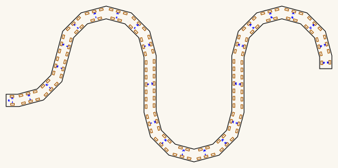
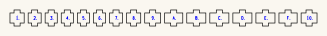
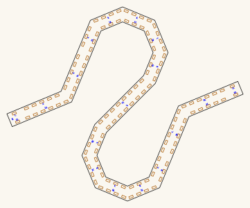
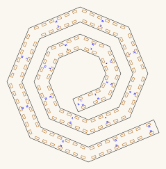
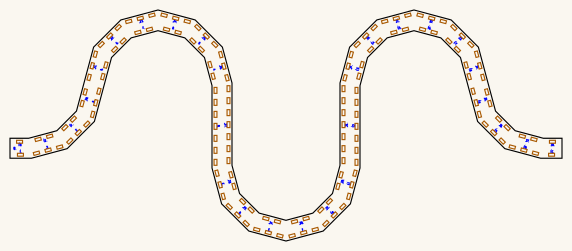

# bore-ribbon

A bore of **constant cross-section** swept along a **planar curve** — cut flat,
assembled with finger joints, no bending and no lamination.

    python3 ribbon_bore.py

<!-- readme-only -->
**[Read the writeup](https://gernreich.github.io/trumpet/bores/ribbon/)** — the same
text as this page, set for reading, with a table of contents.

**[Download the whole repository as a ZIP](https://github.com/Gernreich/trumpet/archive/refs/heads/main.zip)**
— every bore, not this one alone; the ribbon sheets are under
`bores/ribbon/`. GitHub builds it from `main` on every push, so it is never out of date.

Built for **[LaserMadeMusic](https://www.youtube.com/@LaserMadeMusic)**, where
the cutting and the playing are shown.

**[The rest of the build files](https://gernreich.github.io/)** — every
instrument, generator and tool, indexed.

## See it before you cut it

Three pages, self-contained, **drag to turn**. Colour by face to read the
construction, or by facet to follow the bore along its length; the reveal
slider builds it up a facet at a time.

| | |
| --- | --- |
| [`ribbon-coupon-bore10-30deg-R30.html`](ribbon-coupon-bore10-30deg-R30.html) | the 180° coupon |
| [`ribbon-serpentine-bore10-30deg-3lobes-R72.html`](ribbon-serpentine-bore10-30deg-3lobes-R72.html) | the metre serpentine, 10mm bore |
| [`ribbon-opposed-bore10-30deg-3lobes-R64.html`](ribbon-opposed-bore10-30deg-3lobes-R64.html) | the metre again, with mouth and bell facing opposite ways |
| [`ribbon-spiral-bore10-45deg-R35to113.html`](ribbon-spiral-bore10-45deg-R35to113.html) | the metre wound flat, two and a bit turns |
| [`ribbon-wave-bore10-45deg-5arc.html`](ribbon-wave-bore10-45deg-5arc.html) | a trough and a crest, level at both ends |
| [`ribbon-spiral-bore10-45deg-R74to144.html`](ribbon-spiral-bore10-45deg-R74to144.html) | the coil at two turns, 1458.2mm |
| [`ribbon-spiral-bore10-45deg-R36to144.html`](ribbon-spiral-bore10-45deg-R36to144.html) | the coil at three turns, 1766.9mm |
| [`ribbon-traced-volute-bore10-45deg.html`](ribbon-traced-volute-bore10-45deg.html) | the volute, drawn but not cuttable |

Two more draw instruments that live in other repositories, and they are the only
things here still cut at 25mm — the objects are, so their names say so.

[`ribbon-torus-bore25-45deg-R76.html`](ribbon-torus-bore25-45deg-R76.html) is
**[torus-octagonal](https://gernreich.github.io/trumpet/torus/) drawn as a
ribbon bore**, which is what it is — a closed ring of eight 45° facets at
25 × 25mm. Extrapolated from that repository's own cut file: a centreline
octagon of circumradius 76.4696 puts the airway between apothems 58.149 and
83.149, which is what its verifier measures. `--shape=torus`.

[`ribbon-traced-octagonal-trumpet-bore25-45deg.html`](ribbon-traced-octagonal-trumpet-bore25-45deg.html)
is **[trumpet-octagonal](https://gernreich.github.io/trumpet/bores/octagonal/)'s
bore** — 1107.9mm at 25 × 25mm, twelve facets of 45°, and **traced, not
generated**. That sheet's band is hand-authored and its curve is not written
down as parameters anywhere, so the centreline was measured off a trace of the
cheek and kept, with how it was taken, in
[`traces/octagonal-trumpet.json`](traces/octagonal-trumpet.json). The trace
confirmed the model rather than only supplying it: the strip came out **31.2mm
wide** — 25mm of airway with a 3mm wall each side — the turns came out at
**±45°**, the same facet angle as the torus, and the total turning came out at
**0°**, which is what a bore between a mouthpiece and a bell must do — see
[the opposed-ends bore](#the-opposed-ends-bore) below for why the number is 0
and not 180. Treat
its length as ±1%: the traced width scatters 30.7 to 35.5mm about that nominal.

Built by [`ribbon_view.py`](ribbon_view.py), which takes the same flags as the
generator, plus `--trace=`. **It draws the airway, not the plywood** — the passage the air takes,
bounded by the wall faces. That is the point: the section this repository is
about is a property of the airway, and the bore was cut 3mm narrow for a week
because nothing drew the space inside it.

The cut files themselves are hairlines on no background, which is close to
invisible on a page, so `previews/` holds a readable rendering of each — same
geometry and same cut order, thicker strokes, inks darkened to stay legible on
a light ground.

## How this differs from the other two

| | curve | section | joints |
| --- | --- | --- | --- |
| [`bore-generator`](https://github.com/Gernreich/trumpet/tree/main/tools) | 90° lattice turns | +41.4% at each turn | finger joints |
| [`torus-octagonal`](https://github.com/Gernreich/trumpet/tree/main/torus) | a circle, 45° facets | +8.2% at each facet | finger joints |
| **`bore-ribbon`** | **any planar curve** | **+3.5% at 30°, and the dial goes lower** | **finger joints** |

## Why a planar curve

Sweep a rectangle along a curve that lies in a plane, with one axis normal to
that plane, and the duct has **two flat faces and two cylindrical ones**. The
flat pair are the cheeks and come straight off the sheet. The curved pair are
the whole problem: 3mm birch will not bend to these radii, so they are
faceted — short flat panels, each finger-jointed into both cheeks.

The section is exactly `bore × bore` along every facet. At each facet joint the
walls mitre and the area there is `bore² / cos(φ/2)`:

| facet angle | area at the joint | |
| --- | ---: | --- |
| 90° | +41.4% | a turn in the Minecraft lattice |
| 45° | +8.2% | the octagonal torus |
| **30°** | **+3.5%** | **this coupon** |
| 15° | +0.9% | |

That is the whole design dial. It trades against part count, and against how
short the inner panels get.

## What limits the bend

A wall is `thickness` thick and its slot is centred on the offset line, so the
line the walls are offset to is **`(bore + thickness)/2`, not `bore/2`** — put
them at `bore/2` and each wall intrudes half its thickness, leaving an airway
of `bore − thickness`. That is exactly what this generator did until
2026-09-03: a bore asked to be 10 × 10 came out **7 × 10**.

The inner wall's radius is `R − (bore + thickness)/2`, so there is no bore at
all below that. Long before it, the inner panel gets too short to carry a
finger: a Boxes.py tooth is `2 × thickness` and **does not scale with the
bore**. At the 10mm bore and 30° facets:

| R / bore | R | inner panel | holds a 6mm tooth? |
| ---: | ---: | ---: | --- |
| 2.0 | 20mm | 6.87mm | no |
| 2.5 | 25mm | 9.46mm | no |
| 2.61 | 26.1mm | 10.03mm | just |
| **3.0** | **30mm** | **12.05mm** | **yes, with 3.02mm shoulders** |
| 4.0 | 40mm | 17.22mm | yes |

The coupon is R 30 for that reason, not because the bend wants to be that
open. A real Bb trumpet runs R/bore ≈ 4.3.

## The 1000mm serpentine

    python3 ribbon_bore.py --shape=serpentine

**1000.0mm of centreline**, in **52 parts on 2 files** — three half-circles of
R 71.754 joined by 90mm straight runs, with a 20mm lead at each end.

Only the 10mm bore is cut here. `--bore` still takes any value, so another is one
command away and git has the 25mm sheets that were here until 2026-09-03.

| | 10 × 10mm |
| --- | --- |
| the cheek, **cut twice** | [`bore10`](ribbon-serpentine-bore10-30deg-3lobes-R72-1000mm-cheek-x2-cut-files.svg) |
| the panels, cut once | [`bore10`](ribbon-serpentine-bore10-30deg-3lobes-R72-1000mm-panels-cut-files.svg) |
| section | 100mm² |
| cheek band | 20mm |
| R / bore | 7.2 |
| play, per side | 0.025mm |
| shortest panel | 19.14mm |
| slots per cheek | 145 |

**The play is not a constant, it is a lookup.** `PLAY_BY_BORE` carries
bore-generator's measured figures — 0.025mm per side at the 10mm bore and **0
at the 25mm** — because required clearance *falls* as the joint grows. A bore
that is not in the table gets the small-joint value and the generator says so,
because too loose is a worse joint and too tight is no joint at all.

A bigger bore gets *fewer* slots on the same curve, which is worth knowing before
changing `--bore`. The mitre trims each inner panel by
`((bore + thickness)/2) × tan(φ/2)` at both ends — 1.74mm at the 10mm bore
against 3.75mm at 25 — so the panels get shorter and fit fewer teeth.

### Why three half-circles and not two

A half-circle advances only **2/π of its own length** in x. So a 1000mm
serpentine wants **637mm of width** no matter how many lobes it is cut into,
and the bed is 600mm. Dividing it finer barely helps — it only claws back the
lead-in:

| lobes | R | cheek | fits |
| ---: | ---: | --- | --- |
| 2 | 118mm | 634 × 274mm | no |
| 4 | 65mm | 620 × 161mm | no |
| 6 | 43mm | 600 × 119mm | no, by 0mm |
| 8 | 32mm | 581 × 96mm | barely |

What actually fixes it is the **straight vertical runs between the lobes**.
They buy length in y, where there is room, instead of in x, where there is not.
At three lobes and a 90mm rise the cheek is **531 × 251mm** with 57mm of spare
in the worse direction, and the panels stay long enough to carry real joints.

### Long panels get more than one tooth

A 90mm straight run held by a single 6mm tab in its middle is a hinge, not a
joint: it pivots and the seam opens. Teeth alternate with gaps of their own
width, as Boxes.py does —

    n = floor((L − 2 × shoulder + tooth) / (2 × tooth))

— which is 1 up to 17.9mm, 3 at 34mm and **7 at 90mm**. Every panel on the
coupon is short enough to want exactly one, so the coupon's cut geometry did
not move when this arrived.

### How long the coil goes

The metre above is not the limit — facets come in eights plus one, so the coil
comes in whole turns and each turn buys length, until the cheek stops fitting
the bed or starts crossing itself:

| facets | turns | longest | R, centre to rim | cut files |
| ---: | ---: | ---: | --- | --- |
| 17 | 2.1 | **1458.2mm** | R74 to R144 | [cheek](ribbon-spiral-bore10-45deg-R74to144-1458mm-cheek-x2-cut-files.svg) · [panels](ribbon-spiral-bore10-45deg-R74to144-1458mm-panels-cut-files.svg) |
| 25 | 3.1 | **1766.9mm** | R36.5 to R144 | [cheek](ribbon-spiral-bore10-45deg-R36to144-1767mm-cheek-x2-cut-files.svg) · [panels](ribbon-spiral-bore10-45deg-R36to144-1767mm-panels-cut-files.svg) |
| 33 | 4.1 | — | — | none passes |

**Four turns was offered once and was wrong.** It measured 2130mm and every
check of the day passed it, because none of them asked whether the cheek
crossed itself. With that check in place nothing at four turns survives, and
three turns is the ceiling at a 10mm bore.

### A port for the mouthpiece

    python3 ribbon_bore.py --shape=spiral --facet=45 --port

The airway is bounded top and bottom by the cheeks, so **the only way out of the
plane is through one**. `--port` cuts a bore-square opening in the last 10mm of
the run and the bore turns 90° into z there. Both cheeks carry it — they are one
part cut twice, and a socket right through is worth more than saving a hole;
plug the side you are not using. It is taken in the orange stage, while the
sheet still holds the cheek, for the same reason the tab slots are.

**The opening lands at the inner end of the coil**, which is the end that had
nowhere to go: a spiral's inner opening faces along the tube, into the next
turn. Through the cheek is the only way out of the plane, so the port is what
makes a coiled bore playable at all.

| | 10 × 10mm, ported |
| --- | --- |
| the cheek, **cut twice** | [`bore10`](ribbon-spiral-bore10-45deg-R35to113-1000mm-ported-cheek-x2-cut-files.svg) |
| the panels, cut once | [`bore10`](ribbon-spiral-bore10-45deg-R35to113-1000mm-ported-panels-cut-files.svg) |
| centreline | 1000.0mm |
| the opening | 10.1mm square, one bore back from the mouth |
| the two sheets | 240 × 243mm and 593 × 96mm |

A ported file is named `-ported`, so it never overwrites the plain one, and
the two share a geometry exactly: the unported cheek is byte-identical before
and after this was added.

**Every shape here takes it**, and every one is cut both ways:

| bore | plain | ported |
| --- | --- | --- |
| the coupon, 123.2mm | [cheek](ribbon-coupon-bore10-30deg-R30-180turn-cheek-x2-cut-files.svg) · [panels](ribbon-coupon-bore10-30deg-R30-180turn-panels-cut-files.svg) | [cheek](ribbon-coupon-bore10-30deg-R30-180turn-ported-cheek-x2-cut-files.svg) · [panels](ribbon-coupon-bore10-30deg-R30-180turn-ported-panels-cut-files.svg) |
| the serpentine, 1000.0mm | [cheek](ribbon-serpentine-bore10-30deg-3lobes-R72-1000mm-cheek-x2-cut-files.svg) · [panels](ribbon-serpentine-bore10-30deg-3lobes-R72-1000mm-panels-cut-files.svg) | [cheek](ribbon-serpentine-bore10-30deg-3lobes-R72-1000mm-ported-cheek-x2-cut-files.svg) · [panels](ribbon-serpentine-bore10-30deg-3lobes-R72-1000mm-ported-panels-cut-files.svg) |
| the opposed bore, 1000.0mm | [cheek](ribbon-opposed-bore10-30deg-3lobes-R64-1000mm-cheek-x2-cut-files.svg) · [panels](ribbon-opposed-bore10-30deg-3lobes-R64-1000mm-panels-cut-files.svg) | [cheek](ribbon-opposed-bore10-30deg-3lobes-R64-1000mm-ported-cheek-x2-cut-files.svg) · [panels](ribbon-opposed-bore10-30deg-3lobes-R64-1000mm-ported-panels-cut-files.svg) |
| the wave, 836.5mm | [cheek](ribbon-wave-bore10-45deg-5arc-836mm-cheek-x2-cut-files.svg) · [panels](ribbon-wave-bore10-45deg-5arc-836mm-panels-cut-files.svg) | [cheek](ribbon-wave-bore10-45deg-5arc-836mm-ported-cheek-x2-cut-files.svg) · [panels](ribbon-wave-bore10-45deg-5arc-836mm-ported-panels-cut-files.svg) |
| the spiral, 1000.0mm | [cheek](ribbon-spiral-bore10-45deg-R35to113-1000mm-cheek-x2-cut-files.svg) · [panels](ribbon-spiral-bore10-45deg-R35to113-1000mm-panels-cut-files.svg) | [cheek](ribbon-spiral-bore10-45deg-R35to113-1000mm-ported-cheek-x2-cut-files.svg) · [panels](ribbon-spiral-bore10-45deg-R35to113-1000mm-ported-panels-cut-files.svg) |
| the coil at two turns, 1458.2mm | [cheek](ribbon-spiral-bore10-45deg-R74to144-1458mm-cheek-x2-cut-files.svg) · [panels](ribbon-spiral-bore10-45deg-R74to144-1458mm-panels-cut-files.svg) | [cheek](ribbon-spiral-bore10-45deg-R74to144-1458mm-ported-cheek-x2-cut-files.svg) · [panels](ribbon-spiral-bore10-45deg-R74to144-1458mm-ported-panels-cut-files.svg) |
| the coil at three turns, 1766.9mm | [cheek](ribbon-spiral-bore10-45deg-R36to144-1767mm-cheek-x2-cut-files.svg) · [panels](ribbon-spiral-bore10-45deg-R36to144-1767mm-panels-cut-files.svg) | [cheek](ribbon-spiral-bore10-45deg-R36to144-1767mm-ported-cheek-x2-cut-files.svg) · [panels](ribbon-spiral-bore10-45deg-R36to144-1767mm-ported-panels-cut-files.svg) |

A ported cheek is **exactly the same size as its plain twin** — measured, all
seven pairs agree to 0.0mm in both dimensions, because a port is a hole and
changes nothing about the outline. All fourteen cheeks were audited for
self-crossing and none crosses.

The 3D views show the plain bore only: the viewer draws the tube, and a hole
through a cheek is not part of that model.

**It needs no extra lead.** An earlier attempt gave the port a bore of it to
keep the panel numbering clear, and that moved the whole coil enough to make
the cheek cross itself — which is why a sweep of the entire radius range then
found nothing. Only one label ever collides, so only that label moves: it
slides along its own panel until it is clear.

## The wave

    python3 ribbon_bore.py --shape=wave --facet=45

**836.5mm of centreline**, in **36 parts on 2 files** — level, down into a
trough, up over a crest, out level again, in a **362 × 300mm** cheek.

**It is the easiest bore here, and worth saying why: nothing nests.** A coil has
to hold every pass 20mm off every other pass it wraps around, which is what made
the spiral hard. A wave only has to clear its own two lobes, and it does that by
**97mm**. Equal arc counts either side of the middle make the turns cancel, so
the openings come out opposed with no facet-counting to get right.

**The straight between the trough and the crest is not decoration.** Curvature
reverses there, and if that happens at a single vertex the two offset walls cross
each other — the airway came out **67mm wrong** on a 10mm bore. The serpentine
has a riser between its lobes for the same reason. At 100mm it is clean.

| | 10 × 10mm |
| --- | --- |
| the cheek, **cut twice** | [`bore10`](ribbon-wave-bore10-45deg-5arc-836mm-cheek-x2-cut-files.svg) |
| the panels, cut once | [`bore10`](ribbon-wave-bore10-45deg-5arc-836mm-panels-cut-files.svg) |
| section | 100mm² |
| centreline | 836.5mm |
| the two openings | 180° apart |
| trough and crest | R55 each, R/bore 5.5 |
| the straight between them | 100mm |
| shortest panel | 20.00mm |
| slots per cheek | 132 |
| the two sheets | 362 × 300mm and 581 × 96mm |

<table>
<tr>
<td align="center"></td>
</tr>
<tr>
<td align="center">ribbon-wave-bore10-45deg-5arc-836mm-cheek-x2-cut-files.svg &middot; 362 &times; 300mm sheet</td>
</tr>
</table>

## The spiral

    python3 ribbon_bore.py --shape=spiral --facet=45

**1000.0mm of centreline**, in **40 parts on 2 files** — the drawn shape: a flat
coil of two and a bit turns with a lead at each end, in a disc **225 × 221mm**.

**Every facet is its own arc.** The radius holds across each one and steps
4.89mm at the joins, which is the classical compass spiral and the only
construction [`offset()`](ribbon_bore.py) can follow: it mitres a vertex
assuming the curvature either side of it is constant, which is true of an arc
and false of a smooth spiral. Built smoothly this shape lost **6.44mm of a
10mm airway**, the same class of fault as a bore that measures 10 by 7.

**17 facets is not a free choice.** A chord's direction is the tangent at its
arc's midpoint, so **F facets turn the run (F−1) facets, not F** — and the two
openings are opposed only when that is a whole number of turns. At 45° that
means F = 8k+1. Counting arcs instead of facets is what put an earlier attempt's
ends 135° apart while reporting them as opposed.

**Why 45° and not 30°.** The tightest arc has to leave a tooth on the inner
panel: the inner wall sits `wall_off()` inside the centreline and its facet is a
chord `2r sin(φ/2)`, so the floor is **R26 at 30° and R20 at 45°**. A metre
wound this tight needs the smaller floor, and it costs area at each mitre —
**+8.2% against +3.5%**.

| | 10 × 10mm |
| --- | --- |
| the cheek, **cut twice** | [`bore10`](ribbon-spiral-bore10-45deg-R35to113-1000mm-cheek-x2-cut-files.svg) |
| the panels, cut once | [`bore10`](ribbon-spiral-bore10-45deg-R35to113-1000mm-panels-cut-files.svg) |
| section | 100mm² |
| centreline | 1000.0mm |
| the two openings | 180° apart |
| radius, centre to rim | R34.662 to R112.903, stepping 4.89mm a facet |
| the bore's closest approach to itself | 22.00mm, against a 20mm band |
| shortest panel | 20.00mm |
| slots per cheek | 154 |
| the two sheets | 239.5 × 243.0mm and 592.7 × 96.4mm |

<table>
<tr>
<td align="center"></td>
</tr>
<tr>
<td align="center">ribbon-spiral-bore10-45deg-R35to113-1000mm-cheek-x2-cut-files.svg &middot; 239.5 &times; 243.0mm sheet</td>
</tr>
</table>

## The opposed-ends bore

    python3 ribbon_bore.py --shape=opposed

**1000.0mm of centreline**, in **58 parts on 2 files** — the serpentine with one
more quarter turn on the end, and a smaller lobe to pay for it.

**A mouthpiece and a bell want their openings facing opposite ways**: you blow
towards the instrument and it speaks away from you. That is a turn of **0°**,
not 180°. An opening faces *out* of the tube, so the mouth faces backwards along
the run and the bell forwards, and those two are opposed exactly when every turn
cancels. Three half-circles is an odd count, which leaves the serpentine at 90°;
the closing quarter turn brings it to 0.

**The sign of that quarter turn is the whole of it.** Turned the other way it
reaches 180°, which reads like the answer and is not: it puts both openings on
the same heading and folds the tail back inside the lobes, aiming the bell into
the bore with **0.2mm** to spare. Turned this way each opening leaves the
envelope with **22mm** of clearance, against the 20mm the cheek band needs.

The turn that goes outward costs width the one that folds back does not, and
R 71.754 puts the cheek at 614mm on a bed with 580 of usable width. A
half-circle advances 2/π of its own length in x however the run is divided, so
adding lobes buys nothing — the arc itself comes down to **R 64** and the
straights take up the slack at **82.4539mm**, which is 1000.0mm again.

| | 10 × 10mm |
| --- | --- |
| the cheek, **cut twice** | [`bore10`](ribbon-opposed-bore10-30deg-3lobes-R64-1000mm-cheek-x2-cut-files.svg) |
| the panels, cut once | [`bore10`](ribbon-opposed-bore10-30deg-3lobes-R64-1000mm-panels-cut-files.svg) |
| section | 100mm² |
| the two openings | 180° apart, each 22mm clear |
| centreline | 1000.0mm |
| cheek band | 20mm |
| R / bore | 6.4 |
| play, per side | 0.025mm |
| shortest panel | 19.14mm |
| slots per cheek | 152 |
| the cheek | 552.0 × 231.2mm |
| the two sheets | 572.0 × 251.2mm and 596.6 × 96.4mm |

<table>
<tr>
<td align="center"></td>
</tr>
<tr>
<td align="center">ribbon-opposed-bore10-30deg-3lobes-R64-1000mm-cheek-x2-cut-files.svg &middot; 572.0 &times; 251.2mm sheet</td>
</tr>
</table>

## The volute, which is not finished

    python3 volute/volute.py

[`volute/`](volute/) holds a metre of bore wound flat as **six semicircles of
stepping radius**, R82.3 down to R22.3 — the classical compass construction of a
spiral. It is kept because the construction is the answer to something that
defeated a smooth spiral: **a spiral's radius is still changing across a facet,
and [`offset()`](ribbon_bore.py) mitres a vertex assuming the curvature either
side of it is constant.** That is true of an arc and false of a spiral, and
building this shape smoothly cost **6.44mm of a 10mm airway**. An arc chain
holds the radius across each facet and steps it only at the joins, where a mitre
already expects a corner.

**No cut file, because it is not yet an instrument**, and
[`volute.py`](volute/volute.py) says so itself — it runs the same kind of checks
the generator does and two of them fail:

| | |
| --- | --- |
| the bore stays clear of itself | **7.75mm** against the 20mm cheek band |
| the two openings are opposed | **135°** apart, 180° is opposed |
| every arc holds a tooth | R22.3 against R19.6 needed |
| the cheek fits the P2S bed | 192 × 173mm against 580 × 288 |

Both failures are one problem. A volute winds inward and **stops at the centre**,
and that end is enclosed: a straight lead leaving it runs 1mm before it is inside
the coil. Getting both openings onto the rim means winding in and back out again
with the return arm *between* the turns, and every interleaving tried so far
retraced the inward path exactly. The 135° is the same story — a chord's
direction is the tangent at its arc's midpoint, so **F facets turn the run
(F−1) facets**, and at 45° facets an opposed pair needs F = 8k+1, which is one
facet more than any whole number of semicircles gives.

**There is no volute cut file.** Its passes sit 12mm apart where the cheek band
needs 20, and that is what stops it. A three-turn spiral was cut and offered as
"the volute's shape"; it was neither the volute — a volute holds its radius
constant across each semicircle and steps it between them, where that spiral
gives every facet its own arc — nor sound, because its cheek crossed itself.
It has been withdrawn.

[`volute.html`](volute/volute.html) draws it flat and to scale, from the
[`volute.json`](volute/volute.json) the script writes, and
[`ribbon-traced-volute-bore10-45deg.html`](ribbon-traced-volute-bore10-45deg.html)
turns it in three dimensions from [`traces/volute.json`](traces/volute.json) —
the same `--trace=` route the octagonal trumpet's bore uses, which is what
draws a centreline this repository did not generate.

## The coupon

Two files: **[the cheek](ribbon-coupon-bore10-30deg-R30-180turn-cheek-x2-cut-files.svg)**,
which you cut **twice**, and **[the panels](ribbon-coupon-bore10-30deg-R30-180turn-panels-cut-files.svg)**,
which you cut once — a 180° turn at the 10mm bore, 123.2mm of centreline,
**18 parts**.

| | |
| --- | --- |
| Material | 3mm Baltic birch ply |
| Kerf (`BURN`) | 0.1mm |
| Play | 0.025mm per side, out of the slot, never off the tab |
| Section | 10 × 10mm = 100mm², exact along every facet |
| Parts | 2 cheeks (`0`) · 8 inner panels (`1`–`8`) · 8 outer panels (`9`–`10`) |

**The cheek is a thin band, not a plate.** It stops `WEB` = 2mm outboard of
each slot, so the band is 20mm wide for a 10mm bore — the bore, its two 3mm
walls, and 2mm of ply either side. Less material, less weight, and the shape
tells you what it is. 1.5mm is the floor worth cutting in 3mm birch; below that
the strip beside a slot chars through.

Because there is no flange left to write on, **the panel numbers are engraved
in the channel** — which is the floor of the bore. That is 0.1mm of roughness
in a 10mm airway, and the alternative is sixteen near-identical panels with
nothing on the cheek to say which slot each goes in.

**The two cheeks are the same part — outline, slots and engraving all
identical — and both go on the same way up.**

Whether a flipped cheek would *fit* depends on the shape, and the generator
reports it rather than assuming: the coupon's U is congruent to its own mirror,
so one cheek could be turned over and rotated 180° and every tab would still
land. **Do it anyway and its numbers read mirrored, facing into the bore.** The
serpentine is not congruent to its mirror at any angle, so there a flipped
cheek meets no tab at all.

Same way up, both of them, either way. The consequence is that one cheek
carries its numbers on the inside; that is the cheaper of the two mistakes.

**Because they are the same part, the cheek gets its own file and you cut that
file twice.** Nothing else is on it — the panels are a separate file, cut once.
That is the whole reason for the split: the packer used to fill the second
cheek's sheet with panels, so cutting one sheet twice left you thirteen panels
short and no way to notice but counting.

Panels are numbered in hex with the baseline tick, the same glyphs the bore
sections, the bell rings and the torus pieces use — `6` and `9` are one shape
turned over and the tick says which way up. Each cheek slot carries the number
of the panel that goes in it. Stand every panel with its number facing **out**;
the engraving is 0.1mm of roughness and it does not belong in the airway.

**Colour is the cut order**: blue `#0000ff` engraves, orange `#ff8000` cuts the
slots while the sheet still holds the cheek, black `#000000` frees the parts.

## What this coupon is for

Three things, none of which a check can answer:

1. **The butt gap.** Neighbouring wall panels do not join to each other — they
   butt, and the cheeks hold the alignment. At 30° facets with 3mm ply the gap
   on the convex side is `3 × tan(15°)` = **0.80mm**. That is a glue line, and
   whether it seals is the question.
2. **The tab fit at 0.025mm per side**, on a tooth that is 6mm in a panel that
   is only 12.05mm long.
3. **Whether 18 small parts is an assembly anyone wants to do twice.**

If 0.80mm is too much, the gap is `thickness × tan(φ/2)`, so it comes down with
the facet angle: **0.53mm at 20°, 0.40mm at 15°**. Halving it means 15°, not 20°
— and 15° costs a bend radius of R 45 at this bore, because the inner panels
shrink as the facets do and the tooth still does not scale.
