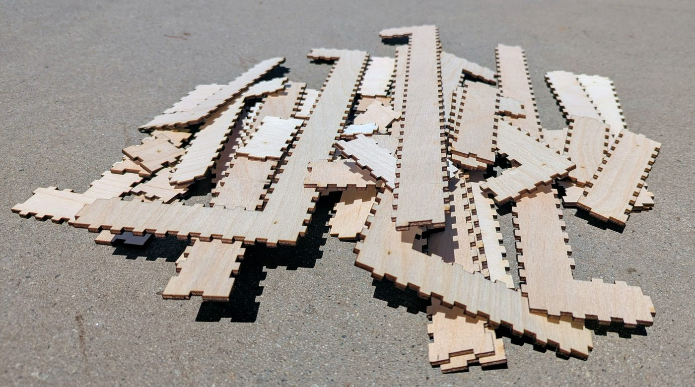

# The coiled trumpet

A trumpet bore that coils flat and then drops out of its own plane, twice.
**59 blocks, 944mm of centreline, eight sections, no elbows and no contact.**
It is a candidate, not an object: the walk is gated, the sheets are drawn, and
nothing here has been glued into a tube.

<!-- readme-only -->
**[Read this page](https://gernreich.github.io/trumpet/coiled/)**

**[Turn it →](../parts/bore/concept/walk/no-elbows/coil/no-contact/flat-drop/bore/bore.html)**
The viewer is a page of its own, not a frame in this one: drag to rotate, and
the slider reveals the bore a block at a time in the order you would glue it.


## The walk is the whole design

```
N N2 U6 W5 N10 E5 D3 S8 W3 D3 N13
```

The first letter is the way you face at the mouth; every term after it turns
where you stand and then travels that many blocks. So **the bore is 1 + the sum
of the numbers** — 58 + 1 = 59. Axes are Minecraft's: `U`/`D` are +Y/−Y, `N` is
−Z, `S` is +Z, `E` is +X, `W` is −X.

The walk is stored in the viewer page, in a `<div class="walk">`, which makes
that page the complete record of the design — the cut files regenerate from it
and from nothing else. Read it out of the file rather than from here.

## The numbers

| | |
| --- | --- |
| blocks | 59 |
| centreline | 944mm |
| sections | 8 |
| parts | 50, over 8 sheets |
| bounding box | 96 × 112 × 288mm — 6 × 7 × 18 blocks |
| airway | 10mm square, constant |
| block pitch | 16mm — 10mm of air in 3mm walls |
| elbows | none |
| contact | none |
| legs | north 26, south 8, west 8, up 6, down 6, east 5 |

**A block is 16mm, not 10.** Ten millimetres of sound space wrapped in 3mm of
wall is 16mm on the outside, and coring it for air does not shrink it. A run of
*N* blocks is 16*N* mm along the bore, which is where 944 comes from.

## Why it drops

A turn is free when one piece can carry it internally, which needs a straight
block either side that the neighbouring piece has not already claimed. Checked
over every window of three consecutive terms: a **step** (two outer legs on the
same axis, same direction) needs a middle of 1, a **hairpin** (same axis,
opposed) needs 2, and a **coil** (three different axes) needs 3. Every window
here clears it, so nothing is stranded as a one-block elbow.

**The drop costs sections, not elbows.** The mid-coil `D3` splits what would
otherwise be one flat spiral into four pieces. The bore is elbow-free either
way — it is the section count that moves, eight here against five for a walk
that stays in plane, and a section is a glue joint you have to get square.

## The eight sections

Numbered from the mouthpiece; assemble in order. A section is one flat snake,
so it is one SVG, and every part on it is engraved with its section number
because the sections only go together one way.

| # | blocks | in → out | plate | shape | parts | sheet |
| --- | --- | --- | --- | --- | --- | --- |
| 1 | 1–4 | N → U | 2×3 | `BDDR~a` | 6 | 273 × 72mm |
| 2 | 5–10 | U → W | 2×5 | `BUUUUL` | 6 | 343 × 107mm |
| 3 | 11–25 | W → E | 4×11 | `BLLLDDDDDDDDDDR` | 8 | 541 × 226mm |
| 4 | 26–30 | E → D | 4×2 | `BRRRD` | 6 | 381 × 56mm |
| 5 | 31–33 | D → S | 2×2 | `BLU` | 6 | 253 × 56mm |
| 6 | 34–41 | S → W | 2×7 | `BUUUUUUL` | 6 | 407 × 139mm |
| 7 | 42–44 | W → D | 2×2 | `BLD` | 6 | 253 × 56mm |
| 8 | 45–59 | D → N | 2×14 | `BLDDDDDDDDDDDDD~b` | 6 | 403 × 274mm |

`~a` and `~b` are the plain ends — the only two faces on the whole bore that do
not couple to another section, and the ones the mouthpiece and the bell land on.
The filenames say `buttin` and `buttout`.

Section 3 is the biggest sheet at 541 × 226mm, well inside the 600mm bed.

## The cut files

In `../parts/bore/concept/walk/no-elbows/coil/no-contact/flat-drop/bore/cut-files/`:

```
bore10-coil-flat-drop-01of08-bend-DDR-buttin-cut-files.svg
bore10-coil-flat-drop-02of08-bend-UUUUL-cut-files.svg
bore10-coil-flat-drop-03of08-bend-LLLDDDDDDDDDDR-cut-files.svg
bore10-coil-flat-drop-04of08-bend-RRRD-cut-files.svg
bore10-coil-flat-drop-05of08-bend-LU-cut-files.svg
bore10-coil-flat-drop-06of08-bend-UUUUUUL-cut-files.svg
bore10-coil-flat-drop-07of08-bend-LD-cut-files.svg
bore10-coil-flat-drop-08of08-bend-LDDDDDDDDDDDDD-buttout-cut-files.svg
```

Every file is millimetre-true at 1 user unit = 1mm. **Blue engraves, then black
cuts** — blue writes the section number on every part, black frees it.



## Rebuild it

The generator lives in `../tools`. Report only, writing nothing:

```
python3 tools/bore_split.py "N N2 U6 W5 N10 E5 D3 S8 W3 D3 N13" --bore=10 --no-write
```

`--bore=10` is the airway; the 16mm block follows from it at 3mm ply.
Add `--refuse-elbows` and the walk still passes. Writing rewrites every sheet in
the folder, so it runs under the venv python that has the gate's dependencies:

```
cd tools && ~/Software/boxes/venv/bin/python bore_split.py \
    ../parts/bore/concept/walk/no-elbows/coil/no-contact/flat-drop/bore/bore.html \
    --write ../parts/bore/concept/walk/no-elbows/coil/no-contact/flat-drop/bore
```

`--write` runs the full gate itself and prints the tally, so a regenerated
folder has been checked rather than merely written.

## The two ends

Only the tube belongs to an instrument. The mouthpiece and the bell are neither
of them touched by the way a bore turns, and every bore in this repository is on
the same 10mm channel, so one of each serves all of them —
**[the bell and the mouthpiece](../ends/)**.

## More, and licence

**[The three-turn trumpet](../three-turn/)** — the bore that exists as an
object, glued up and blown, rather than a candidate.

**[The trumpet writeup](../)** — the idea, the notation, the gate, and the whole
library.

**[The rest of the build files](https://gernreich.github.io/)** — every
instrument, each with its own writeup.

Released under [CC0 1.0](../LICENSE).
