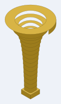
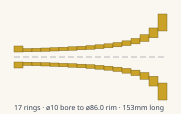
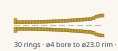

# The bell and the mouthpiece

Neither end is touched by the way a bore turns, so **only the tube belongs to an
instrument**. Both ends are stacks of laminated 3mm rings, both close onto the
same 10mm square in a 16mm face, and every bore in this repository is on that
channel — so one bell and one mouthpiece serve all of them.

<!-- readme-only -->
**[Read this page](https://gernreich.github.io/trumpet/ends/)**

Both live in `../parts/` rather than inside any one instrument's folder, because
neither belongs to a single bore: what cuts them is not what fits them.

## The bell

**17 rings of 9mm, 153mm tall, a 10mm square throat opening to a ø86mm round
rim** — ø80 of air. The section morphs square to round on the way up while
holding area, so the bore never steps in cross-section even though the shape of
it changes completely.


That is the one on the instrument. The small square block is the throat — 10mm
of air in a 16mm face, which is a bore block exactly — and the flat disc is the
rim. Everything between them is the section changing from square to round while
holding area, three plies at a time.

**[Turn it →](../parts/bell/bell-round10-153mm-17rings-x3-rim86-turn.html)**
The viewer is a page of its own: drag to rotate, and the slider stacks the rings
one at a time, which is the useful part.

<figure></figure>



| | |
| --- | --- |
| rings | 17, each 3 laminations of 3mm |
| height | 153mm, built on a 152mm profile |
| throat | 10mm square |
| rim | ø86.0mm outside, ø80 of air |
| profile | Bessel horn, gamma 0.7 |
| sheet | 187 × 192mm |
| pieces | 51 — the sheet goes through the machine three times |

**The bell is cut more than once.** The sheet draws every ring once, and the
`x3` in its filename is how many passes it takes. Cut it once and you get a
51mm stub instead of a 153mm bell.

Rings stack; they do not telescope. Each seats on the one below over 3.0mm per
side. They are engraved in hex with `0` at the bore, and the generator writes
the numbering itself as the last step, with an orientation tick beside each
number — a numbering failure deletes the sheet rather than leaving an unnumbered
one to be cut.

```
cd parts/bell && python3 bell-round.py 17 --bore=10 --length=152 --mouth=80 \
    --out=cut-files/bell-round10-153mm-17rings-x3-rim86-cut-files.svg
```

A bare `bell-round.py` writes four ring budgets, not one; the shipped sheet is
among them and comes back identical, the other three are scratch. Pass a budget
to write one.

### The adapter

A swept-curve bore leaves its cheek through a **7 × 14mm port**, not a 10mm
square, so it cannot meet this bell directly. `bell-adapter.py` draws the piece
that carries one into the other: **7 rings of one ply, 21mm**, holding area
across the change on a smoothstep so both ends are tangent. The last ring is a
collar — 10mm square in a 16mm square face, which is the bore's own end face, so
the bell stacks on it unchanged.

```
cd parts/bell && python3 bell-adapter.py \
    --out=cut-files/bell-adapter-port7x14-to-bore10-7rings-x1-cut-files.svg
```

## The mouthpiece

**30 rings of 3mm, 90mm tall.** A 16mm square plate at the instrument and a
ø23mm rim at the lip — ø17 where the lip actually sits — narrowing to a
**ø3.66mm throat** before the backbore. Full size on a quarter-size instrument,
which is the point of it.


The square block is what meets the bore; the cup is what meets the lip, and the
waist between them is the throat. **The staircase in that photograph is left as
it is.** Every ring is a 3mm step, and the rim is the one part of the instrument
a player feels directly — this one meets a lip unsanded and unfilled.

**[Turn it →](../parts/mouthpiece/mouthpiece-bore10-trumpet-parts-turn.html)**
Again a page of its own, and again the slider stacks it a ring at a time.

<figure></figure>



| | |
| --- | --- |
| rings | 30, each 1 lamination of 3mm |
| height | 90mm |
| layout | 26 backbore rings, 0 entrance rings, 4 bowl rings |
| at the instrument | 10mm square aperture in a 16mm square plate |
| throat | ø3.66mm |
| rim | ø23mm outside, ø17 at the lip |
| wall | 3 to 4.96mm |
| sheet | 111 × 101mm |
| pieces | 30 — one pass |

Station one is a **sharp** 10mm square aperture in a **sharp** 16mm square
plate, matching the bore corner for corner. The corners round away going up, and
the section is a true circle from the 9.026mm station on, so the throat and the
whole cup are round.

```
cd parts/mouthpiece && python3 mouthpiece-round.py \
    cut-files/mouthpiece-bore10-trumpet-parts-cut-files.svg
```

**The staircase is not sanded or filled.** Thirty 3mm rings make a 90mm cone out
of thirty steps, and the lip is the one part of this instrument that can feel
every one of them — it is played that way, off the sheet and unfinished.

> The mouthpiece on the instrument that has been built is **24 rings, 72mm** —
> not the 30 this sheet cuts. It is the instrument that is short, not the
> drawing.

## Every sheet is claimed

Both directories carry a `.repro` manifest naming the exact command that draws
each shipped SVG, checked by `repro-svg.py`. It runs every command into a temp
path and compares the result byte for byte against the sheet on disk, so a sheet
the current code would not draw is caught rather than shipped. A sheet with no
command behind it is reported `UNCLAIMED`, which is why the manifest has to grow
whenever a drawing does.

## The bores these fit

**[the three-turn trumpet](../three-turn/)** — the one they are actually glued
to — and the candidates: **[the coiled trumpet](../coiled/)** ·
**[the switchback trumpet](../switchback/)** · **[the greek spiral](../greek-spiral/)**,
plus every other bore in `../parts/bore/`, all of them on the same 10mm channel.

## More, and licence

**[The trumpet writeup](../)** — the idea, the notation, the gate, and the whole
library.

**[The rest of the build files](https://gernreich.github.io/)** — every
instrument, each with its own writeup.

Released under [CC0 1.0](../LICENSE).
