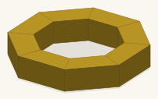
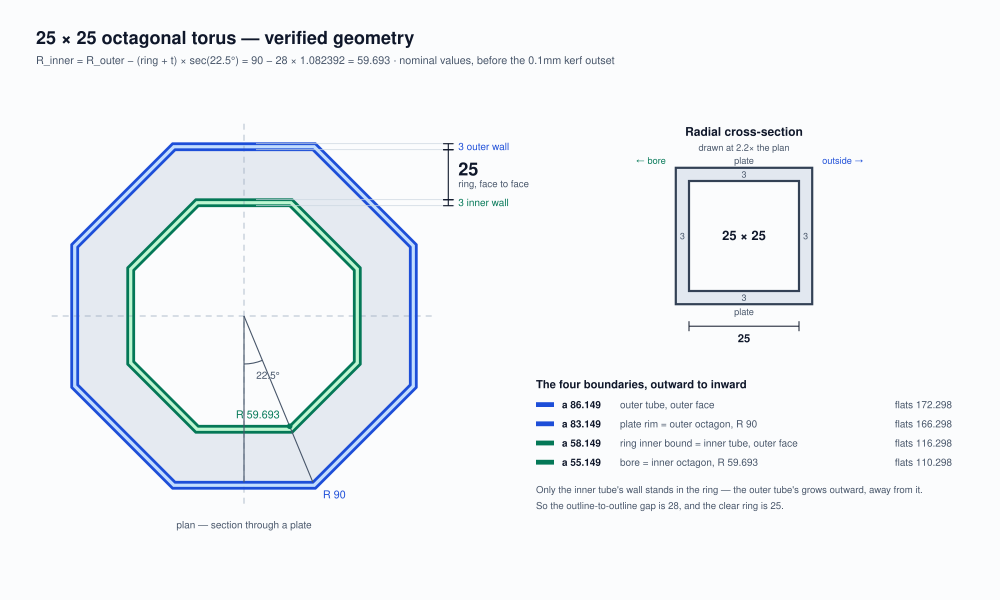
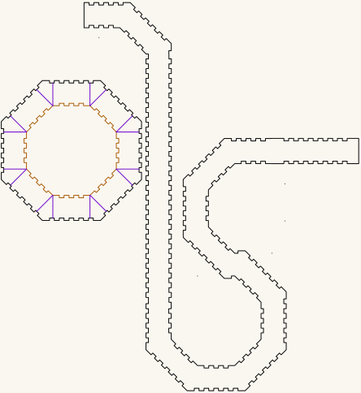

# Octagonal — the torus, and the trumpet cut out of it

Complete record: the trigonometry, the generator, the verified cut list, and the two
objects that come out of it.

**All dimensions are millimetres.**

**One geometry, two things to build.** A laser-cut octagonal torus — two nested octagonal
tubes joined by annular plates, leaving a **square channel** all the way round — and the
**trumpet** you get by cutting that ring open and straightening it into a curve. They are
not two designs that happen to look alike. The trumpet's plate *is* the torus's plate, to
0.001mm, and the violet lines drawn across the torus's plates are the cut that produces it.
That is why they are one document.

**Worked example:** a 25.000 × 25.000mm square cross-section, outer octagon at R 90, cut
from 3mm Baltic birch plywood. Two verified cut files:
**[`BuildA1_90_25.svg`](BuildA1_90_25.svg)** for the ring and
**[`octagonal-trumpet.svg`](octagonal-trumpet.svg)** for the curve.



**A drawing, not a photograph — and the uncut torus.** This is what the finished ring
measures out to: computed by [`torus-3d-view.js`](torus-3d-view.js) from the same three
numbers Part 11 takes, so it cannot drift from the geometry described here. It shows the
object assembled from [`BuildA1_90_25.svg`](BuildA1_90_25.svg) and stopped there — before
the cut along the [violet lines](#the-violet-lines--and-the-trumpet) that opens it.

**Your own size.** Nothing here is fixed to 90, 25 or 3mm material. The whole object follows from
**three numbers** you choose:

| | this example | yours |
|---|---|---|
| Outer octagon radius, corner to centre | 90mm | your choice |
| Ring — the square cross-section | 25mm | your choice |
| Material thickness | 3mm | whatever you are cutting |

They are not independent, though. The ring and the two walls have to fit inside the outer octagon,
which puts a floor under the radius:

```
R_outer  >  (ring + 2 × thickness) × sec(180°/n)
```

Below it the hole-cutter radius comes out zero or negative and there is no inner tube at all. For a
25mm ring in 3mm that floor is **33.554mm**, so this build's 90 is comfortably clear; a 60mm
ring in 6mm needs more than **77.932mm**. A 500mm ring in that same 3mm would need an outer radius past
**547.690mm** — ask for it at R 10 and the arithmetic simply has nowhere to put the bore.

You will not get this wrong quietly: `torus-geometry-diagram.js` checks the floor before it draws
anything and refuses, naming the minimum for your ring and thickness.

Very small inner octagons have a softer limit too: a short face may not fit a finger joint, and
boxes.py's own advice there is to reduce `finger` and `surroundingspaces`.

Everything else is derived. The worked numbers are a demonstration, not a constraint — an R 200mm
torus with a 60mm ring in 6mm ply follows the same method, and only the arithmetic differs (that
one comes out at R 128.562 inner, 381.552 across the flats).

**TL;DR** — **[Part 11 — Another size](#part-11--another-size)** — a self-contained
procedure: three numbers in ... (Magic) ... a cut file out, no other section required.



**The above figure is generated, not drawn.** `torus-geometry-diagram.js` computes every line, label and
dimension from three numbers, so it always agrees with the arithmetic in this document instead of
being an artist's impression of it.

```
node torus-geometry-diagram.js 90 25 3
                               │  │  └─ material thickness
                               │  └──── the ring you want, face to face
                               └─────── outer octagon radius, corner to centre
```

Those three are what the whole build is defined by. Change any of them and the figure redraws for
*your* geometry — the octagons resize, the shaded bands move, every dimension and the formula in the
title recalculate.

It also prints the numbers, which makes it a calculator even when you do not want the picture:

```
$ node torus-geometry-diagram.js 120 30 6
outer octagon  R 120      apothem 110.866   wall out to 116.866   (run 1)
inner octagon  R 81.034   apothem 74.866    wall out to 80.866    (run 2)
hole cutter    R 74.54    (run 3 — invert this disc)
ring           110.866 − 80.866 = 30
outside flats  233.731   bore flats 149.731
```

That is all three runs — run 1 is simply the outer radius you chose, and the other two are derived:

| run | radius (mm) | from |
|---|---|---|
| 1 — outer tube | **120** | your choice |
| 2 — inner panels | **81.034** | `R_outer − (ring + t) × sec(22.5°)` |
| 3 — hole cutter | **74.540** | `R_inner − t × sec(22.5°)` — the pre-compensation of Part 8a |

So a 120mm octagon with a 30mm ring in 6mm material needs those three numbers typed into
boxes.py — Part 11's formula and the inversion offset, both done for you.

**It draws a picture; it does not make cut files.** For parts, use Route A.

Built for **[LaserMadeMusic](https://www.youtube.com/@LaserMadeMusic)**, where the cutting
and the playing are shown.

---

# PART 0 — Build it

## Get the files

- **[`BuildA1_90_25.svg`](BuildA1_90_25.svg)** — the **torus**: 18 pieces, 20 contours,
  verified. On GitHub use the ⤓ *Download raw file* button; clicking the name only
  previews it.
- **[`octagonal-trumpet.svg`](octagonal-trumpet.svg)** — the **trumpet**: the same plate,
  and the curved bore band. One sheet, 444.077 × 484.599mm.
- **[The whole repository as a ZIP](https://github.com/Gernreich/trumpet/archive/refs/heads/main.zip)**
  — both cut files, this writeup, the diagram and the verification tools are under
  `octagonal/`; the other trumpets are beside them.
- **[The octagonal directory](https://github.com/Gernreich/trumpet/tree/main/octagonal)** — every file named below lives here.

---

**The torus is 18 pieces of material:** 2 plates + 8 outer panels + 8 inner panels. (That is 20 cut contours —
each plate is a rim plus a stitched hole — which is why Part 10 verifies 20.)

Assembled: **25.000mm radial × 25.000mm axial**, 172.298 across the flats outside, 110.298 bore.

**What the parts are.** The two plates are the torus's top and bottom faces — annular, 25mm wide.
The 8 outer panels form its outside wall, the 8 inner panels its bore wall. Each set of 8 is
**4 long + 4 short, alternating**, because that is how a polygon tube closes with rectangular
fingers (Part 6b).

**The trumpet is two pieces:** one of those same plates, and a single curved band
507.368 × 306.074mm that forms the bore. [Its own section](#the-trumpet-sheet) is below.

## Which one are you building

They share a plate, a channel and a facet angle, and they diverge at exactly one step.

| | **the torus** | **the trumpet** |
|---|---|---|
| what it is | a closed ring | the ring opened into a curve |
| cut file | `BuildA1_90_25.svg` | `octagonal-trumpet.svg` |
| pieces | 18 | 2 |
| the violet lines | left uncut — the ring stays whole | already taken — this *is* the result |
| centreline | 468.2mm, closed | 1107.9mm over twelve 45° facets |
| cut stages used | green → orange → cyan → black | orange → black |

The rest of Part 0 covers both. Where a step applies to only one of them it says so.

## Turn it before you cut it

**[`torus-turn.html`](torus-turn.html)** — the torus as a solid you can drag:
eight 45° facets, a 25 × 25mm section, 468.2mm of centreline. Colour by face to
read the construction or by facet to follow it round; the slider builds it a
facet at a time.

It draws the **airway** — the passage bounded by the wall faces, at apothems
58.149 and 83.149, which is what `verify_torus.js` measures out of the cut file
— and the two cheek plates around it, so the drawing reads at the thickness of
the part rather than of the passage. Generated by
[`bores/ribbon`](https://gernreich.github.io/trumpet/parts/bore/concept/swept-curve/ribbon/)'s
`ribbon_view.py`, because a torus of rectangular section swept along a planar
curve is exactly what that generator draws:

```sh
python3 ../parts/bore/concept/swept-curve/ribbon/ribbon_view.py --shape=torus --facet=45 --bore=25 \
    --radius=76.4696 --out=torus-turn.html
```

`76.4696` is the circumradius of the centreline octagon: its facets sit at
apothem 70.649, the mean of the two above, and offsetting by ±12.5 reproduces
both to 0.001mm.

The trumpet has its own turnable drawing, from the same generator — see
[the traced bore](#the-traced-bore).

## The video

**Not published yet.** It will appear on
**[LaserMadeMusic](https://www.youtube.com/@LaserMadeMusic)**, which is where every *video* link on
this page points until it is up. It walks through the inversion: breaking the octagon outline into
its eight segments and flipping each one, which is the step hardest to convey in text.

## Route A — generate from scratch at boxes.hackerspace-bamberg.de

Three runs, because the plate hole and the inner panels come from **different radii**.

**Run 1 — outer tube.** RegularBox: `radius_bottom = radius_top = 90`, `h = 25`, `n = 8`,
`thickness = 3`, `burn = 0.1`, `top`/`bottom` = closed, `outside` unchecked.

→ Keep **both discs** and all **8 panels**.

**Run 2 — inner panels.** Same settings, `radius_bottom = radius_top = 59.693`. (There is no field
called `radius`; set both, or you get a taper.)

→ Keep the **8 panels** only. Discard its discs.

**Run 3 — the hole cutter.** Same settings, `radius_bottom = radius_top = 56.446`. (`h` is
irrelevant here — you only want the disc outline.)

→ Keep **one disc**; it is the cutter for both plates. Discard everything else.

**Then:** invert that 56.446 disc and use it to cut the hole in each of the two outer discs.

### How the inversion was done

In **Inkscape**: take **run 3's disc, the R 56.446 one**, and break its outline into **eight
segments** — one per face — then flip each segment. The eight flipped segments together are the
hole; place them concentric on each outer disc and cut.

Not run 2's disc. "Inner octagon" elsewhere in this document means R 59.693, the radius the inner
*panels* are cut for; inverting that disc puts the hole 3mm too far out and leaves a 22mm ring.

Flipping a segment does two things at once, and Part 8 is about both:

- it **mirrors the tab-and-notch pattern**, which is the phase swap the joint needs (Part 8b), and
- it **lands the band one material thickness further out**, which is the ±3mm shift you
  pre-compensate for by generating run 3 at 56.446 rather than 59.693 (Part 8a).

The eight flipped segments come out as eight separate contours, so the hole starts life as eight
open polylines rather than one closed outline.

**Stitching them back together — optional.** In `BuildA1_90_25.svg` the eight were joined into a
single closed loop per plate, which is why `verify_torus.js` reports `hole contours: 2  (1 per plate)`
rather than 16. **This is probably unnecessary.** Measured before stitching, the largest gap between
one segment's endpoint and its neighbour's was **0.077mm** — smaller than the 0.1mm `burn`, and
smaller still than a real beam, so the cuts overlap and the waste drops out regardless.

Stitch anyway if your laser software applies its *own* kerf compensation, since offsetting needs
closed paths to know which side is inside. But if it does, turn that off: `burn = 0.1` is already in
the geometry, and compensating twice loosens every joint by another 0.1–0.2mm — a far worse problem
than a 0.077mm gap.

**This process is demonstrated step by step in the [video](https://www.youtube.com/@LaserMadeMusic).**

Verified example of exactly this: [`RunA1_R90.svg`](RunA1_R90.svg),
[`RunA2_R59Point693.svg`](RunA2_R59Point693.svg), [`RunA3_R56Point446.svg`](RunA3_R56Point446.svg),
assembled into **[`BuildA1_90_25.svg`](BuildA1_90_25.svg)**.

### The three runs as links

Each carries every setting — `thickness=3.0`, `burn=0.1`, `finger=2.0`, `space=2.0`,
`surroundingspaces=1.0`, `play=0.0` — so the form comes up fully populated. Recovered from the
`dc:source` provenance that boxes.py embeds in each generated file.

**Save each run under its own name as you go.** boxes.py serves every generated file as
`RegularBox.svg`, so three runs downloaded in a row will collide.

- [Run 1 — outer tube, R 90](https://boxes.hackerspace-bamberg.de/RegularBox?FingerJoint_style=rectangular&FingerJoint_surroundingspaces=1.0&FingerJoint_bottom_lip=0.0&FingerJoint_edge_width=1.0&FingerJoint_extra_length=0.0&FingerJoint_finger=2.0&FingerJoint_play=0.0&FingerJoint_space=2.0&FingerJoint_width=1.0&h=25&outside=0&radius_bottom=90&radius_top=90&n=8&top=closed&alignment_pins=1.0&bottom=closed&thickness=3.0&burn=0.1&format=svg&labels=0&labels=1&reference=100.0&tabs=0.0&qr_code=0&inner_corners=loop&spacing=0.5&debug=0&language=en&render=0)
- [Run 2 — inner panels, R 59.693](https://boxes.hackerspace-bamberg.de/RegularBox?FingerJoint_style=rectangular&FingerJoint_surroundingspaces=1.0&FingerJoint_bottom_lip=0.0&FingerJoint_edge_width=1.0&FingerJoint_extra_length=0.0&FingerJoint_finger=2.0&FingerJoint_play=0.0&FingerJoint_space=2.0&FingerJoint_width=1.0&h=25&outside=0&radius_bottom=59.693&radius_top=59.693&n=8&top=closed&alignment_pins=1.0&bottom=closed&thickness=3.0&burn=0.1&format=svg&labels=0&labels=1&reference=100.0&tabs=0.0&qr_code=0&inner_corners=loop&spacing=0.5&debug=0&language=en&render=0)
- [Run 3 — hole cutter, R 56.446](https://boxes.hackerspace-bamberg.de/RegularBox?FingerJoint_style=rectangular&FingerJoint_surroundingspaces=1.0&FingerJoint_bottom_lip=0.0&FingerJoint_edge_width=1.0&FingerJoint_extra_length=0.0&FingerJoint_finger=2.0&FingerJoint_play=0.0&FingerJoint_space=2.0&FingerJoint_width=1.0&h=25&outside=0&radius_bottom=56.446&radius_top=56.446&n=8&top=closed&alignment_pins=1.0&bottom=closed&thickness=3.0&burn=0.1&format=svg&labels=0&labels=1&reference=100.0&tabs=0.0&qr_code=0&inner_corners=loop&spacing=0.5&debug=0&language=en&render=0)

### Why run 3 uses 56.446 and not 59.693

Inverting moves a part outward by one tab depth — 3mm — and never leaves it in place (Part 8a). So
you type the radius whose *apothem* is 3mm short of where you want the band to land. In radius that
is 3.247 smaller, since 3mm of apothem is 3 × sec(22.5°):

```
56.446  →  disc at apothem 52.149 / 55.149
invert  →  lands at 55.149 / 58.149   ✓ exactly where the hole belongs
```

Invert the 59.693 disc instead and it lands at 58.149 / 61.149 — a **22mm** ring.

## Route B — shortcut, cut the finished file

**[`BuildA1_90_25.svg`](BuildA1_90_25.svg)** is those 18 pieces already laid out, and nothing else:
2 plates and 16 panels. Assembled by exactly the
Route A steps above, and verified: 20 contours, holes concentric with their plates, joint phase
complementary, no overlaps, and a cut order that never frees a part before it is cut.

**Two things before you send it.** The first is immediately below: the violet lines are
not part of the torus. The second is **[Colour is the cut order](#colour-is-the-cut-order)**,
further down past the trumpet — the four cut colours have to run in the stated order, and a
per-colour job silently skips any colour you leave unmapped. Do both and the file cuts as-is —
no scaling, no kerf compensation, no edits. **Do not send it having read only the first.**

It is specific to **this** build — R 90 outer, 25 × 25mm cross-section, 3mm material. At any other
size or thickness use Route A, or Part 11 for the general formulas; none of the widths carry over.
[Part 10](#part-10--file-record) says what every other file here is.

### The violet lines — and the trumpet

**They are not part of the torus.** The file carries **24 violet paths** alongside the 20
cut contours, and they are all one family: **12 on each of the two plates**. Each is a
single straight line from the hole edge out to the rim — apothem 55.2 to 83.4, inside an
edge at 86.2, so none overruns its octagon. Together they divide each plate wall into
segments.

They are the optional cuts, and they are the hinge of this whole document. **Take them and
the torus comes apart into sections — and sections are what a trumpet is made of.** The
segments they define are also the patches for joining sections back together. Turn one
green to cut it, and leave the rest violet.

Ignore all of them for a plain torus — set the colour to a non-cutting layer, or delete it.
`verify_torus.js` skips exactly this one colour, which is why it reports 20 contours rather
than 44, and it counts them per plate rather than taking this paragraph's word for it:

```
  SKIP LINES  (violet — carried, not cut)
    plate 0: 12 line(s), apothem 55.249 … 83.407   edge at 86.25
    plate 1: 12 line(s), apothem 55.249 … 83.407   edge at 86.25
    none reaches past its octagon's outer edge ✓
    every plate carries the same 12 ✓
```

**If you want the trumpet, you do not have to make those cuts yourself.**
`octagonal-trumpet.svg` is the result already drawn as its own sheet, with the band as one
continuous piece rather than eight segments to rejoin. Cutting the torus open is the
*explanation*; the trumpet sheet is the *shortcut*. Both are below.

## The trumpet sheet

**[`octagonal-trumpet.svg`](octagonal-trumpet.svg)** — the torus opened out into a curve
instead of closed into a ring, on one sheet. Same 25 × 25mm square channel, same R 90
octagonal plate, same 3mm Baltic birch.

<div class="tw">
<table>
<tr>
<td align="center"><a href="octagonal-trumpet.svg"></a></td>
</tr>
<tr>
<td align="center"><sub>octagonal-trumpet.svg · 444.1 × 484.6mm sheet</sub></td>
</tr>
</table>
</div>

*A display rendering — the cut file draws a hairline on no background, which a browser
shows almost invisibly, so this is thickened and painted onto a light ground. Geometry and
sheet position are untouched. The three lightest cut-order inks — green, orange and cyan —
are darkened here; at full strength they fall below the contrast a light background can
carry. Hue and sequence are unchanged, and the cut file keeps the exact values.*

### What is on it

Measured out of the file itself:

| Part | Count | Size |
|---|---|---|
| Octagonal plate, finger-jointed rim | 1 | 172.298mm across flats — R 90 |
| Its central hole | 1 | 116.298mm across flats — R 62.94 |
| Curved bore band, finger-jointed on both edges | 1 | 507.368 × 306.074mm |

The sheet is 444.077 × 484.599mm and every part sits inside it, with no geometry hanging
off the page. It carries **16 violet lines** of its own — one at the middle of every flat
and one at every corner — dividing the plate wall into sixteen segments, on the same
"marked, never cut" terms as the torus's 24.

### The plate is the torus's plate

Not *like* it — the same part. Rim at apothem 86.149, hole at 58.149, hole concentric with
the rim to within 0.001mm, and the same joint phase along every face.

That is checkable rather than asserted, and both files now sit in this directory, so it is
one command:

```
node verify_torus.js octagonal-trumpet.svg RunA2_R59Point693.svg
```

```
    plate hole  : in [-22.9…-15.0] in [-14.9…-9.1] … in [15.0…22.9]
    ref disc    : OUT[-22.8…-15.0] OUT[-14.9…-9.1] … OUT[15.0…22.8]
    -> COMPLEMENTARY ✓  the plate's tabs land in the panel's notches
```

So the side panels cut for the torus mate with this plate too, and **a dry-fit done for one
is a dry-fit done for both**. Until 2026-09-05 this check spanned two repositories and
could not be run in one place, which is the reason they were merged.

### The traced bore

**[`octagonal-trumpet-trace.svg`](octagonal-trumpet-trace.svg)** — the bore band's cheek,
traced by hand, with the centreline taken from it: **1107.9mm over twelve facets of 45°**
at 25 × 25mm. **Display only, not a cut file.**

The curve behind this sheet is not written down as parameters anywhere, so it was measured
rather than generated. The trace confirmed as much as it supplied: the strip came out
**31.2mm wide** — 25mm of airway with a 3mm wall each side — the turns came out at
**±45°**, the same facet angle as the torus, and the total turning came out at **0°**,
which is what a bore between a mouthpiece and a bell must do. An opening faces *out* of the
tube, so the mouth faces back along the run and the bell faces forward, and the two are
opposed — you blow towards the instrument and it speaks away from you — exactly when the
turns cancel. The width scatters 30.7 to 35.5mm about that nominal, so treat the length
as ±1%.

The numbers live in
[`bores/ribbon/traces/octagonal-trumpet.json`](../parts/bore/concept/swept-curve/ribbon/traces/octagonal-trumpet.json)
with how they were taken, and the bore is drawn, turnable, at
[`bores/ribbon`](https://gernreich.github.io/trumpet/parts/bore/concept/swept-curve/ribbon/).

**The centreline is kept out of the cut file deliberately.** Red is a cut colour throughout
this repository, so a red path on a sheet is a path the laser tries to cut —
[`verify_torus.js`](verify_torus.js) says so in as many words: *#ff0000 is a cut colour
with no place in the cut order*. Drawing it there also grew the canvas from 444 × 485mm to
**798 × 492mm**, wider than the 600mm bed.

### The bell and the mouthpiece

Neither is here, and neither is touched by the way a bore turns — only the tube belongs to
an instrument. Both live in **[`parts/`](../parts)**, built on the same 25 × 25mm channel
and shared with the [coiled trumpet](../parts/bore/concept/walk/no-elbows/coiled).

## Colour is the cut order

**Violet `#8000ff` is skip — it is never cut.** Everything else is, and the colour says *when*.

**The torus sheet uses all four stages:**

| | colour | what, and why there |
|---|---|---|
| 1 | green `#00ff00` | the 8 panels nested **inside a plate hole** |
| 2 | orange `#ff8000` | the 4 plate and ring holes — frees the waste centres |
| 3 | cyan `#00ffff` | the remaining 8 panels, out on the open sheet — two of them nested at 45° |
| 4 | black `#000000` | the plate and ring rims — frees them |

**The trumpet sheet needs only two**, because nothing is nested and there is nothing to engrave:

| | colour | what | why then |
|---|---|---|---|
| 1 | orange `#ff8000` | the plate's central hole | cut while the plate is still held by the sheet |
| 2 | black `#000000` | the plate rim and the bore band | frees them, so they go last |

Holes before rims is the whole of the rule on that one: once the black rim is through, the
plate is loose, and anything still to be cut inside it will move.

All the stages present are explicit stroke colours, so select-same-colour finds each group and a
colour-keyed job lists them. **Violet takes no operation at all** — 24 lines on the torus, 16 on
the trumpet, the optional cuts across the plate walls, which neither build makes. Marking them
explicitly is the point, so "not cut" is a decision recorded in the drawing rather than a colour
someone forgot to map.

**Blue is the piece numbers, and it engraves.** Blue means *engrave* across these repositories and
never cuts. From 2026-09-03 every one of the torus's eighteen pieces carries a hex number in blue,
written by `number_pieces.js`, because the outer panels differ by 1.758mm and the inner ones by the
same, and off the bed they are a pile of near-identical rectangles. Give blue a marking operation,
or leave it unmapped and lose nothing but the numbers. The trumpet's two pieces cannot be confused
with each other and carry none.

The sequence is shared by every LaserMadeMusic repository: blue engraves, then
green → orange → cyan → black, black always the cut that frees the part, violet always
skip. A file uses only the stages it needs — the bullroarers and buzz discs run green then
black and nothing else — so learning it once covers all of them.

Eight of the torus's sixteen panels are nested in the middle of the plate and ring holes, where they
would otherwise be waste, and so are the two square patches. That is what forces the sequence:
**cut a part while its material is still held.** Cut the orange hole first and the whole centre
drops away, taking the uncut pieces on it with it — into the machine, if you are unlucky. Holes
before rims for the same reason.

So set your laser to run **green → orange → cyan → black**, and give every stage the file uses a
cutting operation. Leave violet unmapped, or delete it. A job set up per-colour silently skips any
colour you leave unmapped, which is a hazard for the cutting stages and exactly what you want for
violet. On the trumpet sheet that hazard is concrete: **leave orange out and you get a plate with
no bore.**

`verify_torus.js` checks all of this. It prints the palette, marks each colour counted or ignored, lists
the stages in order with what each one is, and fails loudly if a nested panel is scheduled after the
hole it sits in, or a hole after its rim. It also counts the skip lines per octagon and checks that
none runs past that octagon's outer edge, so the counts claimed above are read out of the file
rather than asserted here:

```
  CUT ORDER
    1. green  x8   panels nested in the plate holes — cut before the waste is freed
    2. orange x2   plate holes
    3. cyan   x8   panels on the open sheet
    4. black  x2   plate rims — frees the plates
    tightest nested piece to its hole: 1.095mm  (31.2 x 48.372 panel in plate 1) — kerf comes off both sides of that
    8 nested panels and 0 patches cut before their hole ✓   holes before rims ✓
```

## Before cutting the full sheet

Dry-fit **one plate and one inner panel** in cardboard. The plate's tabs around the hole should drop
into the panel's notches.

- Line up → cut everything
- Land between the notches → change run 3's `surroundingspaces` and regenerate, but not by the value
  you would guess: it is a staircase, not a dial, and everything from 1.0 to 2.5 redraws the same
  face. [If the phase comes out wrong](#if-the-phase-comes-out-wrong) measures it
- Too tight → set `play` to 0.05–0.1 — **multiples of thickness**, so 0.15–0.30mm at t = 3

**What the dry-fit is actually for.** Registration *is* provable from coordinates — that is exactly
what `verify_torus.js`'s phase check does, and a `COMPLEMENTARY ✓` means the tabs and notches are in the
right places relative to each other. Both failures this project actually had were caught that way:
a hole in the wrong phase, and a panel set of 5/3/2/6 where an octagon needs 4/4/4/4.

What no measurement of the file can tell you is whether the joint fits **your material on your
machine**:

- **Material thickness.** Every width here assumes exactly 3.000mm. Nominal 3mm ply is commonly
  2.7–3.2mm, and the finger joints are cut for the nominal figure. Thin stock gives sloppy joints,
  thick stock gives joints that will not close.
- **Your kerf.** `burn = 0.1` is baked into the geometry. If your beam removes 0.15mm every joint
  is 0.05 loose; if it removes 0.08 they are tight. Across eight corners and two tubes that adds up.
- **Assembly force.** A joint can be dimensionally perfect and still be unassemblable — too tight to
  push home without splitting a finger, or loose enough to need glue to hold alignment.

None of that is in the coordinates, and all of it is in a 30-second cardboard test. The geometry is
settled; the fit is not.


**Grain direction is a real choice on the trumpet**, because the band curves. Run the face grain
along its length and it bends more willingly; run it across and the band resists and holds its shape
harder. Neither is wrong — they give different curves, and it is worth cutting one of each before
deciding. The torus's panels are short and flat and do not care.

**Cut both in 3mm Baltic birch plywood.** That is what they are built in, and the void-free core
earns its place at the finger joints: a void landing in a tooth that has to carry the curve is a
break waiting to happen.

## Check before cutting

Measure across the flats, not the corners. The rim and the hole each have two readings —
the tabs stand 3mm proud of the body line on both — so check the one you mean.

**Two columns, because the kerf is already in the geometry.** Measuring the file in Inkscape gives
the drawn contour; the cut part comes out **0.2 smaller** across every full width, because the beam
takes 0.1 off each edge. Neither is an error — they are the same part before and after cutting.

| measure | in the file | cut part |
|---|---|---|
| plate rim, flat to flat between the tabs | 166.50 | **166.30** |
| plate rim, tab tip to tab tip — the finished outside | 172.50 | **172.30** |
| plate hole, tab tip to tab tip — its narrowest | 110.50 | **110.30** |
| plate hole, notch bottom to notch bottom — its widest | 116.50 | **116.30** |
| outer panels, long / short — 4 of each | **73.326** / **71.568** × 31.200 | 73.126 / 71.368 × 31.000 |
| inner panels, long / short — 4 of each | **50.130** / **48.372** × 31.200 | 49.930 / 48.172 × 31.000 |

The bold figures are the ones quoted elsewhere in this document: octagon geometry is given nominal
(Part 9), panel widths as drawn, since that is what boxes.py emits and what `verify_torus.js` reports.

## Tooling

Two scripts live beside this document — [`verify_torus.js`](verify_torus.js) and
[`torus-geometry-diagram.js`](torus-geometry-diagram.js). Everything they report has been derived
and explained below; they exist so a file can be checked in one command instead of by eye.

```
node verify_torus.js BuildA1_90_25.svg RunA2_R59Point693.svg
```

Checks a cut file end to end: the stroke **palette**, with each colour marked counted or ignored;
contour inventory with each panel's implied radius; plate and hole count; hole eccentricity; every
boundary line as apothem / R / across-flats; the **joint phase**; the **cut order**, including
whether any part is freed before it is cut; nesting clearances; and whether all content sits inside
the viewBox. The second argument is the R 59.693 run — the disc the inner panels key to.
Without it the phase pattern still prints but cannot be judged, so pass it. A **COMPLEMENTARY ✓**
verdict is the check that would have caught the first failed build; run it after any edit, including
ones you believe were only cosmetic.

**On the HTML:** `index.html` is generated from this markdown by `md2html.py` in
`../../lasermade-tools`, which inlines `torus-geometry-diagram.svg` so the page stays
self-contained. **The markdown is the source — edits made directly to the HTML are
overwritten on the next run.**

```
node torus-geometry-diagram.js 90 25 3      # outer R, ring, thickness
```

Redraws the figure at the top of this document and prints the resulting dimensions, labelled by
generator run — see the note under the figure for what the three arguments mean. It refuses, without
writing anything, if the numbers do not describe a torus (`R_outer` below
`(ring + 2 × thickness) × sec(22.5°)` — it assumes an octagon), if any argument is not a positive
number, or if you give it one or two arguments instead of three. That last one matters: a missing
thickness would otherwise be filled in from this build's 3mm and answer confidently for the wrong
material. Give all three or none. Regenerate the
HTML afterwards to pick up the new drawing.

Everything below is why.

---

# PART 1 — Octagon trigonometry

A regular octagon has two "radii" that people constantly confuse:

- **R** (circumradius) — centre to a **vertex**
- **a** (apothem) — centre to the middle of a **face**

They are locked by the half-angle **180°/8 = 22.5°**:

```
a    = R × cos(22.5°)              cos(22.5°) = 0.923880
R    = a × sec(22.5°)              sec(22.5°) = 1.082392
side = R × 2sin(22.5°)             2sin(22.5°) = 0.765367
side = a × 2tan(22.5°)             tan(22.5°) = 0.414214 = √2 − 1
```

Closed forms:

```
cos(22.5°) = √(2+√2) / 2 = 0.923880
sec(22.5°) = 2 / √(2+√2) = 1.082392
tan(22.5°) = √2 − 1      = 0.414214
```

**sec(22.5°) = 1.0824 is the number this entire project turns on.** It says the corners of an
octagon sit **8.24 % further from centre** than the flats.

| R (mm) | apothem (mm) | across flats (mm) | across corners (mm) | side (mm) |
|---|---|---|---|---|
| 90.000 | 83.149 | 166.298 | 180.000 | 68.883 |
| 62.940 | 58.149 | 116.298 | 125.880 | 48.172 |
| 59.693 | 55.149 | 110.298 | 119.386 | 45.687 |
| 56.446 | 52.149 | 104.299 | 112.892 | 43.202 |

---

# PART 2 — Nesting two octagons: the 1.0824 rule

Two concentric, same-orientation octagons. The **gap between their faces** is a difference of
*apothems*; CAD wants *radii*. Since both scale by the same cos(22.5°):

```
gap = a_outer − a_inner = (R_outer − R_inner) × cos(22.5°)

ΔR / gap = sec(22.5°) = 1.082392
```

**The ratio is independent of size.** It holds for one octagon and for the difference between two,
which is what keeps the whole problem linear — no iteration, no trial fits.

Two consequences that bite:

**Trap 1 — corners open faster than flats.** For a 25mm face gap the corners are
`25 × 1.0824 = 27.060` apart. Subtract 25 straight off the radius instead and you get
`90 − 25 = 65`, apothem `60.052`, so only `83.149 − 60.052 = 23.097` at the flats — **1.903 short**.

**Trap 2 — the ring width is a difference, so it is shift-invariant.** Move both octagons outward
by the same amount and the gap between them does not change. This becomes important in Part 8.

---

# PART 3 — Material: walls eat the gap

The octagons are *surfaces*. Material grows off them, and whether that costs you depends on
direction.

In this build (see Part 5 for why), **R 90 is the inner surface of the outer tube**, so its wall
grows outward, away from the ring — free. The inner tube's wall grows outward too, but for the
inner octagon "outward" means *into* the ring — costs one thickness.

```
one wall intrudes  →  nominal gap = ring + wall = 25 + 3 = 28
R_inner = R_outer − nominal × sec(22.5°)
        = 90 − 28 × 1.082392
        = 90 − 30.307
        = 59.693mm
```

**Wall allowances ADD, in face-to-face units. sec(22.5°) MULTIPLIES, and only to convert a
face-to-face figure into a radius.** Two operations, two domains, in that order.

Getting this backwards is the classic error. If you come up short and "scale up by the ratio you
missed by", you leave a residual of `L²/(gap − L)`:

| nominal gap (mm) | real ring (mm, L = 3) | implied "ratio" | error if you scale by it (mm) |
|---|---|---|---|
| 10 | 7 | 1.4286 | +1.29 |
| 25 | 22 | 1.1364 | +0.41 |
| 50 | 47 | 1.0638 | +0.19 |
| 100 | 97 | 1.0309 | +0.09 |

The "ratio" changes with the gap, which proves it is not geometry — it is an artifact of where you
measured. 1.0824 is identical at every size. *That* is what a real ratio looks like.

---

# PART 4 — The generator

**[boxes.py](https://www.festi.info/boxes.py/)** by **Florian Festi**, generator **RegularBox**. GPL 3.0, source at
[github.com/florianfesti/boxes](https://github.com/florianfesti/boxes); the runs below use the
[Hackerspace Bamberg instance](https://boxes.hackerspace-bamberg.de/).

Settings used:

| RegularBox | value | meaning |
|---|---|---|
| `radius_bottom` / `radius_top` | **90**, **59.693** or **56.446** — one per run | **inner radius at the corners.** Set both to the same value; boxes.py's own labels read "inner radius of the box bottom / top (at the corners)" |
| `h` | 25 | **inner** height in mm (`outside` unchecked) |
| `n` | 8 | number of sides |
| `top` / `bottom` | closed | solid discs top and bottom |

| Default | value | meaning |
|---|---|---|
| `thickness` | 3.0 | material thickness |
| `burn` | 0.1 | kerf compensation — every contour is outset 0.1mm |
| `inner_corners` | loop | |

| Finger joints | value | meaning |
|---|---|---|
| `style` | rectangular | |
| `finger` | 2.0 | finger width in multiples of thickness → **6mm** |
| `space` | 2.0 | gap between fingers → **6mm** (so a **12mm pitch**) |
| `surroundingspaces` | 1.0 | space at the start and end, in multiples of the normal space — so 1.0 is one 6mm space — **this is the phase control** |
| `play` | 0.0 | extra clearance, **in multiples of thickness** like `finger` and `space` — so 0.1 is 0.3mm, not 0.1mm; raise if joints are too tight |

Each run produces: **2 discs** (top and bottom) and **8 side panels**. Which of them you keep
depends on the run — see Route A.

"At the corners" is the detail that matters: `radius` is the **vertex** radius, not the apothem, and
it describes the tube's **inner** surface. That is exactly the quantity `sec(22.5°)` operates on, so
the number you type goes straight into the formula — Part 5 works this through.

**Nothing in those tables names the side panels**, and there is no setting that does. The panels are
*outputs*: RegularBox derives them from the same handful of inputs.

| panel dimension | derived from | this build |
|---|---|---|
| height | `h` + two thicknesses | `25 + 3 + 3` = 31.000 (31.200 as drawn, with kerf) |
| width | the octagon's side length at that radius, plus a corner allowance | 73.326 / 71.568 outer · 50.130 / 48.372 inner |

So you cannot size a panel directly. Change `radius`, `n`, `h` or `thickness` and the panels follow;
Part 6 derives both widths from first principles and checks them against every panel in the file.
That is also why a panel set belongs to the run that produced it — mixing panels from one radius
with discs from another is the error that broke an early build.

---

# PART 5 — Mapping generator terms to the geometry

This is the join between Parts 1–3 and the tool, and it is exact:

| measured in the SVG | generator setting | relation |
|---|---|---|
| uniform +0.100mm outset on every contour | `burn = 0.1` | direct |
| disc body apothem 83.149 | `radius = 90` — run 1 | `83.149 = 90 × cos 22.5°` |
| disc body apothem 55.149 | `radius = 59.693` — run 2 | `55.149 = 59.693 × cos 22.5°` |
| disc body apothem 52.149 | `radius = 56.446` — run 3 | `52.149 = 56.446 × cos 22.5°` |
| finger reach, +3.000 beyond the body | `thickness = 3.0` | direct |
| panel height 31.200 | `h = 25` | `25 + 3 + 3 + 2 × 0.1` |
| wall thickness 3.000 | `thickness = 3.0` | direct |

Run 3's row is the one worth dwelling on. Its disc is generated at apothem **52.149** and its
fingers reach to **55.149** — yet the hole it cuts, once inverted, measures **55.149 / 58.149**. The
generator's arithmetic is untouched; the inversion moved the whole band outward by one thickness
after the fact. Part 8a measures that on the shipped file.

**`radius` is the vertex radius of the *inner* surface.** That is precisely the quantity the
sec(22.5°) conversion in Part 3 operates on, so the number you type goes straight into the formula:

```
R_inner = R_outer − (ring + thickness) × 1.082392
```

It also settles Part 3's "one wall, not two": since `radius` is an *inner* surface, R 90 is the
inside of the outer tube, and only the inner tube's wall reaches into the ring.

And the axial 25 is not luck — it is `h = 25` typed in, with `outside` unchecked.

---

# PART 6 — Panel widths, derived

Each run emits **two alternating panel types**. Both are the octagon's side length plus a corner
allowance:

```
side = 2 × a × tan(22.5°)

long  panel = side + t√2          + 2·burn
short panel = side + 2t·tan(22.5°) + 2·burn
```

With t = 3.0 and burn = 0.1:

```
t√2 + 2·burn          = 4.2426 + 0.2 = 4.443
2t·tan(22.5°) + 2·burn = 2.4853 + 0.2 = 2.685
difference             = t(2 − √2)    = 1.757
```

Check against every panel measured across all files:

| R (mm) | apothem (mm) | side (mm) | long (mm) | short (mm) | matches file? |
|---|---|---|---|---|---|
| 90.000 | 83.149 | 68.883 | **73.326** | **71.568** | ✓ |
| 59.693 | 55.149 | 45.687 | **50.130** | **48.372** | ✓ |
| 56.446 | 52.149 | 43.202 | **47.645** | **45.887** | ✓ |

Exact to the last digit in every case. **This is the diagnostic that catches a mismatched panel
set:** given a panel width you can invert the formula and recover the radius it was generated from.
That is how an early build was caught carrying panels cut for R 56.446 against a hole at R 59.693.

The two closed forms were matched to the measured widths, not read out of boxes.py's source. Both
have a sensible reading at a 135° corner — `t√2` is a thickness cut at 45°, `2t·tan(22.5°)` is the
wall's double offset — but treat them as a fitted rule that holds across every file here, not as
proven generator behaviour.

Note the `a` above is the apothem of the **inner** surface — the apothem of the radius you typed.
Part 6b measures the same panels against the **outer** surface instead. Both are correct and give the
same widths; they differ by the wall's projection, `2t·tan(22.5°) = 2.485`:

```
4.4426 = 2.4853 + 1.9574     2.6853 = 2.4853 + 0.2000
```

(Four decimals here because the parts of a sum, rounded separately to three, stop adding up — see
the rounding note in Part 9.)

## 6a. Why a panel looks too wide for its octagon

Lay an inner panel against the plate's hole and it appears oversized by 1.3–2.2mm per end. It
isn't. Two different faces are being compared.

A face of the octagon has **two lengths**, because the wall is a trapezoid in plan:

```
at the bore,          apothem 55.149:  2 × 55.149 × tan(22.5°) = 45.687
at the wall's outside, apothem 58.149: 2 × 58.149 × tan(22.5°) = 48.172
difference = 2t·tan(22.5°)                                     =  2.485
```

Measured across one face, the hole's boundary spans **45.687** at its inner line — the face at the
**bore**. The panel is
cut to the face at the wall's **outer surface**, 48.172. So laying one on the other compares a
panel to the short end of the trapezoid:

| | vs the hole segment (45.687) | per end |
|---|---|---|
| long panel 50.130 | +4.443 | **2.221** |
| short panel 48.372 | +2.685 | **1.343** |

Those are Part 6's two corner allowances, 4.443 and 2.685, arriving from the other direction.
**1.243 per end is common to both** — the wall projecting outward as the face grows from bore radius
to outer radius, `t·tan(22.5°)`. What remains differs by panel type: for the long panel the 0.979
corner lap (Part 6b), for the short panel just the 0.100 kerf.

## 6b. The corner lap

The two panel types are not a mistake either. Measured against the face at the wall's **outer**
surface — the correct reference — both tubes behave identically:

| tube | outer-surface face (mm) | long panel (mm) | short panel (mm) | long over | short over |
|---|---|---|---|---|---|
| Outer (a = 86.149) | 71.368 | 73.326 | 71.568 | **+1.957** | **+0.200** |
| Inner (a = 58.149) | 48.172 | 50.130 | 48.372 | **+1.957** | **+0.200** |

Short panels sit flush on the face (+0.100 per end, kerf only). Long panels stand **0.979 per end**
proud — `t(1 − 1/√2) + burn` — and lap over the short panel next to them. That is how boxes.py
closes a polygon tube with rectangular fingers rather than mitres: **4 long, 4 short, alternating.**
A panel that stopped exactly at the face would leave every corner open.

---

# PART 7 — Why a torus forces an inversion

RegularBox makes a **box**. A torus needs its two rims facing opposite ways:

- The **outer** tube's wall stands *outside* the plate's outer edge → fingers point outward.
- The **inner** tube's wall stands *inside* the plate's inner edge → fingers point inward.

RegularBox draws every disc with fingers facing consistently outward, and has **no setting for
finger direction**. It has no concept of a part that is a wall on one side and a hole on the other.

So exactly one of the two discs must be mirrored. **The inversion is structural, not a mistake.**
The mistake is failing to compensate for what it does.

The torus plate is therefore: the **outer disc**, with a hole cut in it derived from an inverted
inner disc. The inner tube's own discs are not used.

One wrinkle, developed in Part 8a: the disc you invert must be generated one thickness *inside*
where the hole belongs, because inverting moves it outward. That is why Part 0's Route A needs a
third generator run at R 56.446 rather than reusing the R 59.693 discs.

---

# PART 8 — What inversion actually does

Two things at once, and they must be handled separately.

## 8a. It shifts the part ±3mm

You can read this straight off the finished build. **[`BuildA1_90_25.svg`](BuildA1_90_25.svg)**'s
hole was made by inverting a disc generated at **R 56.446**, whose own boundaries sit at apothem
52.149 / 55.149. Measure the hole and it lands at **55.149 / 58.149** — three millimetres further
out, exactly one material thickness:

| | boundary lines (apothem) | gap to the R 90 plate |
|---|---|---|
| the R 56.446 disc as generated | 52.149 / 55.149 | 28.000 |
| **the same disc, inverted — the hole in `BuildA1`** | **55.149 / 58.149** | **25.000** |

**Inverting rebuilds the castellation on the other side of its original line and never leaves the
part in place.** It moves by exactly one tab depth, and it moves outward.

That is also why typing 56.446 is a legitimate route to a hole at R 59.693: the inverted disc lands
in the identical position a disc generated at 59.693 would occupy. Inverting *that* one instead
would put the hole at 58.149 / 61.149 and leave a 22mm ring.

**Rule:** if you pre-compensate the radius for an inversion, take the panels from the run whose
radius equals where the part *ended up*, not where you typed it. boxes.py sizes panels from the
number you type, and nothing tells them the disc moved.

## 8b. It flips the phase — and that is the part that must be right

Call the disc's finger positions **F** and its gaps **G**. The panels have notches at **F**,
because that is where the disc's fingers went.

- Cut the hole using the disc outline **as-is**: the fingers at F are removed, so the plate keeps
  material at **G**. Its tabs land where the panel has no notches. **Won't assemble.**
- Cut the hole using the **phase-inverted** disc: material remains at **F**, so the plate's tabs
  drop into the panel's notches. ✓

Using a disc outline as a hole flips *material for air*. It does **not** flip the *finger pattern*.
That distinction is the whole difficulty of this project.

### Reading the phase from a file

Take one face. For every point on it, record which of the two boundary lines it sits on, then
compress to runs along the face. That prints the finger pattern directly:

```
RunA2 disc — what the inner panels key to
  OUT[-22.8…-15.0] OUT[-14.9…-9.1] OUT[-9.0…-3.0] OUT[-2.9…2.9] OUT[3.0…9.0] …

BuildA1 plate hole
  in [-22.9…-15.0] in [-14.9…-9.1] in [-9.0…-3.0] in [-2.9…2.9] in [3.0…9.0] …
```

**Same intervals, opposite lines = complementary = the plate's tabs land in the panel's notches.**

**Do not use point counts for this.** An earlier version of this document read phase off the number
of points on each line, taking the minority line as the finger side. It is wrong, and two things
here disprove it. A file that has been opened and re-saved in Inkscape carries duplicate nodes, so
two geometrically **identical** discs can report 48 points against 96 and the heuristic calls them
opposite in phase. And stitching this build's hole segments into one loop took its inner line from
80 points to 97 without moving a single coordinate. Counts depend on edit history and on your
clustering tolerance; intervals depend only on the geometry.

### If the phase comes out wrong

The fix is `surroundingspaces`, not geometry — but not in the way the name suggests. **It does not
slide the pattern along the face.** boxes.py centres the fingers on each face and keeps them
centred; the parameter changes only **how many fit**. So it moves the phase in one way alone: by
changing the finger count by one. An odd number of notches puts a notch at the face centre, an even
number puts a finger there.

That makes it a staircase, not a dial. Measured on run 2's disc at R 59.693:

| `surroundingspaces` | notches across the face | at the face centre |
|---|---|---|
| 0.0 – 0.5 | 4 | finger |
| **1.0 – 2.5** | **3** | **notch** ← this build |
| 3.0 | 2 | finger |

Everything from 1.0 to 2.5 is one tread of that staircase and regenerates an identical face —
including **2.0**, which is exactly what "the pitch is 12mm, so half a pitch is 6mm" tempts you
into typing, since the parameter counts in 6mm spaces. To move the joint at all you have to step
off the tread: **0.5 or below, or 3.0**.

Where the treads fall depends on the face length, so one value does not act on all three runs alike.
At R 60 / 25 / 3, dropping to 0.5 adds a finger to run 2's disc and leaves run 3's untouched — which
is the mismatch, arriving by the route meant to cure it.

So **change it on run 3**, the hole cutter. That moves the hole and leaves the panels it has to mate
with where they are. Regenerate, re-invert, and confirm with `verify_torus.js` rather than by eye: a
`COMPLEMENTARY ✓` is the whole test, and it costs nothing next to a sheet of ply.

---

# PART 9 — How everything was measured

Every number here was extracted from path coordinates, not from CAD readouts.

**Octagon support function.** For each point, the apothem-equivalent is
`max over k of (dx·cos(k·45°) + dy·sin(k·45°))` for k = 0…7. Taking the max over all eight face
normals means corner geometry cannot skew the result, unlike a bounding box. Clustering those
values reveals the boundary lines directly.

**Kerf.** Every contour is outset by `burn = 0.1`, so measured values run 0.1 high per edge and
0.2 high across a full width. All nominal figures here have that backed out. A measured 83.249
is a nominal 83.149.

**Rounding.** Every figure is the exact value rounded to 0.001mm, and every sum, difference and
halving was computed at full precision before rounding. So a decomposition can disagree with its own
displayed parts in the last digit — the long panel stands 1.957 proud of its face and 0.979 per end,
and 0.979 doubled looks like 1.958. Nothing is wrong; 0.001mm is four times finer than a laser
holds anyway. Where a printed identity would visibly fail to add up, it is given to four decimals
instead.

**Cross-check.** All four cardinal faces (top / bottom / left / right) are measured independently.
On plate rims they agreed to 0.001mm in every file. A hole sitting slightly off its rim's centre
shows up as a spread across the four — up to 0.17mm in one earlier file, and zero in the shipped
one. That spread is the eccentricity, not measurement error: averaging the four recovers the true
apothem, while a single face can be off by half of it.

Five pitfalls cost real time and are worth recording:

1. **Relative subpaths.** Splitting a `d` attribute on `M`/`m` and parsing each fragment
   independently breaks relative (`m`) subpaths — the running point resets to 0,0 and pieces
   scatter across the sheet. Subpaths must be split *while* carrying the current point.
2. **Combined paths.** Inkscape's Combine puts several unrelated parts in one `<path>`. Per-path
   bounding boxes then span the whole sheet; per-subpath is right for those.
3. **Multi-subpath outlines.** Conversely, some panels are drawn as four separate edge subpaths
   (top / bottom / left / right), where only the *union* is the part. Both groupings are needed.
4. **Group transforms.** Every `<g transform>` on the path's ancestor chain must be composed and
   applied, `translate()` included. Skipping them does not fail loudly — it silently reports parts
   at their pre-transform coordinates. Here it produced a confident, wrong claim that a correctly
   centred hole sat 98mm off its plate. If a part looks displaced by a round number, suspect the
   measuring tool before the file.
5. **Filtering by colour.** `verify_torus.js` skips the trumpet lines by stroke colour, and its ignore
   list once included blue. When the cut contours were recoloured for cutting order, six intact
   panels became blue and the tool reported 14 contours instead of 20 — a correct file looking like
   a broken one, from a file whose geometry had not changed at all. A filter that drops geometry
   must name what it dropped: the palette is now printed with every colour marked counted or
   ignored, so the same recolour is visible rather than silent. Same lesson as pitfall 4, from the
   other direction — the tool, not the file.

   Blue went back on the ignore list in 2026-09-03 when the piece numbers arrived, which is the
   same move that caused the bug — so it does not stand alone. `verify_torus.js` now measures every
   blue contour and refuses to be quiet about one bigger than 20mm: a glyph is a mark, a panel is
   not, and a part recoloured blue is reported instead of vanishing. An ignore list is safe only
   while something checks that what it drops is what it meant to drop.

Plus: `id="..."` contains the substring `d="..."`, so a naive regex will match it and parse
nonsense.

---

# PART 10 — File record

| file | what it is | verdict |
|---|---|---|
| `RunA1_R90.svg` | Route A run 1 | discs 83.149→86.149, panels 73.326 / 71.568 |
| `RunA2_R59Point693.svg` | Route A run 2 | discs 55.149→58.149, panels 50.130 / 48.372 |
| `RunA3_R56Point446.svg` | Route A run 3 | discs 52.149→55.149; only its disc is used, as the hole cutter |
| **`BuildA1_90_25.svg`** | **final — cut this** | **20 contours, holes stitched and concentric, phase and cut order confirmed ✓** |

Nothing else in the repository is a part:

| file | what it is |
|---|---|
| `verify_torus.js` | checks a cut file end to end — see [Tooling](#tooling) |
| `torus-geometry-diagram.js` | draws the figure at the top, and prints the three radii |
| `torus-geometry-diagram.svg` | that figure, regenerated by the script — do not edit by hand |
| `torus-3quarter-view.svg` | drawing of the finished torus, standing in until the photograph exists |
| `torus-3d-view.js` | draws it, from `R_outer`, `S` and `t` — the same three numbers as Part 11 |
| `number_pieces.js` | writes and clears the blue piece numbers, and prints the table |
| `octagonal-trumpet.svg` | **the trumpet** — the plate and the curved bore band |
| `octagonal-trumpet-trace.svg` | the hand trace the trumpet's centreline came from — display only |
| `previews/` | display renderings of both sheets — **not** cut files |
| `README.md` | this document, and the source the HTML is built from |
| `index.html` | the generated page — edits to it are overwritten |
| `LICENSE` | CC0 1.0 |

## Final verification, `BuildA1_90_25.svg`

| feature | measurement (mm) | R (mm) |
|---|---|---|
| Plate rim | apothem 83.149 → 86.149, nominal | 90.000 → 93.247 |
| Plate hole | apothem 55.149 → 58.149, nominal | 59.693 → 62.940 |
| Outer panels | 73.326 / 71.568 wide × 31.200 tall, as drawn | 90.000 |
| Inner panels | 50.130 / 48.372 wide × 31.200 tall, as drawn | 59.693 |

```
ring    = 83.149 − 58.149 = 25.000 ✓
axial   = 31.200 − 3.1 − 3.1 = 25.000 ✓   (as-drawn; nominally 31.000 − 3.0 − 3.0)
outside = 2 × 86.149 = 172.298
bore    = 2 × 55.149 = 110.298
phase   = interval pattern complementary to RunA2's disc ✓
order   = nested panels before their hole, holes before rims ✓
holes   = one stitched contour per plate
```

---

# PART 11 — Another size

**Self-contained.** Everything you need is here; nothing above is required reading.

Pick three numbers:

| | | this build |
|---|---|---|
| `R_outer` | outer octagon radius, corner to centre | 90mm |
| `S` | the side of the square channel | 25mm |
| `t` | material thickness | 3mm |

**`S` is one number used twice.** It sets the **radial** width of the ring, and it is also what you
enter as `h`, the box height — so the channel comes out as tall as it is wide. This build used
`S = 25`, which is why the cross-section is 25 × 25.

For an octagon, `n = 8`.

## 1. Get your three radii

```
node torus-geometry-diagram.js <R_outer> <S> <t>
                               │         │   └─ material thickness
                               │         └───── the ring you want, face to face
                               └─────────────── outer octagon radius, corner to centre
```

**The script is octagons only.** It hardcodes `n = 8`, in the radii it prints, the floor it checks
and the figure it draws. For any other polygon skip it and use the formulas below — the method is
identical, only `sec(180°/n)` changes. Run it for a hexagon and it will answer as though you had
asked for an octagon, without saying so.

It prints them, labelled by run. Worked through with this build's numbers:

```
$ node torus-geometry-diagram.js 90 25 3
outer octagon  R 90       apothem 83.149   wall out to 86.149   (run 1)
inner octagon  R 59.693   apothem 55.149   wall out to 58.149   (run 2)
hole cutter    R 56.446   (run 3 — invert this disc)
ring           83.149 − 58.149 = 25
outside flats  172.298   bore flats 110.298
```

So `90 25 3` gives you **90**, **59.693** and **56.446** — the three radii to type into boxes.py in
step 2. The last two lines are the finished object: 172.298mm across the flats outside, 110.298mm
across the bore.

**It also rewrites the figure.** Every successful run overwrites `torus-geometry-diagram.svg` — the
drawing at the top of this document — with your geometry, and it writes to the script's own
directory whatever directory you run it from. That is the point if you are documenting your own
build, and a nuisance if you only wanted the numbers.
`git checkout torus-geometry-diagram.svg` puts the shipped one back.

Or compute them yourself:

```
R_inner = R_outer − (S + t) × sec(180°/n)      ← run 2
R_hole  = R_inner − t × sec(180°/n)            ← run 3
```

`sec(180°/n)`: square **1.4142** · hexagon **1.1547** · **octagon 1.0824** · decagon **1.0515** ·
dodecagon **1.0353**.

**The three numbers are not independent:** `R_outer` must exceed `(S + 2t) × sec(180°/n)`, or
`R_hole` comes out zero or negative and there is no inner tube. The script checks this and refuses,
telling you the floor for your ring and thickness, rather than drawing something impossible.

## 2. Generate three boxes.py runs

At **<https://boxes.hackerspace-bamberg.de/>**, generator **RegularBox**. Identical settings each
time except the radius:

| | `radius_bottom` = `radius_top` | `h` | keep |
|---|---|---|---|
| **run 1** — outer tube | `R_outer` | `S` | both discs **and** all n panels |
| **run 2** — inner panels | `R_inner` | `S` | the n panels only |
| **run 3** — hole cutter | `R_hole` | anything | **one disc**; discard the rest |

Everything else: `n` = your polygon, `top` and `bottom` = closed, `outside` **unchecked**,
`thickness` = `t`, `burn` = your kerf. Leave the finger-joint settings alone unless step 5 says
otherwise.

## 3. Invert run 3's disc

In Inkscape, break its octagon outline into its `n` segments — one per face — and flip each one. The
flipped segments together are the hole.

This is the one step better watched than read: the **[video](https://www.youtube.com/@LaserMadeMusic)**
demonstrates it, and [How the inversion was done](#how-the-inversion-was-done) walks through it.
Expect `n` separate open polylines rather than one closed outline — stitching them back into a loop
is optional, and that section says when it is worth doing.

## 4. Build the plates

Place the inverted hole concentric on each of run 1's two discs and cut it out. Those two annular
plates are the torus's top and bottom faces.

## 5. Dry-fit before cutting the sheet

One plate against one inner panel, in cardboard. The plate's tabs should drop into the panel's
notches.

- Land between the notches → change **run 3's** `surroundingspaces` and regenerate. It changes how
  many fingers fit on a face, not where they sit, so small nudges do nothing at all — from 1.0 you
  have to reach 0.5 or 3.0. [Part 8b](#if-the-phase-comes-out-wrong) measures it
- Too tight → raise `play` to 0.05–0.1 — **multiples of thickness**, so 0.15–0.30mm at t = 3

## Parts you end up with

2 plates · n outer panels · n inner panels. Run 3's panels and run 2's discs are unused. Two
stiffening rings are **optional and not on the shipped sheet** — described below if you want them.

### The two stiffening rings

Two plain octagonal rings are **optional** — the torus closes without them — and they exist to
stiffen it if it needs it. **They are not on `BuildA1_90_25.svg`**, which ships the torus's 18
pieces only; draw them yourself from the numbers below.

They are not plates and carry no joinery: no fingers, no notches, just an outer octagon and an inner
one. Both are **172.258mm across the flats outside** and **110.298mm across
the hole**, which is the finished torus's own outside and bore. So a ring laid on a face sits flush
at both edges, adding a layer of material without changing any dimension you have to fit to.

Note what that means at the bore: the plate hole is 116.298 across the flats, because it has to clear
the inner tube's **outer** surface. The ring's hole is 110.298, the bore itself. A ring therefore
reaches 3mm further in than the plate beneath it and covers the inner tube's wall thickness — which
is the join it is bracing.

## Three things that will bite you

**Run 3 is not optional, and it is not run 2.** Inverting shifts a disc outward by one thickness, so
the cutter must be generated one thickness *inside* where the hole belongs. Invert run 2's disc
instead and you get a ring of `S − t`. Part 8a measures this.

**A panel set belongs to the run that made it.** boxes.py sizes panels from the radius you type, and
nothing tells them a disc was later moved. Run 2's panels go with the hole that run 3 produced —
they are not interchangeable with run 1's or run 3's. Part 6 derives the widths.

**Cut a part before the cut that frees the material holding it.** The middle of a plate hole is a
tempting place to nest small panels, and the plate rims come last for the same reason: once a cut
frees the waste or the plate, anything still to be cut in it can move. Order the job so nested parts
go first, then the holes, then the rims. Colour is the usual way to tell a laser that sequence —
`BuildA1_90_25.svg` does exactly this, and [Colour is the cut order](#colour-is-the-cut-order)
describes the scheme. `verify_torus.js` will tell you if a file gets it wrong.

---

# The two rules

1. **Wall allowances ADD**, in face-to-face units, once per wall growing into the gap.
2. **sec(22.5°) = 1.0824 MULTIPLIES**, only to turn a face-to-face figure into a radius.

Corners always open up 8.24 % more than flats. Miscount the walls by one and you are out by
3.247mm of radius. Mismatch a panel set by one generator run and you are out by 2.485mm of width.
Get the phase backwards and the dimensions are all perfect and nothing fits.


---

# Licence

Released under **[CC0 1.0](LICENSE)** — public domain, no strings. Cut it, modify it, sell what you
make, no attribution required. A credit is always welcome but never owed.

That dedication covers what is mine: this writeup, the diagram and its generator, and the tools. The
part geometry itself comes from **[boxes.py](https://www.festi.info/boxes.py/)** by **Florian Festi** — the SVGs carry its
`dc:source` provenance in their metadata. boxes.py is GPL 3.0; its source is at
[github.com/florianfesti/boxes](https://github.com/florianfesti/boxes). Check its own terms if you
plan to redistribute generated output at scale.

# Credit

Parts generated with **[boxes.py](https://www.festi.info/boxes.py/)** by **Florian Festi** (GPL 3.0,
[source](https://github.com/florianfesti/boxes)), generator **RegularBox**, run on the
[Hackerspace Bamberg instance](https://boxes.hackerspace-bamberg.de/).
