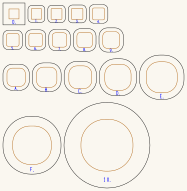

# Trumpet parts

The **bell** and the **mouthpiece**: the generators that draw them, and the sheets that
a trumpet cuts. Both are built on the **10 × 10mm channel** — 16mm outside in 3mm Baltic
birch plywood — so either fits any bore cut to it, today the
**[switchback trumpet](https://github.com/Gernreich/trumpet/tree/main/bores/switchback)** at 10mm.

They live here rather than inside one instrument because neither is changed by the shape
of the bore. A trumpet is a mouthpiece, a length of tube and a bell; only the tube differs.

**The 25mm parts were retired on 2026-09-03.** Both generators still take `--bore`, so any
channel can be cut from them, but the sheets kept here are the 10mm ones. The 25mm bores
that used to take them —
[coiled](https://github.com/Gernreich/trumpet/tree/main/bores/coiled),
[octagonal](https://github.com/Gernreich/trumpet/tree/main/octagonal) and the switchback's own 25mm
folder — are unaffected as bores; they simply have no bell or mouthpiece cut for them here
any more. Git has the old sheets if they are wanted back.

Millimetre-true at `1 user unit = 1mm`, so everything prints and cuts at real size.

<!-- readme-only -->
**[Read the writeup](https://gernreich.github.io/trumpet/parts/)** — the same text as this
page, set for reading, with a table of contents.

Built for **[LaserMadeMusic](https://www.youtube.com/@LaserMadeMusic)**, where the cutting
and the playing are shown.

**[The rest of the build files](https://gernreich.github.io/)** — every instrument,
generator and tool, indexed.

**[Download the whole repository as a ZIP](https://github.com/Gernreich/trumpet/archive/refs/heads/main.zip)**
— the whole tree, not the parts alone; the bell and the mouthpiece are under
`parts/`. GitHub builds it from `main` on every push, so it is never out of date.

<table>
<tr>
<td align="center"></td>
</tr>
<tr>
<td align="center">bell/bell-round10-153mm-17rings-x3-rim86-cut-files.svg &middot; 187.2 &times; 191.9mm sheet</td>
</tr>
</table>

## What fits what

The bore is cylindrical — constant section end to end — and the only part of a trumpet
that flares is the bell. That is why these two parts are interchangeable across bores:

| | dimension | mates with |
| --- | --- | --- |
| Bore, air channel | 10mm square | the bell's 10mm throat and the mouthpiece's station one |
| Bore, end face | the 3mm ring between them | covered completely by the bell's flange and the mouthpiece's plate |
| Mouthpiece station one | 16mm square plate, 10mm square aperture | the end face of a 16mm-block bore |

The wall is 3mm either way, so **the plate is always the channel plus 6mm**. That one line
is the whole of what `--bore` changes.

## The two sheets

**[`mouthpiece-bore10-trumpet-parts-cut-files.svg`](mouthpiece/mouthpiece-bore10-trumpet-parts-cut-files.svg)**
and
**[`bell-round10-153mm-17rings-x3-rim86-cut-files.svg`](bell/bell-round10-153mm-17rings-x3-rim86-cut-files.svg)**
— a mouthpiece and a bell for a **10mm bore on a 16mm block**.

Both generators take **`--bore`**, which sets the air channel and the plate around it —
**the channel plus a 3mm wall each side** — and nothing else. The ply is still 3mm and a
ring still rises 3mm; that part genuinely cannot be scaled, which is why a bell for a
small bore is not a small bell.

`bell.py` and `mouthpiece.py` do **not** take `--bore`. Only the square-to-round pair
does, because those are the two anything new is cut from.

### The mouthpiece

    python3 mouthpiece-round.py --bore=10 --rim=17 --layout=trumpet

30 rings, 90mm stacked: a sharp **10mm square aperture in a 16mm square plate** at station
one, rounding to a true circle by station 3, only 6mm up, because a 10mm square has that
little corner to lose. Then a 26-ring, 75mm backbore
down to the standard **ø3.66 throat**, and a four-ring bowl out to a **ø17mm rim**.

**The throat does not follow the bore.** ø3.66 is a #27 drill and a real trumpet throat;
a mouthpiece is sized by the lip at one end and the drill at the other, not by the tube it
feeds. `--rim=17` is the inside of the rim, where the lip sits, and 16 to 17mm is where a
trumpet lives — so this mouthpiece is full size on a quarter-size instrument, which is the
point of it.

`--layout=trumpet` because this is a new part: it spends its length on the backbore and
keeps a 12mm cup, which is how a real mouthpiece is proportioned. The `legacy` layout is
kept only for the one that has already been glued.

### The bell

    python3 bell-round.py --bore=10 --length=152 --mouth=80

A **10mm square throat opening to ø80 of air over 152mm**, flange ø10 in a ø22 square,
covering the bore's 10–16 end face 3mm proud. Drop the ring budget and you get four
lamination schedules of the same bell; the **17-ring** is the one that was kept, 17 × 3 ply
for a 153mm stack off a 187 × 192mm sheet in 3 passes. 152 divides by neither 3 nor 9, so
every schedule overshoots a little and the stack lands at 153mm; asking for 153 in the
first place would have divided evenly by both.

### `--mouth` is the hole, `--rim` is not

This is the trap the option exists to close. **`--rim` is the *square* bell's width at the
rim**, which the area law then opens out by `2/√π` once the section is a circle — so
`--rim=80` delivers a **ø90.3** hole, not an 80mm one. `--mouth=80` inverts that and gives
you 80.

Beside it, the outer diameter is another **6mm** larger again, because the rim ring carries
the 3mm lap each side: this bell is **ø80.0 of air inside a ø86.0 rim**. The `section` line
now prints both, and the README's "Rim diameter" column has always been the outer one.

## See them built

Every sheet has two pictures. **Turn it** is a solid you can drag; the
isometric is one fixed view, better for a page. Both are drawn from the cut
file's own ring sizes, so neither can drift from what gets cut.

| Part | Rings | Height | | |
| --- | ---: | ---: | --- | --- |
| [`mouthpiece-bore10-trumpet-parts`](mouthpiece/mouthpiece-bore10-trumpet-parts-cut-files.svg) | 30 | 90.0mm | [turn it](mouthpiece/mouthpiece-bore10-trumpet-parts-turn.html) | [isometric](mouthpiece/mouthpiece-bore10-trumpet-parts-view.svg) |
| [`bell-round10-153mm-17rings-x3-rim86`](bell/bell-round10-153mm-17rings-x3-rim86-cut-files.svg) | 17 | 153.0mm | [turn it](bell/bell-round10-153mm-17rings-x3-rim86-turn.html) | [isometric](bell/bell-round10-153mm-17rings-x3-rim86-view.svg) |

`part-view.py` writes the turnable pages and `bell-view.py` /
`mouthpiece-view.py` the isometrics. All three read the ring sizes with the
same `sections()`.

## Colour is the cut order

**Blue engraves, then green -> orange -> cyan -> black**, with black always the cut that
frees the part and violet always skip. That sequence is shared by every LaserMadeMusic
repository.

**Every bell and mouthpiece sheet here uses three of those stages.** Blue engraves the ring
numbers, **orange cuts each ring's aperture**, and black cuts the outlines and frees the
parts. The aperture and the outline used to be one path in one colour, which left a
per-colour job free to cut an outline first and drop a ring before its hole was in. Holes
before rims, and the file now says so rather than relying on the order paths happen to be
written in.

**A nested sheet needs more than that.** Where a small ring sits inside a big one's
aperture, the small one has to be cut first or it is freed along with the waste it sits in,
and one black stage cannot say so. `ramp_bell.py` answers that with a **black → red ramp**,
one stage per ring by size, so the cut runs smallest first. None of the sheets here are
nested today, so all of them cut in a single black stage with their numbers in blue. Give
a ramped sheet an explicit operation per colour — a per-colour job silently skips any
colour left unmapped.

## Before you cut

**Cut these in 3mm Baltic birch plywood.** Ring thickness is ply thickness here: a bell
ring rises 3mm because the sheet is 3mm, and the mouthpiece stacks 23 rings into 69mm the
same way. Substituting 4mm stock does not scale the design, it breaks the profile.

Check an edited sheet with `verify_bell.py` rather than diffing path data — once paths
have been through an editor and converted to curves, a byte diff says nothing.

## Files

**The bell**, in `bell/` — `bell-round10-153mm-17rings-x3-rim86-cut-files.svg`, generated
by `bell-round.py`, which checks its own sheets rather than leaving it to
`verify_bell.py`, and numbers their rings itself. `ramp_bell.py` applies the cut-order
colour, and `verify_bell.py` checks an edited sheet for ring sizes, the lap it states,
nesting order and overlapping cuts.

`bell.py` is still here and still writes a square-section bell on demand; no sheet from it
is kept.

**Each number carries an orientation tick.** A ring is a circle and has no top, so a number
alone is ambiguous: turned over, a `3` reads as an `E` and a `6` reads as a `9`. A short
mark on the baseline, right of the last character, says which way up the label was
engraved — the same convention as a seven-segment display's decimal point, or the
underlined 6 and 9 on dice. `--mark=no` writes a label without one.

**The mouthpiece**, in `mouthpiece/` — `mouthpiece-bore10-trumpet-parts-cut-files.svg`,
generated by `mouthpiece-round.py`, which checks every joint in both directions before it
writes, and engraves each ring's number itself by calling
`bell/number_rings.py --order=document` as its last step. `--numbers=no` writes a bare
sheet; a numbering failure deletes the sheet rather than leaving an unnumbered one to be
cut. `mouthpiece.py` and `mouthpiece-cup.py` are kept and write on demand; no sheet from
either is.

**Display only, never cut** — the axial sections
`bell-round10-153mm-17rings-x3-rim86-section.svg` and
`mouthpiece-bore10-trumpet-parts-section.svg`, drawn by `bell-section.py`; the isometrics
`bell-round10-153mm-17rings-x3-rim86-view.svg` and
`mouthpiece-bore10-trumpet-parts-view.svg`, from `bell-view.py` and `mouthpiece-view.py`;
and the turnable pages `bell-round10-153mm-17rings-x3-rim86-turn.html` and
`mouthpiece-bore10-trumpet-parts-turn.html`, from `part-view.py`.

Released under [CC0 1.0](LICENSE).
