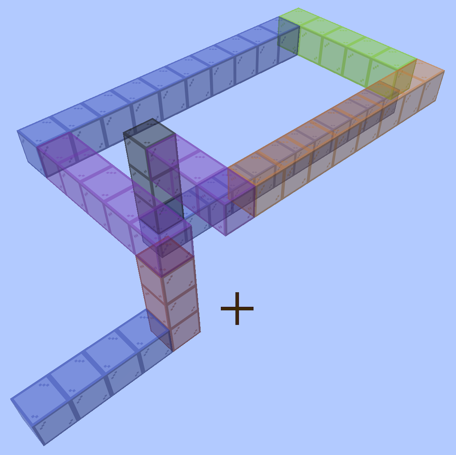

# Bore designs

Every bore that has been worked out, built out into cut files and a viewer page and kept.
This is the corpus **[bore-generator](https://github.com/Gernreich/trumpet/tree/main/tools)**
regresses against: `regress.py` runs the full gate over these, which is the only reason any
of it stays honest.

<!-- readme-only -->
**[Read the writeup](https://gernreich.github.io/trumpet/parts/bore/concept/)** — the same text as this
page, set for reading, with a table of contents.

**[The rest of the build files](https://gernreich.github.io/)** — every instrument,
generator and tool, indexed.

Built for **[LaserMadeMusic](https://www.youtube.com/@LaserMadeMusic)**, where the cutting
and the playing are shown.

**[Download the whole repository as a ZIP](https://github.com/Gernreich/trumpet/archive/refs/heads/main.zip)**
— the whole tree, of which this library is `designs/`: every design, its cut
files and its page. GitHub builds it from `main` on every push, so it is never out of date.

**The bore being built is the coiled trumpet:**
[`N N3 U6 W5 N10 E5 D3 S8 W3 D3 N12 N`](pages/coiled_trumpet.html) — 59 blocks, 944mm,
8 sections, **no elbows anywhere**. Its cut files and writeup are in
[trumpet-coiled](https://github.com/Gernreich/trumpet/tree/main/parts/bore/concept/walk/no-elbows/coiled). Everything below is how
that design was arrived at, starting from a first trumpet that used elbows and worked out
what they cost.

The SVGs regenerate byte-identical from the walk, so the walk and the generator are the
real source — but they are kept here so there is something to send to the machine without
running anything.

The nested sheets are not kept: they assume a full sheet of material, and
partly cut boards do not work that way. `nest.py` still produces them if a
whole sheet ever comes up.

The walk it is all built from, and [the bore to turn around](walk/elbows/first_trumpet/first_trumpet.html):

```sh
cd ../../../GIT/bore-generator
W="N N10 U2 W2 S7 U2 E4 N9 W2 D2 N4 N"

python3 bore_split.py --write walk/elbows/first_trumpet "$W"   # the eight sections
python3 nest.py "$W" --out nest.svg                # the same parts nested
python3 nest.py "$W" --deepnest dn.svg             # for Deepnest/SVGnest
python3 bore_render.py "$W"                                   # the 3D view
python3 check.py "$W" --files walk/elbows/first_trumpet        # cut nothing until it passes
```

## The first trumpet bore

The design this all started from, and **not** the one being built — it turns with elbows,
which is what the rest of this page goes on to price. Compare it against the
[coiled trumpet](pages/coiled_trumpet.html), which does the same job with none.

[`N N10 U2 W2 S7 U2 E4 N9 W2 D2 N4 N`](walk/elbows/first_trumpet/first_trumpet.html) — 45 blocks,
720mm of centreline. **Every walk on this page is a link**: follow one and the bore
opens in a page you can turn around with the mouse, colour by direction or by section,
and step through block by block.

Read off a Minecraft model coloured by direction — yellow north, grey south,
blue east, red west, orange up, green down, each block coloured by the way you
travelled to reach it.

Eight sections, numbered along the bore from the mouthpiece. Every part is
engraved with its section number and nothing else, about 1.7mm tall — enough
to tell a loose part which section it belongs to, which is what gets lost on
the bench.

Part names and per-edge marks were tried and dropped: on parts this size they
were harder to read than they were worth.

`P1` and `P2` — the two face plates of a section — are mirror images rather
than spares, and on sections 1, 3, 4, 6 and 8 they genuinely differ, one having
a coupling the other does not. The plate whose seam edge has no notch or tab is
the one that faces the elbow.

44 flat parts, 3mm stock, 10mm square bore throughout, every sheet inside the
xTool P2S bed of 600 x 308mm.

**Couplings kept, six sides flattened.** An elbow's opening frame has three
sides — the fourth is its other opening — so at every seam with an elbow, one
side of the neighbour's frame has no mate: a notch nothing fills, or a tab with
nowhere to go. That side is a face plate in every case, so one of that
section's two plates drops its coupling at that end and the other keeps it.

Six sides in all, on sections 1, 3, 4, 6 (both ends) and 8, marked `_flatin` /
`_flatout` in the file name. Every other coupling stays, so the tabs still hold
each seam square while the glue sets.

The one thing no check can settle is **which** of the two plates was flattened:
they are the same shape mirrored, and which ends up facing the elbow depends on
how Boxes lays the mirrored copy out. It is derived rather than measured. Dry
fit section 1 to section 2 before cutting the rest — if it is the wrong way
round you will find a tab with nowhere to go, and it is a one-word change.

Nested, the lot is two sheets. Sections 2 and 7 are the same shape but are cut
separately so each carries its own number.

Sections 2, 5 and 7 are one-cell elbows, which is where the bore changes plane.
Each leaves its 3 x 3 x 25mm corner open on the inside of the bend — sealed
from outside by the surrounding walls and plates, so a notch in the bore rather
than a leak.

**No ports.** A port opens one face plate so a change of plane can happen inside
a piece, which would make this five sections rather than eight. It is not used:
the plate it opens leaves that cell's walls supported on one side, with their
fingers facing nothing. `bore_split.py --ports` still turns it on; what remains is suppressing the fingers on the
missing-plate side over the port cell.

## When a turn costs a section

A piece is cut as a flat snake and its opening sits on the rim, opposite the
neighbouring cell, so **a piece's two end blocks must be straight**. A block
that bends cannot be at the end of one. Every turn therefore has to sit inside
a piece, which means a straight block on each side, in the same plane, not
already claimed by the piece next door.

Everything about how a design splits follows from that.

**Folding is free.** Two turns in a row that use only two axes - north to up,
then up to north again - stay in one plane and share a piece, however tightly
they are packed:

| walk | axes | cost |
| --- | --- | --- |
| [`N N3 U1 N3 U1 N3 N`](pages/fold_u1.html) | y and z only | 1 section, 0 elbows |
| [`N N3 U2 N3 U2 N3 N`](pages/fold_u2.html) | y and z only | 1 section, 0 elbows |
| [`N N3 U3 N3 U3 N3 N`](pages/fold_u3.html) | y and z only | 1 section, 0 elbows |

**Coiling costs three blocks a turn.** Two turns in a row that reach a third
axis - north to up, then up to east - leave the plane, so the piece breaks
between them and each turn needs a straight block of its own:

| walk | axes | cost |
| --- | --- | --- |
| [`N N3 U1 E3 U1 S3 S`](pages/coil_u1.html) | all three axes | 7 sections, 4 elbows |
| [`N N3 U2 E3 U2 S3 S`](pages/coil_u2.html) | all three axes | 5 sections, 2 elbows |
| [`N N3 U3 E3 U3 S3 S`](pages/coil_u3.html) | all three axes | 3 sections, 0 elbows |

Three blocks apart is the threshold: two straights between the turns, one for
each. With one straight they fight over it and one turn is stranded on its own
as a single-block elbow. With none - adjacent turns - both are.

The turn that is not stranded becomes the corner of an **L**, and two Ls in
place of an elbow is both fewer files and fewer parts:

| walk | pieces | elbows | blocks | parts |
| --- | --- | ---: | ---: | ---: |
| [`N N4 U1 E4 E`](pages/two_ls_u1.html) | straight, elbow, elbow, straight | 2 | 10 | 16 |
| [`N N4 U2 E4 E`](pages/two_ls_u2.html) | straight, elbow, L | 1 | 11 | 14 |
| [`N N4 U3 E4 E`](pages/two_ls_u3.html) | L, L | 0 | 12 | 12 |
| [`N N4 U4 E4 E`](pages/two_ls_u4.html) | L, L | 0 | 13 | 12 |

### Writing it

Mid-walk, two Ls meeting is three consecutive terms on three different axes
with **3 in the middle**:

| fragment | axes |
| --- | --- |
| [`... E4 U3 S4 ...`](pages/mid_E4U3S4.html) | east, up, south |
| [`... W4 N3 E6 ...`](pages/mid_W4N3E6.html) | west, north, east |
| [`... S9 E3 U5 ...`](pages/mid_S9E3U5.html) | south, east, up |

Each link opens the fragment inside a complete walk, since a fragment on its own has
no way in or out.

The outer numbers can be anything - 1, 4, 9, it makes no difference. Only the
middle one has to be 3, because that is the leg the two pieces divide between
them; the legs either side are already there and each supplies an arm for
free. On its own, from a standing start, the same figure is six blocks:

[`E E1 U3 S1 S`](pages/six_block_turn.html)

    block  travels  turns        piece  role
      1      E                     1    arm
      2      U      E -> U         1    corner
      3      U                     1    arm
      4      U                     2    arm
      5      S      U -> S         2    corner
      6      S                     2    arm

The seam always falls inside the three-block leg, one block to the piece behind
and two to the piece ahead.

Three is the number that is always safe rather than the number always needed,
and what decides it is whether the three terms name three different axes.

| fragment | why | cost |
| --- | --- | --- |
| [`... W9 N2 U9 ...`](pages/unlucky_W9N2U9.html) | x, z, y — all different | **1 elbow**, in every context |
| [`... W9 N3 U9 ...`](pages/fixed_W9N3U9.html) | the middle widened to 3 | 0 elbows, two 11-block Ls |
| [`... U5 W4 N2 E6 ...`](pages/slack_U5W4N2E6.html) | two turns only | 0 elbows, the search has slack |

[`W9 N2 U9`](pages/unlucky_W9N2U9.html) is the unlucky shape: both turns leave the plane, so they need an arm
each, and the two-block leg has one straight block to give. One turn takes it,
the other is left bare. The nine-block legs either side do not help - the
problem is between the turns, not outside them - and no context rescued it:
alone, mid-walk, with a turn before, with a turn after, always one elbow. `N3`
makes it two 11-block Ls for 31mm more bore.

So: **if three consecutive terms name three different axes, the middle one must
be 3.** If two of them share an axis it is a fold, and can be as tight as you
like.

Apply that to **every** window of three terms, not the one you happen to be
looking at. A fragment can be blameless and still cost elbows through the
windows it forms with its neighbours:

| walk | what it is | cost |
| --- | --- | --- |
| [`W W1 N2 E1 E`](pages/fragment_alone.html) | the fragment on its own | one 5-block bend, no elbows |
| [`U U4 W1 N2 E1 U4 U`](pages/fragment_in_walk.html) | the same fragment in a walk | 7 sections, **4 elbows** |
| [`U U4 W3 N2 E3 U4 U`](pages/fragment_widened.html) | the two ones widened | 3 sections, no elbows |

The middle one costs four elbows because of the windows it forms, not the fragment:

| window | axes | middle | cost |
| --- | --- | ---: | --- |
| [`U4 W1 N2`](pages/window_U4W1N2.html) | three axes | 1 | an elbow |
| [`W1 N2 E1`](pages/fragment_alone.html) | a fold | 2 | fine |
| [`N2 E1 U4`](pages/window_N2E1U4.html) | three axes | 1 | an elbow |

W1 N2 E1 is a fold and free in itself - W and E are both the x axis. What costs
is the W1 and the E1 each being the middle of their own window, where the terms
either side reach a third axis.

An L needs a straight block running out to each of its two ends - that is what
gives the piece the flat end faces its neighbours couple to - so two turns can
never share one straight between them. Whichever piece claims it, the other
ends on a bending block, and a bending block cannot open on the rim. Adjacent
turns therefore have no arrangement of Ls at all; that is geometry, not the
splitter being careful.

Note that this is the opposite trade from re-splitting a walk that is already
written. Adding a block to move two turns apart buys an L and pays for itself;
re-splitting the same blocks to avoid an elbow costs about two parts. The first
changes the walk, the second only changes where the seams fall.

It is not about which axes a single turn uses. One turn defines a plane by
itself and is always fine. It is about whether the turn after it stays in that
plane.

The splitter is set to take **the fewest single-block elbows**, and the fewest
pieces only after that. `--fewest-pieces` swaps the two.

In parts alone that is the wrong way round: measured over 133 walks it trades
23 elbows for 46 more parts and never fewer, because folding a turn into a bend
adds two walls to that bend while a lone elbow is four parts for its whole
block. It costs no extra pieces - over those same walks the count did not move
at all - but it is not free.

It is still the right setting, because the part count is not what an elbow
costs. An elbow's opening frame has three sides rather than four, and that
missing side propagates into the pieces either side of it:

What an elbow costs, counted across the designs here. **Flats, tongues and voids track
elbows exactly** — every design with no elbows has none of any of them, and the design
being built is one of those:

| design | elbows | flats | tongues | voids | parts |
| --- | ---: | ---: | ---: | ---: | ---: |
| [first trumpet](walk/elbows/first_trumpet/first_trumpet.html) | 3 | 6 | 0 | 3 | 44 |
| [spiral trumpet](walk/elbows/spiral_trumpet/spiral_trumpet.html) | 3 | 5 | 1 | 2 | 68 |
| [telescope spiral](walk/elbows/telescope_spiral/telescope_spiral.html) | 11 | 18 | 2 | 9 | 106 |
| [hilbert snorkel](walk/elbows/hilbert_snorkel/hilbert_snorkel.html) | 24 | 26 | 20 | 4 | 260 |
| [wide telescope](walk/no-elbows/wide_telescope/wide_telescope.html) | **0** | 0 | 0 | 0 | 72 |
| [metre spring](walk/no-elbows/metre_spring/metre_spring.html) | **0** | 0 | 0 | 0 | 36 |
| [**coiled trumpet**](pages/coiled_trumpet.html) — the one being built | **0** | 0 | 0 | 0 | 50 |

A **flat** is a plate whose coupling was dropped because it faced an elbow's
missing side: no tab, no notch, nothing to locate against. Two smooth faces
held square by eye while the glue grabs. A **tongue** is a wall run 3mm past
the joint to fill the inside of a bend, glued the same way and having to clear
the elbow's face as it goes. A **void** is the corner nobody could fill.

None of those appear in the part count, and all of them track the elbow count
exactly. A design with no elbows has none of them: every seam is a full
four-sided coupling that locates itself, and the glue only has to hold what the
tabs have already squared up. Two more plywood parts against a butt joint held
square in mid-air is not a close trade.

Two other ways a turn becomes an elbow:

* **A turn in the last block of the bore.** There is nothing after it to make
  it interior, so it is always its own piece. [`N N5 U`](pages/last_block_turn.html)
  is 6 blocks in **2** pieces; [`N N5 U1 U`](pages/last_block_straight.html) is 7
  blocks in **1**. One block further along the bore costs a file fewer.
* **A bed split** landing on a turn, if the piece would otherwise be too big.

Which is why the designs here come out so differently. The switchback ramp
folds back and forth in one plane: 91 blocks, 17 sections, no elbows at all.
The Metre Spring coils, so every quarter leaves its plane - it gets away with
no elbows only because rising 3 gives each turn its own straight. The Hilbert
cube at scale 1 changes plane at nearly every turn with no room between, and
comes out as 56 elbows in 63 sections.

## How big a piece can be

A flat piece is one sheet, so the bed sets the limit: **at most 19 blocks one
way by 9 the other**, measured on the piece's bounding box in its own plane,
not on its block count. An L of 19 by 9 is 27 blocks and fits; a square of 10
by 10 is 19 blocks and does not.

    19 x 31mm + tab + burn = 592mm  against the 600mm bed
     9 x 31mm + tab + burn = 282mm  against the 308mm

`bore_split.py --no-write` prints the plate size of every piece and flags any
that will not fit, so a design can be checked before anything is drawn. The
size is read off the walk, exact on the long axis and 3mm pessimistic on the
short one - it never says a piece fits when it does not.

A run longer than that is not an error: the splitter puts a turn's worth of it
in the next piece, or spills the parts onto a second sheet, which is why
section 6 is two files. The machine itself takes stock up to 3 m through the
pass-through, but nothing here knows how to use it.

## What a walk is checked for

Four layers, and the first three are automatic:

1. **Reading it.** A reversal, a block asked to bend twice, and a walk that
   runs into itself are refused outright, naming the blocks: "block 9 runs into
   block 1". Every entry point reports it the same way.
2. **Splitting it.** Whether each piece is one flat snake, whether an end block
   that bends can open on the rim, and whether the piece fits the bed. A piece
   too big is not an error - the search simply will not use it.
3. **Warnings that are not errors.** Blocks that touch without being joined
   along the bore, single elbows meeting directly, and inside corners left
   unfilled. All legal, all worth a look.
4. **The gate**, `check.py`: the parts, the sections, the seams and a voxel
   model of the assembled bore. `--write` runs it on what it just wrote, so a
   design folder having been made means it has been checked.

`regress.py` runs the gate over every design in the repository, which is the
only way any of this stays honest.

### The build is the check; the notation is what goes wrong

Building the bore in Minecraft first is the check, not a rehearsal for one. You build it
floating in open space, knowing you are building a bore, and a section running into one
you laid down earlier is plainly visible while you are standing in it. **A build that
looks right is evidence the bore works.**

<p>

</p>

*The [coiled trumpet](pages/coiled_trumpet.html) as built, floating in open sky with
nothing else in frame. Every block is coloured by the way you travelled to reach it —
**N blue, S orange, E green, W purple, U red, D grey** — the same palette the viewer and
the renders use, so a build and a drawing can be compared at a glance.*

What goes wrong afterwards is writing it down. A walk is a long string of letters and
numbers transcribed from something you built by eye, and one wrong letter is enough —
which is a job a human is bad at and a script is good at. So: **trust the build, and let
the script check the notation.**

[`N N3 U3 W5 N10 E5 S8 W3 S3 N12 N`](walk/no-elbows/doubled_walk/doubled_walk.html) is the example. It
was refused, and the build it came from was fine — the fault was a single letter in the
transcription, an `S3` where the build turned `D3`, and no amount of adjusting the
*lengths* fixed it because the fault was a direction. Read the walk back off the page
rather than off your memory of the build.

Walked permissively it places fifty-three blocks into forty-eight cells: five land where
a block already is, and the `S3 N12` at the end is a 180 that retraces its own last
three blocks. That is what a crossing costs. A cell entered twice is a junction — the
air arrives with two ways out — and there is no box section with an opening in four
sides, so it cannot be cut at all.

`mcwalk.py` draws a refused walk under Minecraft's permissive rules instead of the
bore's, and lights up every cell entered more than once, which the ordinary viewer
cannot do because it will not open a walk that crosses itself:

    cd ../../../GIT/bore-generator
    python3 mcwalk.py "N N3 U3 W5 N10 E5 S8 W3 S3 N12 N" \
        --out walk/no-elbows/doubled_walk/doubled_walk.html --title "..."

The step slider is the tell: scrub it and watch *placed* keep climbing while *cells
filled* stalls — that gap is where the transcription went wrong.

## Before cutting

`check.py` runs every check there is — 234 of them on this bore, across the
parts, the sections, and the seams between them. Each exists because something
was cut and thrown away:

| check | what it caught |
|---|---|
| part is one closed piece | a plate all but severed by a port hole |
| no feature under 1.5mm | 0.5mm and 0.1mm slivers on three plates |
| the two plates are one part mirrored | a plate drawn a cell short, its fingers 2mm out of phase |
| no wall finger left unengaged | section 5's closed-end wall, hanging off one plate |
| both sides agree on bore and tab size | an elbow tab sitting 1.5mm off the centreline |
| seam has no port | a port opening a face that carries a joint |
| sheet fits the bed | a nested sheet 2mm over |
| no two parts overlap | parts sharing a cut line on a nested sheet |
| engraving on material | labels placed in the notch of an L-shaped plate |
| the section closes round its bore | a port, or any face left open |
| the joint is closed | an end frame not backed by material |
| the bore carries on through the joint | two sections not meeting |
| the assembled bore is one sealed passage | anything the above miss, end to end |
| bore volume matches the walk | the assembly not being the bore you asked for |
| part count, part fits the bed, seam gender | — |

Run it with ports turned on and **16 checks fail** across five names, naming the three
ported sections and all four seams — so it is known to fail when it should. Those five:
the two plates are one part mirrored, the section closes round its bore, no wall finger
left unengaged, seam is one tab side and one slot side, and seam has no port.

It does fold each section up in 3D. `assemble.py` builds the section as a
solid - plates over both faces, walls the full depth of the tube along every
boundary run that is not an opening - plugs the openings it is meant to have,
floods the outside, and asks whether the flood reaches the bore. The model is
checked against arithmetic on the way past: a two-cell straight comes out at
25 x 25 x 62 = 38,750 mm3 of bore, to the voxel.

The seams get the same treatment. Two sections are put where the bore actually
puts them with only their outer ends stopped up: if the joint leaves any of the
end frame unbacked the flood gets in, and if the two bores do not meet the bore
comes back as more than one region. Then all eight go in at once, and the volume
that comes out is compared with what the walk says it should be — 874,936 mm3
against 45 blocks x 25 x 25 x 31 = 871,875, the difference being the voxel size.

These are the checks that test the thing you are actually trying to do rather
than a proxy for it. On the port version the section check reports the whole
bore of sections 2, 4 and 5 open to the outside; break a seam deliberately and
the joint check reports the bore in two pieces.

## Turning one around

Every design folder carries a page you can turn around with the mouse, named
for the folder - `first_trumpet/first_trumpet.html`,
`spiral_trumpet/spiral_trumpet.html` and the rest. Walks with no cut files have a
page of their own instead; they are listed under [Loose pages](#loose-pages).
Open one in a browser; nothing is installed and
nothing is fetched but the fonts. Drag to turn, scroll to zoom, right-drag to
pan, colour by direction or by section, click a legend row to isolate it, and
drag the slider to follow the bore from the mouthpiece a block at a time.

**Blocks** opens a list of every block from the mouth: its number, its colour,
which way the bore goes through it, and its position relative to block one,
with the turns ruled off. That is the list to build from - place block one
anywhere and follow the offsets - and every line is checkable against F3.

The direction colours are the ones the bore gets built in first:

    up     red        down   grey
    north  blue       south  orange
    east   green      west   purple

Down is grey rather than a sixth hue because grey is a block you can actually
get, and because it cannot be mistaken for south's orange once the faces are
shaded - which yellow can. Change them in `DIRCOL` at the top of
`bore_render.py`; `viewer.py` takes them from there, so one edit moves both the
pages and the still renders.

The walks with no cut files sit loose in the repository root, listed under
[Loose pages](#loose-pages) below.

The stepped coil and the switchback ramp are worth reading together. The [stepped coil](walk/elbows/stepped_coil/stepped_coil.html) is
`U1 W1 S2 E2` six times over and costs 116 parts for 40 blocks; the
[switchback ramp](walk/no-elbows/switchback_ramp/switchback_ramp.html) is the same idea with every leg widened,
`U2 W3 S3 E3`, and costs 132 parts for 91. Same
family, less than half the parts per block, because a leg of one block forces
a standalone elbow and a leg of three does not.

It goes the other way too. Every tool takes a walk, a file with one in, or one
of these pages - the walk sits in the page's title rail, so a page you kept is
enough to cut from and nothing else has to be filed:

    python3 bore_split.py --write out ../../../test/telescope_spiral/telescope_spiral.html
    python3 check.py ../../../test/tightest_coil.html
    python3 viewer.py walks/small_hook.txt --out again.html

`bore_split.py --write DIR` writes the page along with the cut files, so the
two cannot drift apart. For a walk you are only looking at:

    python3 viewer.py "<walk>" --out ../../../test<name>.html --title "<Name> Bore"

## A sheet for airtightness testing

`small_trumpet.svg` is a hand-nested sheet, 209 × 254mm, carrying 24 finger-jointed
plates with sections 2 and 5 engraved. It exists for a job the generator does not do:
**its entrance and exit are flat**, so the assembled bore can be sealed at both ends and
checked for leaks before it is committed to. A bore that whistles at a seam is worth
knowing about while the glue is still a choice.

It is also nested by hand rather than by `nest.py`, which lays each section out on its
own sheet — two small sections that would share one sheet get cut on two.

One cut stage: every outline black, the section numbers engraved blue. It was drawn with
half the plates stroked red in a style property while carrying a black attribute, so it
showed red in Inkscape and would have cut black through an importer that reads the
attribute — and red is not a stage anything here maps, so a per-colour job would have
skipped those twelve in silence. The reds are now black and the duplicate attributes are
gone; `svg-stroke-check.py` reports nothing.

## Loose pages

Six walks that got a viewer but never got cut. Each is a self-contained page — the
walk is baked into it, so `bore_split.py` will read the cut files back out of any of
them.

| walk | blocks | sections | elbows | why it is kept |
| --- | ---: | ---: | ---: | --- |
| [`E E8 U3 S8 S`](walk/no-elbows/three_block_turn/three_block_turn.html) | 20 | 2 | 0 | the three-block minimum on its own: two long runs and the shortest leg that still turns without an elbow |
| [`U U3 W3 N2 E1 E`](walk/no-elbows/hook_check/hook_check.html) | 10 | 2 | 0 | the smallest walk that ends on a single block, which is where the splitter used to strand a turn |
| [`U U1 W1 S2 E2` × 6](walk/elbows/stepped_coil/stepped_coil.html) | 40 | 26 | 18 | six loops marching diagonally, every leg as tight as it goes |
| [`U U2 W3 S3 E3` × 8](walk/no-elbows/switchback_ramp/switchback_ramp.html) | 91 | 17 | **0** | the same idea with every leg widened: eight hairpins climbing |
| [the tightest coil](walk/elbows/tightest_coil/tightest_coil.html) | 22 | 20 | 18 | single-block legs throughout — 20 sections for 22 blocks, the worst ratio here |
| [a Hilbert cube with an eight-block riser](walk/elbows/hilbert_snorkel/hilbert_snorkel.html) | 138 | 48 | 24 | the densest walk here, with the exit taken up and clear of the cube |

The snorkel's walk is 60 terms and does not fit a table cell; it is on
[its own page](walk/elbows/hilbert_snorkel/hilbert_snorkel.html), and in full here:

    U U4 E2 D2 S2 U2 W2 D2 S4 E2 N2 U2 S2 W2 N2 U2 S2 U2 N2 E2 S2 D2 N4 W2 U2 E2 N2 W2 D2 E6 U2 W2 S2 E2 D2 W2 S4 U2 N2 E2 S2 D2 N2 D2 S2 W2 N2 D2 S2 E2 N4 U2 W2 D2 N2 U2 E2 D2 E1 U8

`index.html` is this README rendered by `md2html.py` and committed, not built on the
server, so it goes stale silently unless it is regenerated after every edit.

Released under [CC0 1.0](LICENSE).
