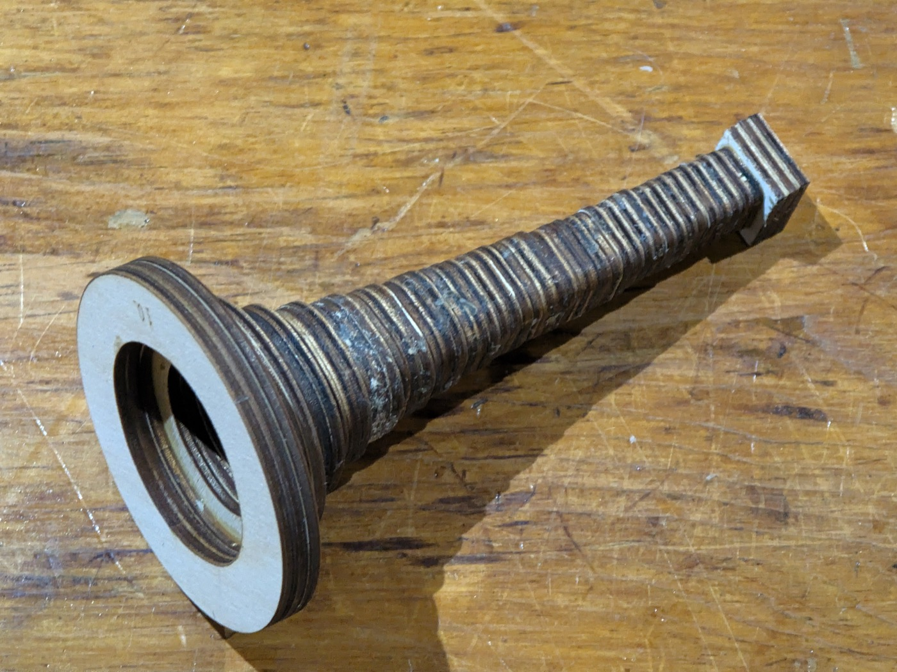
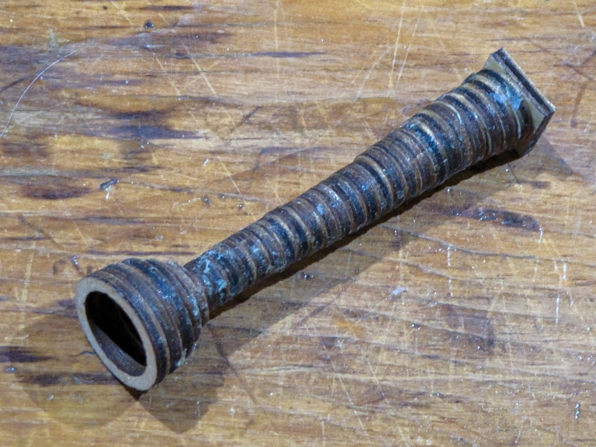

# The three-turn trumpet

**The one that plays.** The spiral is in wood too; this one is glued up,
varnished and blown, and it makes a note. A coil of **1096mm in 12 sections**
winding **three whole turns** about a north–south axis, with a mouthpiece at one
end and a 153mm bell at the other.

<!-- readme-only -->
**[Read this page](https://gernreich.github.io/trumpet/three-turn/)**

**It plays. One of its notes is F4** — 349.2 Hz, measured off the instrument.


**[Turn it →](../built/coil-fold2-long-straight-3t/fold2-long-straight-3t.html)**
The viewer is a page of its own, not a frame in this one: drag to rotate, and
the slider reveals the bore a block at a time in the order it was glued.

## The walk is the whole design

```
N1 W3 U2 E3 N3 D3 W2 U3 N3 E3 D2 W3 N3 U3 E2 D3 N1
```

The first term is the way you face at the mouth and how far you go before
anything turns; every term after it turns where you stand and then travels that
many blocks. So **the bore is 1 + the sum
of the numbers** — 43 + 1 = 44.

**It is `W U E D` three times over.** Strip the north advances and the lateral
legs read `W U E D W U E D W U E D`: twelve of them, four to a turn, each
followed by a step north. That is the whole coil, written out.

```
N1  W3 U2 E3  N3   D3 W2 U3  N3   E3 D2 W3  N3   U3 E2 D3  N1
```

The first and last blocks sit on the same point of the cross-section, which a
fractional number of turns cannot do. It sweeps **1080°**, right-handed.

> **Two counts of the same winding differ by a quarter turn.** The four coils in
> the family sweep 270°, 540°, 810° and 1080° about the circuit's own centre —
> one group of three lateral legs is three-quarters of a turn — and the folder
> names are those figures. `spiral_metrics.js` sums the turn between
> *consecutive pairs* of lateral legs instead: twelve legs give eleven quarter
> turns, 990°, and read as 2¾. That is the tangent's rotation from the first leg
> to the last rather than the winding, and the two differ by exactly one quarter
> turn whenever the walk closes its circuit. The multi-bore viewer at
> `../parts/bore/concept/walk/coil/fold2-long-straight/coils.html`
> labels its four sets ¼, 1¼, 2 and 2¾ from that same count. Do not take a turn
> count from the tool without checking that the walk closes.

## The numbers

| | |
| --- | --- |
| blocks | 44 |
| centreline | 1096mm |
| sections | 12 |
| parts | 80, over 12 sheets |
| bounding box | 122 × 122 × 304mm |
| turns | 3, right-handed, 1080° about a north–south axis |
| airway | 10mm square, constant |
| stranded turns | none; every turn is a bend |
| whole instrument | 1339mm — 90mm mouthpiece + 1096mm bore + 153mm bell |
| as actually built | 1321mm — the mouthpiece on it is 24 rings, not 30 |
| measured note | F4, 349.2 Hz |

## The straights are stretched, the turns are not

Forty-four blocks at the plain 16mm pitch would be **704mm**. This bore is 1096.
The difference is `--straight=30`: a block that runs straight is drawn 30mm long
while a block that turns stays a 16mm cube, so the tube lengthens without the
walk changing and the cross-section stays square throughout.

That is the cheapest length in the project. A turn is what costs — in pieces, in
glue joints, and in the +41.4% the section grows through a 90° lattice corner —
and stretching the straights buys metres without buying any more of them.

## One walk, four lengths

The same shape truncated at four places, and the truncations are exact:

| | walk ends at | blocks | centreline | sections |
| --- | --- | --- | --- | --- |
| 0.75 turn | `E3 N1` | 11 | 274mm | 3 |
| 1.5 turns | `U3 N1` | 22 | 548mm | 6 |
| 2.25 turns | `W3 N1` | 33 | 822mm | 9 |
| **3 turns** | `D3 N1` | **44** | **1096mm** | **12** |

**274 : 548 : 822 : 1096 is exactly 1 : 2 : 3 : 4.** A tube twice as long sounds
an octave lower, so four bores in that ratio are worth cutting: what the bell and
the mouthpiece actually contribute becomes measurable rather than assumed. The
three shorter ones are candidates in
`../parts/bore/concept/walk/coil/fold2-long-straight/`; this
one is the object.

## The twelve sections

Numbered from the mouthpiece; assemble in order. Every part is engraved with its
section number, because they only go together one way.

| # | blocks | in → out | shape | parts | sheet |
| --- | --- | --- | --- | --- | --- |
| 1 | 1–3 | N → W | `BDL~a` | 6 | 325 × 70mm |
| 2 | 4–8 | W → E | `BLUUR` | 8 | 455 × 86mm |
| 3 | 9–11 | E → N | `BRD` | 6 | 337 × 70mm |
| 4 | 12–14 | N → D | `BDL` | 6 | 331 × 73mm |
| 5 | 15–19 | D → U | `BDLLU` | 8 | 481 × 73mm |
| 6 | 20–22 | U → N | `BRD` | 6 | 337 × 70mm |
| 7 | 23–25 | N → E | `BDR` | 6 | 331 × 73mm |
| 8 | 26–30 | E → W | `BRDDL` | 8 | 455 × 86mm |
| 9 | 31–33 | W → N | `BLD` | 6 | 337 × 70mm |
| 10 | 34–36 | N → U | `BDR` | 6 | 331 × 73mm |
| 11 | 37–41 | U → D | `BURRD` | 8 | 481 × 73mm |
| 12 | 42–44 | D → N | `BLD~b` | 6 | 337 × 70mm |

**Ten distinct sheets over twelve sections.** Only two shapes repeat: `BRD`
(sections 3 and 6) and `BDR` (7 and 10), each cut twice. `BDL` and `BLD` each
appear once coupled and once plain-ended, and a plain end is a different cut —
`BDL~a` is 325 × 70mm against `BDL`'s 331 × 73mm. The four five-block folds are
each cut once. `~a` and `~b` are the two plain ends, the only faces that do not
couple to another section: the mouthpiece lands on one and the bell on the
other. The widest sheet is 481mm and the largest 455 × 86mm, both well inside
the 600mm bed.

The cut files are in
`../built/coil-fold2-long-straight-3t/cut-files/`, named `01of12`
through `12of12`. **Blue engraves, then black cuts.**

## Building it

1. Cut the twelve bore sections, in order.
2. Cut the bell — 17 rings, **three passes**, 51 pieces. Cut it once and you get
   a 51mm stub instead of a 153mm bell.
3. Cut the mouthpiece — 30 rings, one pass.
4. Glue each bore section closed, then join them in engraved order.
5. Stack the bell rings from ring 0 at the bore; stack the mouthpiece rings from
   ring 0 likewise. Both are engraved in hex, `0` at the bore.
6. **Do not finish the mouthpiece.** It goes to the lip as it comes off the
   sheet — the staircase is not sanded, the rim is not filled, and the
   instrument that plays has had neither.

<p></p>

The two on this instrument. Both are **[the bell and the mouthpiece](../ends/)**,
shared by every bore on the 10mm channel — the square block on each is a bore
block exactly, 10mm of air in a 16mm face, which is the whole reason one of each
serves every tube here.

**The mouthpiece is the one part of this instrument that is not what the drawing
says.** It is 24 rings and 72mm; the sheet cuts 30 and 90. The instrument is
short, not the drawing, and that is where the 1339mm above becomes 1321 in wood.

## Clearance is one measurement, not a curve

`PLAY_BY_BORE` is a lookup of what has actually been cut, and it has **one row**:
0.025mm per side at the 10mm bore. A bore not in the table gets that value too — too loose is a worse joint than too tight
is no joint — and the generator says on stderr that it is guessing, because a
guess that looks like a measurement is the dangerous kind.

Whether the requirement is absolute, a fraction of the tab, or something else
takes a second bore to say, and there is one bore. The comment above
`pin_play()`'s table in `../tools/bore_split.py` sets out the coupon
that would settle it, and `--play` is the flag that cuts it.

## Do not size a bore from a pipe formula

F4 lands on no simple mode of a 1.339m tube. It is **2.73 times** the open–open
fundamental (`c/2L` = 128 Hz) and **5.45 times** the closed–open one (`c/4L` =
64 Hz), and neither multiple is a whole number. That is what a bell and a
mouthpiece do: they pull the resonances away from where a plain tube would put
them, and how far is not something either formula knows.

Length still sets the register, which is why the 1 : 2 : 3 : 4 family above is
worth cutting — their bores are exact multiples, so what the ends contribute
becomes a measurement instead of a guess.

## Rebuild it

The generator lives in `../tools`. Report only, writing nothing:

```
python3 tools/bore_split.py "N1 W3 U2 E3 N3 D3 W2 U3 N3 E3 D2 W3 N3 U3 E2 D3 N1" \
    --bore=10 --straight=30 --no-write
```

Drop `--straight=30` and the same walk reports 704mm. Writing rewrites all
twelve sheets and must run under the venv python that has the gate's
dependencies:

```
cd tools && ~/Software/boxes/venv/bin/python bore_split.py \
    ../built/coil-fold2-long-straight-3t/fold2-long-straight-3t.html \
    --straight=30 \
    --write ../built/coil-fold2-long-straight-3t
```

**These sheets were cut.** Regenerating them changes the drawing of a thing that
already exists in wood — check what moved before you replace them.

## The candidates

**[the switchback trumpet](../switchback/)**
· **[the greek spiral](../greek-spiral/)** — neither of them cut.

## More, and licence

**[The trumpet writeup](https://gernreich.github.io/trumpet/)** — the idea, the notation, the gate, and the whole
library.

**[The rest of the build files](https://gernreich.github.io/)** — every
instrument, each with its own writeup.

Released under [CC0 1.0](../LICENSE).
